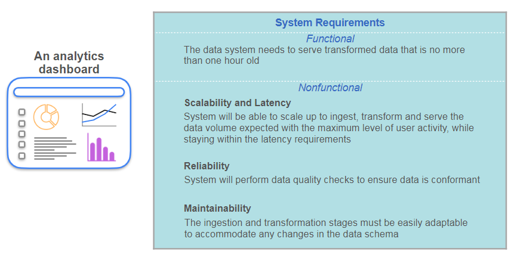
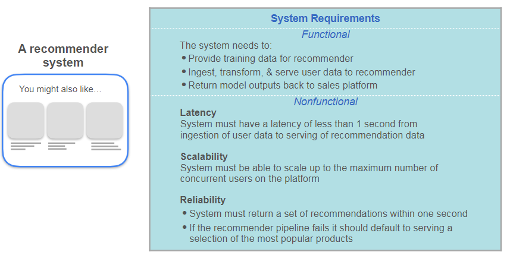
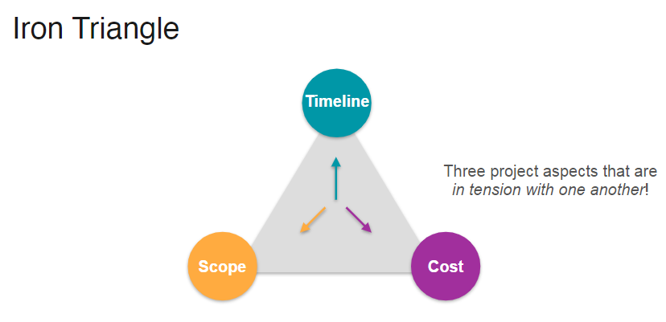
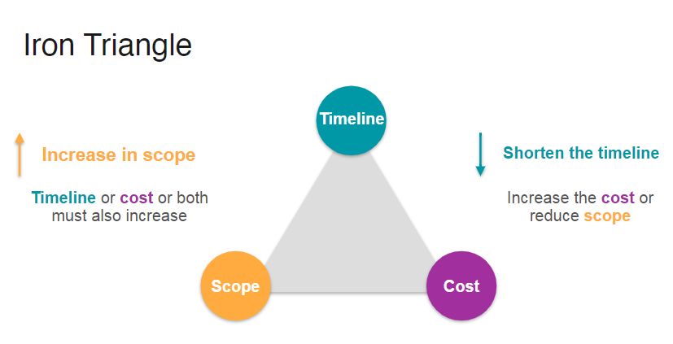
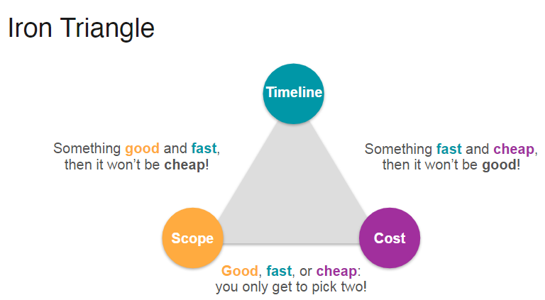
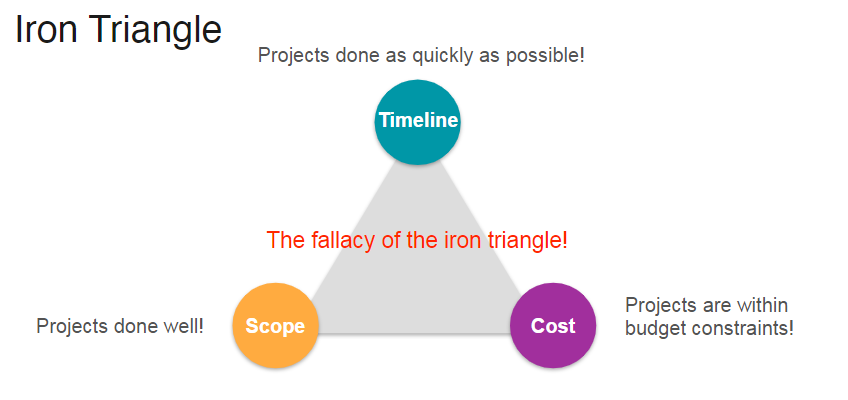
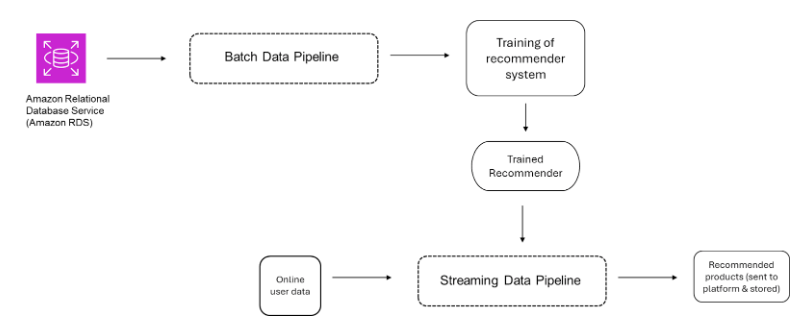

## Week 4 : Stakeholder Management and Gathering requirements (Personal Notes)

This week talks about the How to talk and manage with stakeholders. And then gather requirements. In this case specific to data pipe lines or data systems.

### Thinking like a DE - Complete Mental model !!

The above is the summary of first three weeks and we specifically dwelved on building a small data pipeline to understand DE lifecycle and its undercurrents. Week 3 helped us understnd the priciples of data architect. In this we developed a web application to serve to end users. 
    
    We used APACHE BENCHMARK for stress test the application we built. It helps you simulate the traffic to the application you built.  Started we two ec2 systems - ALB (Automatic load balancer) defines the threshold when to increase the no of ec2 systems and buffer time for systems to load then up and rinning. 

* FinOps and Cost efficiency Pillar -  As a part of efficiency, we managed to change the type of ec2 systmes. from `t2.micro` to `t3.nano`. 
* Autoscalling allowed you architecting for scalability. 

* We focussed on reliability pillar by focussing on planning for failure. Having EC2 in other availibility zones. 

Then we also adjusted the security requirements of the application by making sure external users have access to only port 80 and others. 

We monitored the app for usage and activity. 

* Thing to be done in this week.

### Requirements

* Functional Requiremtns - what the system will be able to do. For ex. It should flag the frads as soon as they happen in system

* Non Functional Requirements - Characteristics. such as latency and scalability. 

### Conversation with Matt Housley.

How Fundamentals of DE is written. 
Guidance from Matt :
    
1. Learn Core data concpets
2. Getting first job on DE is not justlerning stack of tools.
3. Develop a general competence about thetools. and then focus on the stack of toolsthe organization has. 
* Conversation with CTO - Joe and Matt. 
1. E commerce company - They have a legacysystem on data. Thats the kinda challengethey have. Old code running could cause theoutages. 
2. They are going international. so they needto scale up and plus refactor the old codethat they have. 
3. make everything much more scalable. 
4. Legacy code generates the schema that isvery complex to use for analytics. 
5. Tryong to move from batch based approachto stream based approach. 
6. Tools then are KINESIS - Amazon nativetool for streaming. KAFKA - as we potentiallyscale up.
Work as a consultant with a software side.
7. Spin up these services, create proof of concept. Experiment with their scalability.
8. Avoiding downtime in general.
9. We want to develope recommender engine. 
Manage and expand streamin capabilities.
- imprve attention of the customer. how customers behaves. 

DE - 
* To help modernize the systems. Legacy
* What tools to work with. 

### Conversation with marketing

* Key elements of req  

    

Current primary intiatives are in PoC stage. There are two initiatives

1. The Dashboard developed by DS -Product sales by category, also inregion on time plot. 
2. Recommender Engine showing popular products. 

Understand the existing problem -
    Thre is a lag the in data when it appears on the dashboard. kind of day or 2. 
solution - they would like to see things in realtime. And that should be an hr or so. This is to pick up on any trending produt or so. 
* Repeat the problem and what kind of solution they would like to the stakeholder. That gives you the clarity. Keep a documentatio of things.

On recommender system, currently its just the basic system showing you the popular products as the recommnedation - they want to see the personalized recommnedation. 

Then document the functional requiremetns -

1. write down the business goals.
2. Then Stakeholder needs.
    * Analytics Dashboard
    * Recommender system
3. Functional requirements.
    * Translate above needs to functional requirements
    For ex/ in recommender system.
        

### Conversation with Software Engineer.

Now this talk will be more techncal and easier nature. so you should be able to talk with softwared engg easily.

Follow the same proc. Understand the existing promble they are facing. 

Ask them questions. Ask them what could be a proposed solution and what the current solution is. 

Currently they have a suboptimal solution of providing the file daily to DS to modify the dashboard. On this they can create a replica of the database or production database to update this replica in realtime. 

they could notify the downstream data users in advance for any disruptions or downtime. 

Now the sales platform is always improving with each feature addition and removal - their user interaction data schema is also changing ctsly. They could keep replica database more stable then production one to keep other use cases more stable - those that are more dependent on replica database.

Keep the DE in loop in advance. So that he can modify his pipeline to keep downstream use cases stable. 

### Documenting Non Functional Requirements :

* 
* 

### Main takeways

1. Identify the stakeholders, understand their needs and broader goals of the business.
2. Ask Open Ended Questions.
3. Document all your findings
4. Evaluate Trade offs.
    * Timeline
    * Cost
    * Scope - features etc. 

Concept of Iron Triangle :

* 
* 
* 
* 

### Translating Requirements to Architecture.

* Conversation between DE and DS.
    - Gather Functional and Non Functional Requirements.

* DS Explain PoC Recommnedermodel they developed and what kind of data they are using. Tabular with features present in the data. - Content based Recommender model. 
DE has a doubt on How arethey deployed on a sales platform and what is the frequency of training the model. They plan to keep the models output once in production for later use for retraining the model. Once a week could be the retraining time. 

- New batch of training data every once a week - if possible modified according the models expectaion or the newproducts that are coming on the platform. 
- what are the expecation of DS - what are they browsing ? and other use information.
user information and info about the products they have been looking at.
- How fastthey need to generate recommnedations ? - instantaneously. model is fast at recommending thigs - few miliseconds. It is just a similarity caculation between embeddings. 
- platform logs data about the user.
- what about the scalability ? 100k customers-at leaes a item. they expect to number to grow as they grow. Activity sometimes spike. 

- There could be wide range of concurrent users at a time. 

- Needs data in batch for frequent retraining. Pipeline for data in batches 
- How frequntly thisneeds to be done the training. 

