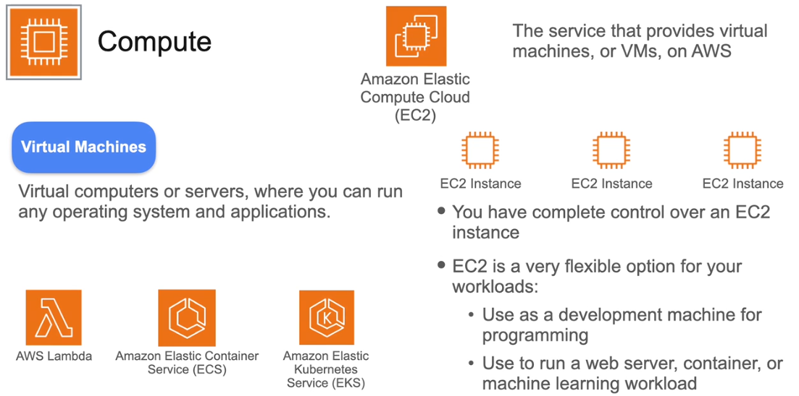
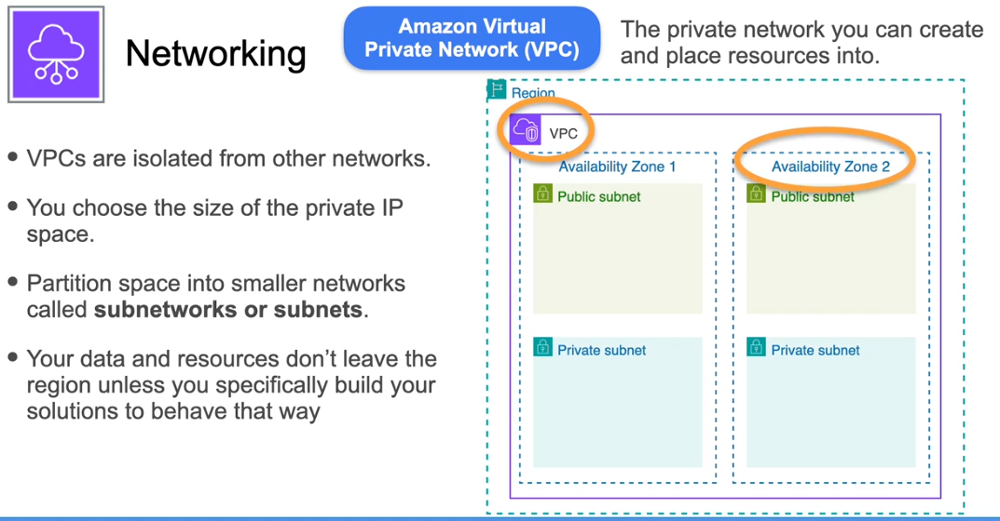
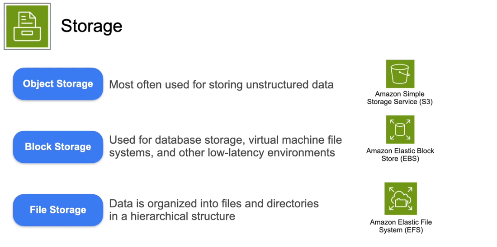
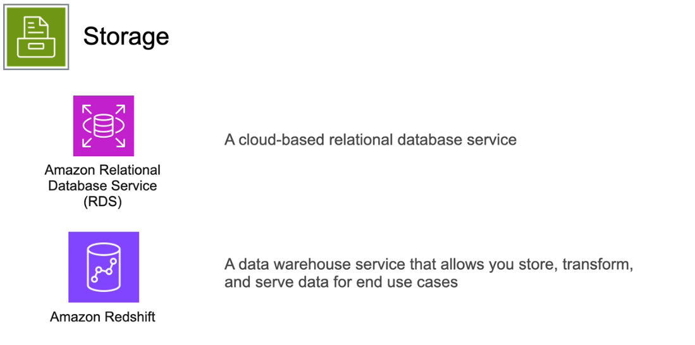
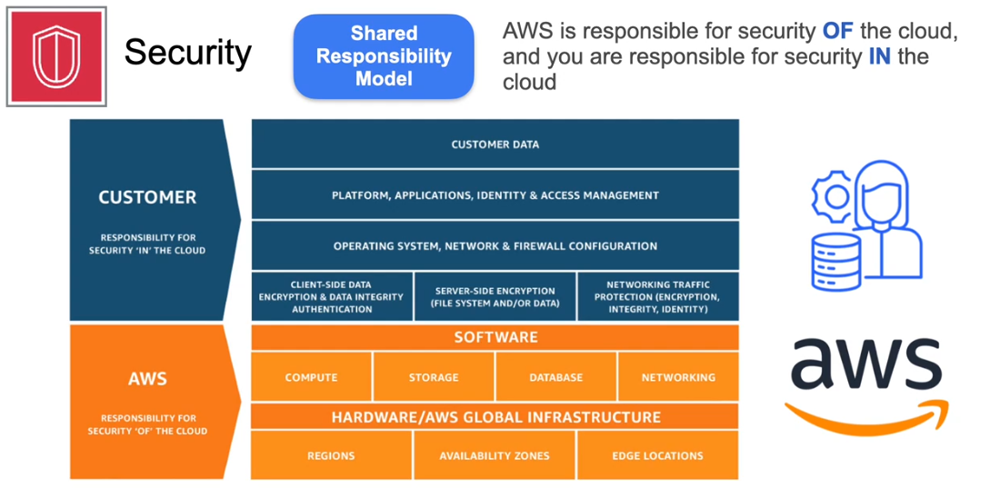

## AWS

### Compute

**AWS compute services**, focusing on **Amazon Elastic Compute Cloud (EC2)**. Here are the key points:

- **EC2 Overview**: EC2 provides virtual machines (VMs) on AWS, allowing users to run various operating systems and applications.
- **Instance Control**: When you launch an EC2 instance, you have complete control over the operating system and applications.
- **Flexibility**: EC2 is versatile for different workloads, such as development, web servers, and machine learning.
- **Scaling**: You can deploy a single instance or scale horizontally by launching multiple instances to meet demand.
- **Other Compute Options**: Besides EC2, AWS offers serverless functions (AWS Lambda) and container hosting services (Amazon ECS and EKS).

AWS uses a specific naming convention for the instance types. For example, t3a.micro breaks down as follows:

* t: family name

* 3: generation

* a: optional capabilities

* micro: size

### Networking

**AWS Networking**, specifically focusing on **Amazon Virtual Private Cloud (VPC)**. Here are the detailed key points:

- **VPC Definition**: A VPC is a private network that you can create and control within the AWS cloud. It is isolated from other networks in AWS.

- **Network Configuration**: When creating a VPC, you choose the size of the private IP space and can partition it into smaller networks called **subnets**.

- **Availability Zones**: A single VPC spans all **Availability Zones (AZs)** within a region, but it cannot span across different regions. This means you need to create a separate VPC for each region you want to operate in.

- **Resource Placement**: When you create AWS resources like EC2 instances, you must select which VPC and AZ to place them in. This is crucial for managing your resources effectively.

- **Compliance and Security**: The region-bound nature of AWS resources is important for compliance and security purposes, ensuring that your data and resources remain within the designated region unless explicitly configured otherwise.

### Storage 

The lecture on **AWS Storage** covers various types of storage services offered by AWS, including object, block, and file storage, as well as databases. Here are the detailed key points:

#### Types of Storage:

1. **Object Storage**:
   - **Definition**: Used for storing unstructured data such as documents, logs, photos, and videos.
   - **Service**: The primary service discussed is **Amazon S3 (Simple Storage Service)**, which is widely used for object storage.

2. **Block Storage**:
   - **Definition**: Typically used for database storage and virtual machine file systems where low latency and high performance are critical.
   - **Service**: **Amazon Elastic Block Store (EBS)** is mentioned, which allows you to attach block storage devices to EC2 instances. These volumes can be mounted to the operating system for data storage and access.

3. **File Storage**:
   - **Definition**: Organizes data into files and directories in a hierarchical structure, similar to traditional file systems.
   - **Service**: **Amazon Elastic File System (EFS)** is a managed service that provides scalable file storage, allowing multiple systems to access files simultaneously.

### Databases:
- **Overview**: Databases are considered a separate category of storage, even though they use block storage behind the scenes.
- **Functionality**: Databases provide special features for managing structured data, such as complex querying and data indexing.
- **Key Services**:
  - **Amazon RDS (Relational Database Service)**: A cloud-based relational database service that you will frequently work with in the course.
  - **Amazon Redshift**: A data warehouse service that allows you to store, transform, and serve data for various use cases.

### Security

The lecture on **AWS Security** focuses on the **shared responsibility model** and the importance of security in the cloud. Here are the detailed key points:

### Shared Responsibility Model:
- **Definition**: This model outlines the division of security responsibilities between AWS and the customer.
  - **AWS's Responsibility**: AWS is responsible for the security **of** the cloud, which includes the physical infrastructure, hardware, and software that run the cloud services.
  - **Customer's Responsibility**: Customers are responsible for security **in** the cloud, which includes managing the guest operating system, software updates, networking configurations, and data access.

### Analogy:
- The lecture uses the analogy of a **high-rise apartment building**:
  - **Building Management**: The building owner and management ensure the physical safety and security of the building (e.g., locks, safety codes).
  - **Tenant Responsibility**: As a tenant, you must use the security features (e.g., locking your door) to keep your apartment secure.

### Example of EC2:
- **AWS's Role**: When you launch an EC2 instance, AWS manages the underlying hardware and hypervisor layer, ensuring their security.
- **Customer's Role**: You are responsible for:
  - Managing the guest operating system (e.g., applying security patches).
  - Configuring networking settings (e.g., setting up firewalls).
  - Controlling access to your data and using encryption when necessary.

### Importance of Security:
- both AWS and the customer must work together to maintain a secure environment. Each AWS service has its own security responsibilities, and understanding this division is crucial for effective cloud security management.

