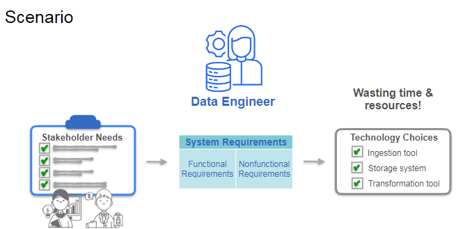
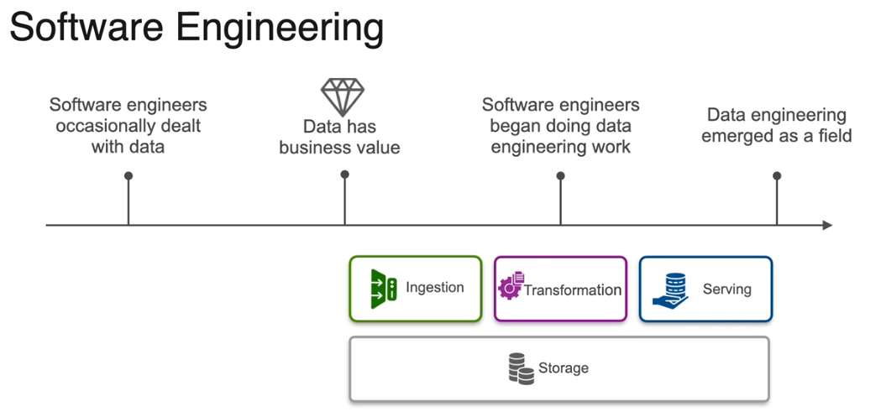
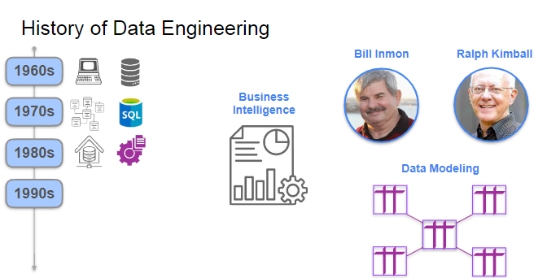

Gain a high-level overview of the data engineering lifecycle and key undercurrents to understand how data engineers add business value to organizations. Start developing a mental framework for thinking like a data engineer, starting with gathering stakeholder needs and translating them into system requirements. Learn the basics of working on the cloud from an AWS expert.

**Learning Objectives**
* Identify key upstream and downstream collaborators and stakeholders for data engineers
* Identify the stages of the data engineering lifecycle and key undercurrents
* Articulate a mental framework for building data engineering solutions
* Identify some of the necessary considerations for requirements gathering at the start of a new project / role as data engineer.

## Introduction to Data Engineering

### Overview

In this lecture, you are introduced to the role of a **data engineer** within a company, particularly in the commerce space. Here are the key points:

- **Scenario Setup**: You are hired as a data engineer after a data scientist struggles due to the lack of necessary data infrastructure for analytics and machine learning tasks.

- **Importance of Data Engineering**: The lecture emphasizes that data engineering is crucial for building robust data infrastructures that support various data-related tasks, including analytics and machine learning.

- **Core Skills**: The core skills required for data engineering are consistent across different tasks, and understanding these skills is essential for success in the field.

- **Stakeholder Needs**: As a data engineer, you must translate stakeholder needs into system requirements and select appropriate tools and technologies to build effective data systems.

- **Avoiding Pitfalls**: The lecture warns against rushing into implementation without fully understanding how the systems will deliver value, as this can lead to wasted resources and potential job loss.

- **Course Structure**: The first week focuses on developing a mindset for data engineering rather than coding or using cloud tools. Future weeks will cover the data engineering lifecycle, data architecture, and hands-on practice with AWS.

This foundational understanding is crucial for your success as a data engineer, setting the stage for more technical learning in subsequent weeks.

1. **Week 1: Introduction to Data Engineering**
   - Focuses on developing a mindset for data engineering.
   - Discusses the importance of understanding stakeholder needs and translating them into system requirements.
   - No coding or cloud tools are used this week.

2. **Week 2: The Data Engineering Lifecycle and Undercurrents**
   - Explores the stages of the data engineering lifecycle.
   - Provides a theoretical framework for data engineering.
   - Prepares you for hands-on practice with cloud data pipelines on AWS at the end of the week.

3. **Week 3: Data Architecture**
   - Concentrates on the principles of good data architecture.
   - Discusses how to design data systems that deliver value based on stakeholder needs.

4. **Week 4: Translating Requirements to Architecture**
   - Pulls together the concepts learned in previous weeks.
   - Focuses on designing and building a data architecture that meets business goals.

### Data Engineering Defined

 The original data engineers were software engineers, whose primary work was building the software applications or organizations needed.
 
 

 >

 ### Brief History of Data Engineering

 Certainly! Here's a nuanced summary of the lecture, designed to help you recall the key points and integrate slide images where appropriate:

---

### The Omnipresence and Evolution of Data

**Introduction to Data:**
- Data is ubiquitous, forming the building blocks of information, whether tangible like numbers and words, or intangible like photons and wind.
- Historically, data has existed in various forms, but our focus is on digitally recorded data—data that can be stored and transmitted electronically.

**The Journey from Data's Inception to Big Data:**
- **1960s**: The digital data era began with the advent of computers and the introduction of the first computerized databases.
- **1970s**: Relational databases and SQL emerged, revolutionizing data management.
- **1980s**: Bill Inman introduced data warehouses, enabling data transformation for analytical decision-making.
- **1990s**: The rise of the Internet and web-first companies like Amazon led to a need for robust backend systems—servers, databases, and storage.

**The Big Data Era:**
- **2000s**: Post-dotcom bust, survivors like Yahoo, Google, and Amazon faced unprecedented data growth, heralding the big data era.
- **MapReduce and Hadoop**: Google's 2004 MapReduce paper sparked a revolution, leading to the development of Apache Hadoop, enabling scalable data processing.
- **Amazon's Cloud Innovations**: Amazon introduced EC2, S3, and DynamoDB, pioneering cloud computing and creating AWS, a flexible marketplace for compute and storage.

**Transition to Cloud and Real-Time Data:**
- The public cloud transformed software and data application development, enabling small startups to access cutting-edge tools.
- The shift from batch computing to event streaming marked a new era of real-time data, simplifying big data processing and making it universally accessible.

### The Modern Data Landscape

**The Evolving Role of Data Engineers:**
- Data engineering today integrates cloud-first, open-source, and third-party products, simplifying large-scale data work.
- Data engineers now focus on interoperability, connecting diverse technologies to achieve business objectives.

**Higher Value Contribution:**
- The role of data engineers is more strategically significant than ever, enabling them to build scalable systems that directly influence business strategies.
- Data engineers can leverage existing technologies while contributing to the development of future solutions.

### Looking Forward

**Integration with Business and Other Roles:**
- Upcoming discussions will explore how data engineering aligns with organizational roles and stakeholders, focusing on understanding end-user needs and translating them into system requirements.

**Conclusion:**
- As a data engineer, you have the opportunity to drive business value and innovation by building robust data systems. Join the next session to delve deeper into the practical integration of data engineering within organizations.

