## Week 2 : The Data Engineering Lifecycle and Undercurrents (Personal Notes)

This week talks about the ...

Week 3 Lab :

## Data Engineering Lifecycle on AWS

### Source Systems

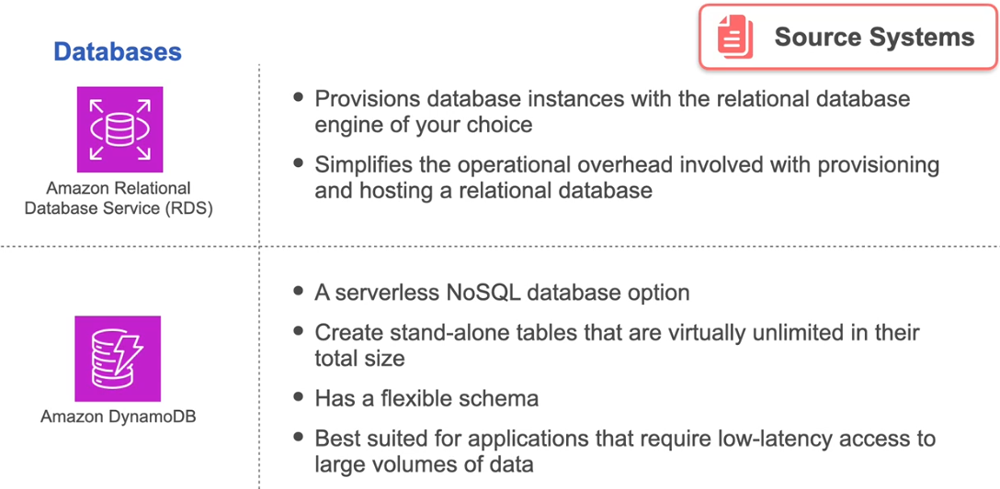

**source systems** primarily focusing on **databases**. Here’s a brief summary of the key points:

- **Common Source Systems**: The most frequently interacted source systems in data engineering are databases, particularly relational databases.
  
- **Amazon RDS**: Morgan highlights the use of **Amazon Relational Database Service (RDS)**, which simplifies the process of provisioning and managing relational databases like MySQL and PostgreSQL. RDS handles operational tasks such as patching and upgrading.

- **Amazon DynamoDB**: Another database option mentioned is **Amazon DynamoDB**, a serverless NoSQL database. It allows for the creation of standalone tables with virtually unlimited size, making it suitable for applications requiring low-latency access to large data volumes.

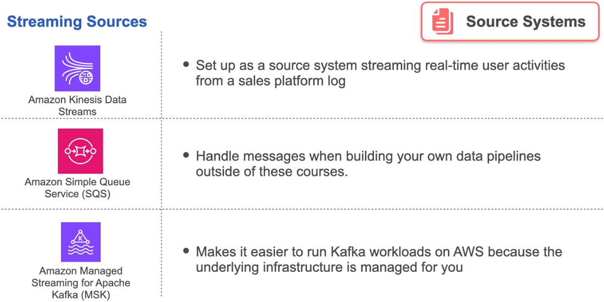

- **Streaming Sources**: For streaming data, Morgan introduces **Amazon Kinesis Data Streams**, which can capture real-time user activities. Other options like **Apache Kafka** are also mentioned for streaming source systems.

### Ingestion

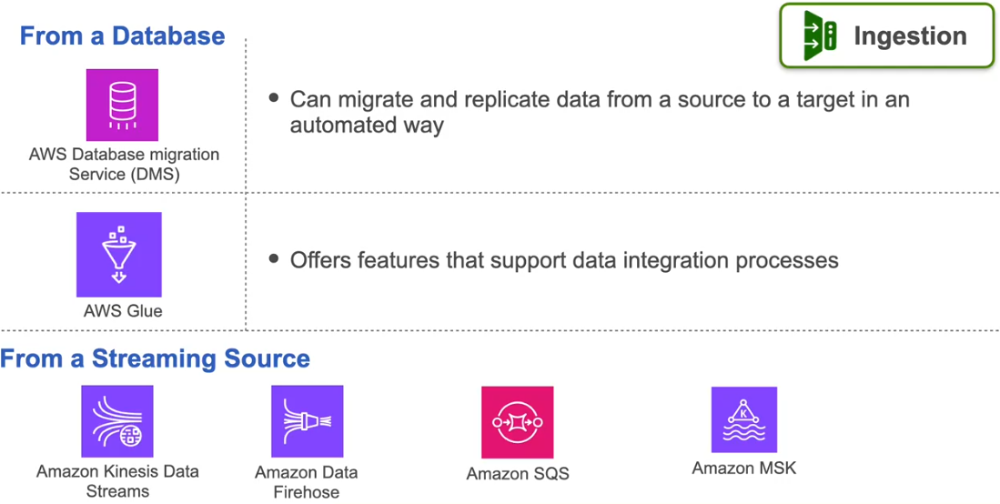

 **Ingestion**, the focus is on how data is brought into the data engineering lifecycle. Here are the detailed points covered:

- **Ingestion from Databases**: 
  - When ingesting data from a database, **Amazon's Database Migration Service (DMS)** is highlighted. DMS automates the migration and replication of data from a source to a target, making the process efficient.

- **AWS Glue ETL Service**: 
  - For the labs in the course, the primary tool used for ingestion is **AWS Glue**. This service supports Extract, Transform, Load (ETL) processes, allowing for seamless data integration.

- **Ingestion from Streaming Sources**: 
  - For streaming data ingestion, **Amazon Kinesis Data Streams** and **Amazon Kinesis Data Firehose** are utilized in the labs. These tools enable the capture and processing of real-time data streams.

- **Other Streaming Ingestion Tools**: 
  - While the labs focus on Kinesis, Morgan mentions that in real-world applications, other tools like **Amazon Simple Queue Service (SQS)** and **Apache Kafka** can also be used for handling streaming data.

  ### Storage

In the discussion on **Storage**, Morgan covers various aspects of how data is stored within the data engineering lifecycle. Here are the detailed points:

- **Amazon S3**: 
  - **Amazon Simple Storage Service (S3)** is highlighted as a versatile storage solution. It is used for storing data in its raw form, which can be ingested from various sources. S3 is known for its scalability, durability, and cost-effectiveness, making it ideal for large datasets.

- **Data Lake Architecture**: 
  - Morgan discusses the concept of a **data lake**, where S3 serves as the foundational storage layer. A data lake allows for the storage of structured and unstructured data, providing flexibility in data processing and analysis.

- **Amazon Redshift**: 
  - For structured data storage, **Amazon Redshift** is introduced as a data warehouse solution. Redshift is optimized for complex queries and analytics, enabling efficient data processing and retrieval.

- **Amazon RDS and DynamoDB**: 
  - **Amazon RDS** and **Amazon DynamoDB** are mentioned as options for storing relational and NoSQL data, respectively. RDS is suitable for transactional data, while DynamoDB is ideal for applications requiring low-latency access to large datasets.

    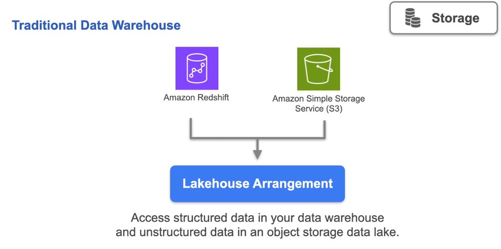

### Transformation 

In the talk on **Transformation**, Morgan discusses the processes and tools involved in transforming data to make it suitable for analysis and use. Here are the detailed points covered:

- **Transformation Process**: 
  - Transformation involves converting raw data into a format that is more useful for analysis. This can include cleaning, aggregating, and enriching the data.

- **AWS Glue**: 
  - **AWS Glue** is emphasized as a key tool for transformation. It provides a serverless ETL service that automates the process of data preparation, making it easier to transform data at scale.

- **Apache Spark**: 
  - Morgan mentions **Apache Spark** as another powerful tool for data transformation. Spark is known for its speed and ability to handle large datasets, making it suitable for complex data processing tasks.

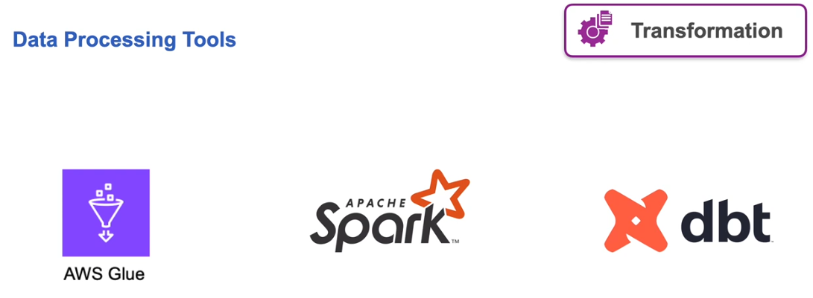

- **DBT (Data Build Tool)**: 
  - **DBT** is introduced as a tool that allows data analysts and engineers to transform data in their warehouse more effectively. It enables users to write modular SQL queries and manage data transformations in a version-controlled manner.

### Serving

In the lecture on **Serving Data**, Morgan discusses how transformed data is made accessible for analysis and decision-making. Here are the detailed points covered:

- **Use Cases for Serving Data**: 
  - Morgan identifies two primary use cases for serving data:
    - **Business Intelligence and Analytics**: This involves providing data for reporting and analysis to stakeholders.
    - **AI and Machine Learning**: This includes serving data for model training and inference in machine learning applications.

- **Tools for Analytics**: 
  - For analytics purposes, tools like **Amazon Athena** and **Amazon Redshift** are highlighted. Athena allows users to query data directly in S3 using SQL, while Redshift is optimized for complex queries and large-scale data analysis.

- **Dashboards and Visualization**: 
  - Morgan mentions the use of dashboards for visualizing data insights. Tools like **Amazon QuickSight** and open-source options such as **Apache Superset** and **Metabase** are discussed as ways to create interactive dashboards for stakeholders.

- **Serving Data for AI/ML**: 
  - In the context of AI and machine learning, Morgan explains the importance of serving batch data for model training. He also discusses the use of vector databases for serving data to product recommenders and large language models.

- **Importance of Data Accessibility**: 
  - The lecture emphasizes that making data easily accessible and understandable is crucial for driving business value and enabling informed decision-making.

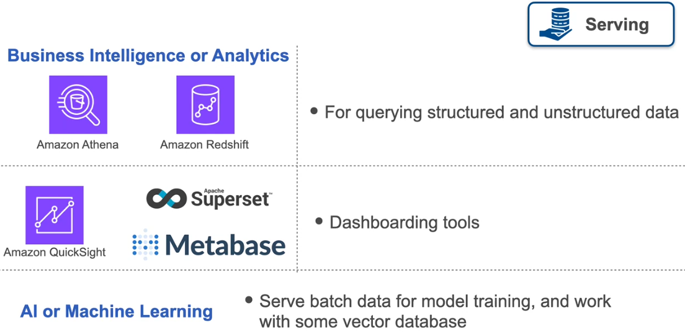

## Undercurrents on AWS

The lecture covers the **undercurrents of the data engineering life cycle** and their relevance to working on **AWS**. Here’s a detailed summary:

### Key Undercurrents:

1. **Security**:
   - **Shared Responsibility Model**: AWS secures the infrastructure, while users must secure their applications and data.
   - **Identity and Access Management (IAM)**: Users can set roles and permissions to control access to AWS resources. IAM roles provide temporary credentials and permissions for users and applications.
   - **Network Security**: Familiarity with services like **Amazon Virtual Private Cloud (VPC)** and security groups (firewalls) is essential for securing data pipelines.

    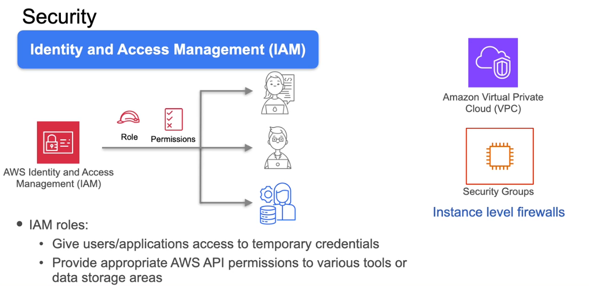

2. **Data Management**:
   - Tools like **AWS Glue** are used for discovering and managing metadata for data stored in services like **Amazon S3**.
   - **Lake Formation** helps manage fine-grained data access permissions.
    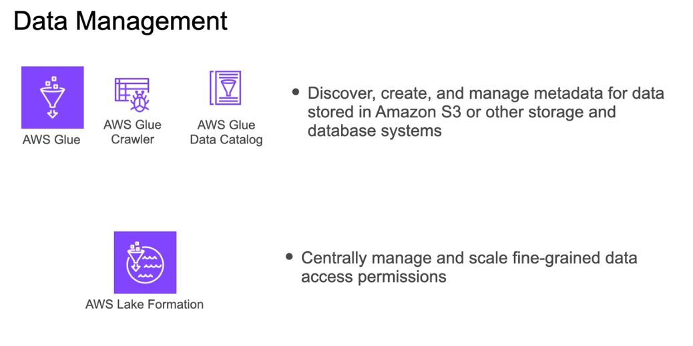

3. **DataOps**:
   - **Amazon CloudWatch** is introduced for monitoring cloud resources and applications.
   - **Amazon Simple Notification Service (SNS)** allows for event-triggered notifications between applications.
    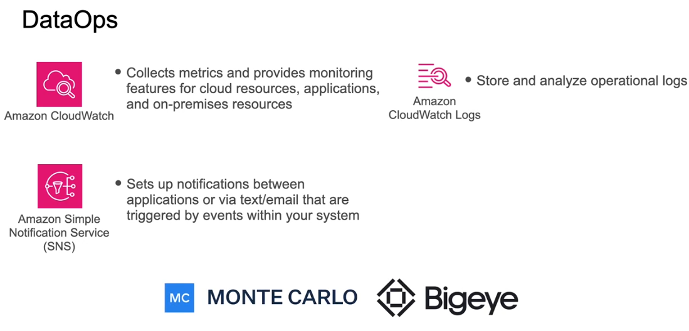

4. **Orchestration**:
   - **Apache Airflow** is highlighted as the industry standard for orchestration, with newer tools like **Dagster**, **Prefect**, and **Mage** also mentioned.
    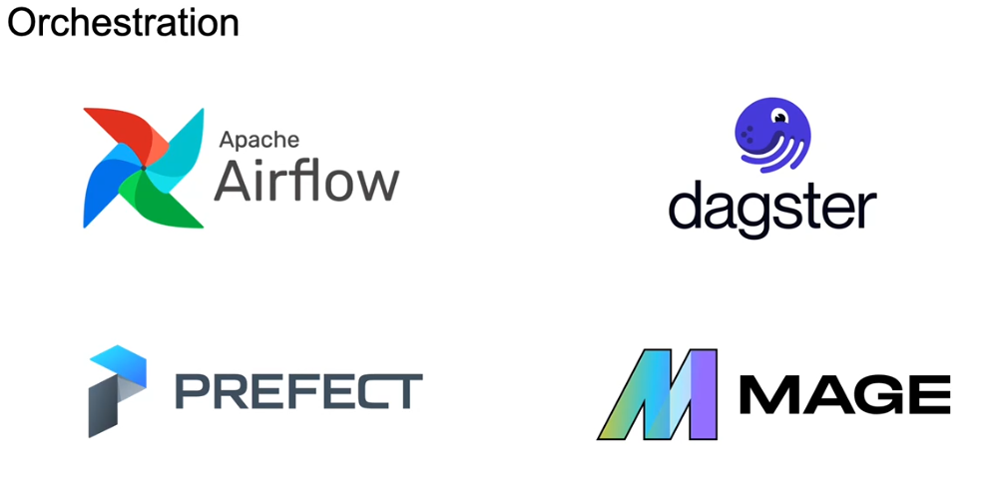
5. **Architecture**:
   - The **AWS Well-Architected Framework** will be explored in the next week, focusing on operational efficiency, security, scalability, and sustainability.
    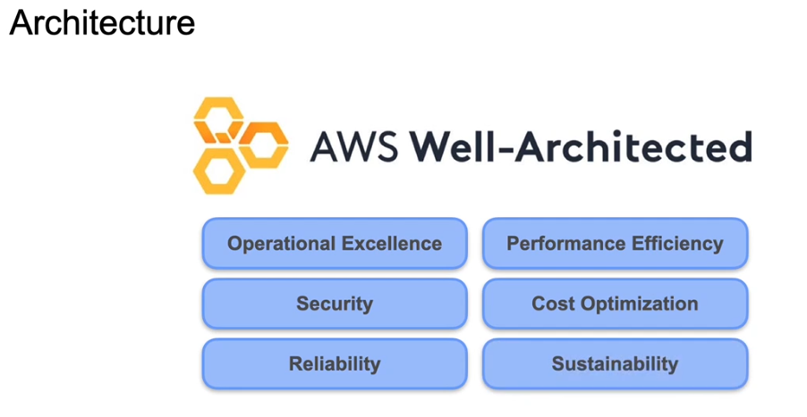
6. **Software Engineering**:
   - **Amazon Cloud9 IDE** is used for development, hosted on **Amazon EC2**.
   - Tools like **Amazon CodeDeploy** automate code deployment, and version control is managed with **Git** and **GitHub**.
    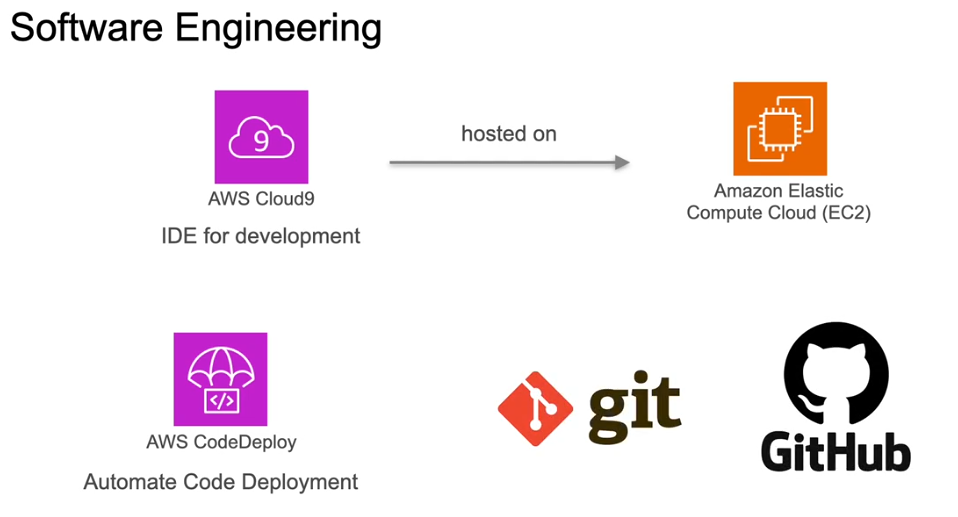