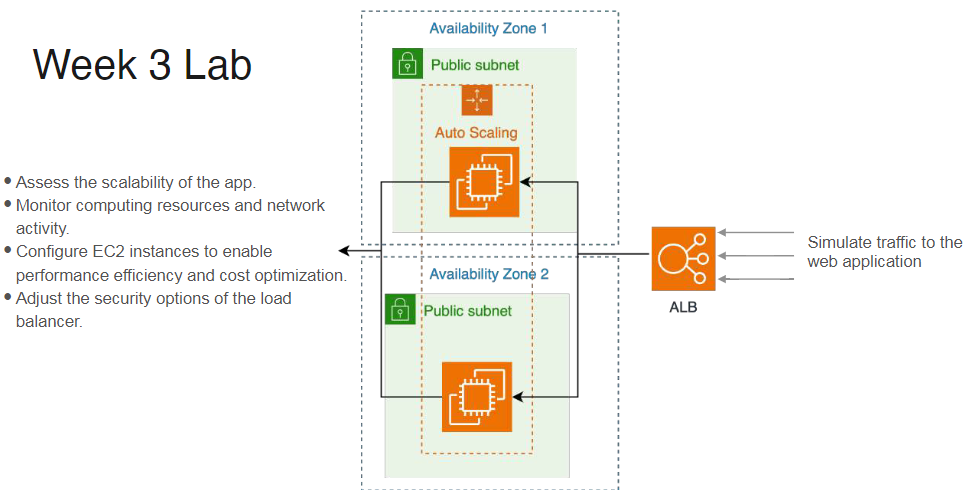

## Week 3 : Data Architecture (Personal Notes)

This week talks about the 9 principles of data Architecture. and groups them in three 3 groups.

Always be architecting, Keep the systems loosly coupled, Plan for failure are among those. 

Week also talk about choosing the right architecting when there is streaming or batching involved. And the unified approach of using Streaming and batching togehter.
How one system itself can be used to do both batching and streaming. 
	*Example-Google DataFlow 
	*Beam
	
Kappa and Lambda Architecture. How Lambda has falled out of the practice.

Architecting also involves data Finops. How to optimise for costs etc.

On Choosing the right Technologies :
* Open Source 
* Managed Open Source
* Propietory

-- There are no shortage of options for Data Engineering. Delivering high data solutions in the prodction/

Data Architecturing is all what , what and when of the data that leads to Reality (solution). How is defined by the selection of tools. This section talks about the concepts and actual tools. in the data pipeline. 

Location : 
* on Premise
* Cloud 
* Hybrid
There are other considerations such as cost optimizations and Build vs buy concepts that can help arrive at a decision in choossing the right tech.

### Monolith vs Modular Systems
* Monolith Architecture : 
It is a tightly coupled set of systems. Any change to component might lead to change or replacement of all the other components in a system. It has a single codebase for the app in production. 
1. But this system is easy to understand and reason.
2. Generally deals with only one tech.
3. But this one is hard to maintain. Sometimes you need to renew the entire application. 

* Modular architecture : Each service in a system or app is deployed as a single unit. and these units are loosely coupled. Change to one does not necessarily lead to change of other in a data pipeline. Open source, managedd open soruce or even propietory solution come very handy while deployingn these single units. And their replacement generally is easy because comman use data storage format eg. parquet.

### Cost Optimization and business Value
Three concpets were discussed - 
* TCO - Total Cost of Ownership
* TOCO - Total Opportunity cost of Owenership
These things are based on CapEx and OpEx. OpEx models are generally preffred in business because they are based on pay as you go basis. And basically there is zero CapEx. Opportunity cost are generally the cost involved in not trying the other costs. They could go zero with proper planning and you know the business use case properly. Building loosly coupled system can help you reduce these cost to much extent. Plug and play system

### Server, Container and Serverless Compute option
* Server : 
	1. You set up and manage server.
	2. Update OS - Install Packages - Patch SOft - Networking, scalling and Security.
	3. Add Image here
* Containers :
	1. Modular units that packages the code & dependencies to run on a aserver
	2. this is lightwetihg and prtable
	3. Add Image here

* Serverless:
	1. you dont need to maintain and setup server.
	2. Use only when its cheaper than server option.
	3. These are generally used when there is event involved. In high rate event use case this could be and would be expensice option.
	4. Generally used for simple and discrete cases.
	5. Not good when many parts require a lot of compute or memory power. 

### How undercurrents impact your decisions.
* Six Undercurrents - 

	1. Security - what are the security features of the tool ?
	2. Data Managament - How Data governance is handled. data is stopped from breaching ?
	3. DataOps - What features does the tool offer in terms of automation and monitoring.
	4. Data Architeture - Is modularuty and ineroperability
	5. Orchestration - apache airflow, dagster, mage. 
	6. Software Engineering - How much do you want to do ?
		- Team's capabilities. Avoid undifferentiated heavy lifting. 

### AWS Well Architected Framework

* Helps you design and operate reliable, secure, efficient, cost-effective and sustainable systems in the cloud.
* Helps you think throufh the pros and cons of different architecture choices. 

* LENS is an extension of AWS Well-Architected Framework that focusess on a particular area, or tech stack and provides guidance that is specific to those context. E.g Data Analytics Lens. helps you with Industry Best Practices. 

AWS LAB From here.

* Task to perform
1. 
2. 
3. 

Apache Benchmark is used here as a thrid party tool to do the stress testing of the web applicaion. It simulates the traffic to the webapp served on EC2 instance which can scale up and down based on the incoming traffic.

SO basically :
	
	1. Get the address of the web app.
	2. Simulate the incoming traffic.
	3. Monitor the CPU usage and Network activity.

 explore and assess the security, performance, reliability, and scalability aspects of a web application hosted on AWS. You will do this by simulating traffic to your web application and using AWS tools such as Amazon CloudWatch to monitor computing resources and network activity on your web application. You will configure the computing resources to enable performance efficiency, as well as security options to control the in-bound traffic to your web application. You will perform these tasks through the principles of “good” data architecture as well as the lenses of AWS Well-Architected Framework. By going through this lab, you will gain an understanding of the primitive resources available on AWS, so that you can later apply this understanding when you architect your data pipelines as a Data Engineer.

 Virtual Private Cloud (VPC) and subnet. VPC is a way to isolate your resources (for example EC2) from the outside world. Think about it as a box or a wall that protects your resources, and also as a way to organize them. Resources within the VPC can communicate with each other. But by default, there’s no communication between the VPC and the internet outside unless you allow for this communication to happen by properly configuring the VPC. Now inside your VPC, you may need some resources to be public and some others to be private. How can you do that? This is the role of subnets that you can create within your VPC. Subnets provide you with more detailed control over access to your resources. You can create a public subnet if you want to allow for outside traffic to access your resources, and you can create a private subnet if you don’t want to allow for outside traffic to access your resources.

Resources:
* [Chapter 3 and 4 Data Engineeing](https://www.redpanda.com/guides/fundamentals-of-data-engineering)
* [AWS Well-Architected Framework](https://aws.amazon.com/architecture/well-architected/)
* [“A Brief Introduction to Two Data Processing Architectures — Lambda and Kappa for Big Data”](https://towardsdatascience.com/a-brief-introduction-to-two-data-processing-architectures-lambda-and-kappa-for-big-data-4f35c28005bb)