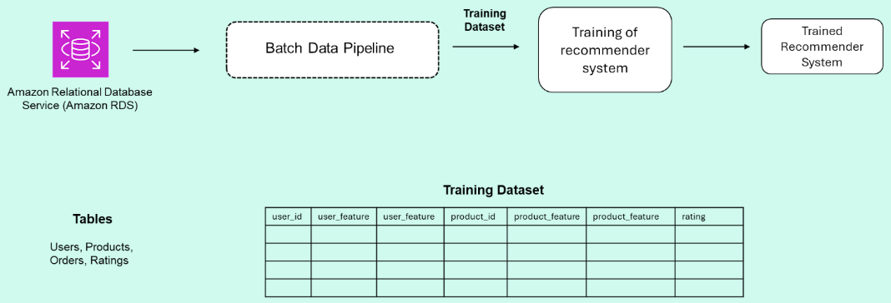

### Quiz - practice
**Question 1**

Based on the conversation between the data engineer and the data scientist, what are the functional and nonfunctional requirements for the batch pipeline?

**Note:**  This question is for you to reflect on the conversation. You will receive full credit for this question no matter how you answer. Make sure to check the feedback.  

**Answer** -> Functional Requirement for batch pipeline - this is suppose to answer what the system will do. Batch pipeline Functional Requirement for batch pipeline - this is suppose to answer what the system will do. Batch pipeline will provide the weekly data in a required format to DS. This is required for periodic retraining of the model to see the shift in the data etc and align the model respectively. 

Non Functional requirements - These are the characteristics of the system such as scalability. This pipeline going forward should be able to scale well for the new region and users. Latency is not a requirement because we are providing the data in batch format. 
It should be able to not just scale but should able to handle new data. - Reliable. So cost has to be optimised for the required category. but user experience is the primary requirement - that shouldnt be trivialized or downplayed. On top of it, security is the important aspect of the data pipeline - what things are allowed to store and anonymized. Aspects such as GDPR.

Feedback answers :

Functional requirements

When thinking about the functional requirements of the data pipeline, consider the tasks the pipeline needs to perform (i.e. what data it needs to ingest or combine, how it should process it, and what data it needs to serve). 

In this case, the data pipeline needs to serve data in a format that is suitable for training the machine learning model as shown in the figure below (i.e. tabular and containing the columns specified)

Although not explicitly discussed in the conversation, other common considerations around functional requirements that are usually discussed for machine learning models include:

* The duration the data pipeline should retain or store the training data. 

* How the data pipeline should combine the old with the new dataset. Should the old dataset be discarded? If the same customer updated their rating for a given product, should you keep the last rating or compute the average?

* The file format the training data should be served in. (e.g. CSV, Parquet, etc.)

**Nonfunctional requirements**

Nonfunctional requirements are attributes or characteristics of the data pipeline that allow it to successfully meet stakeholder needs. The data scientist mentioned that they’d like to retrain the model as soon as they notice any drift in performance or change in the input data, meaning that the data pipeline needs to perform a simple transformation task only when it is needed. So, it must not require too much operational overhead to deliver the new training set.

Although not explicitly discussed in the conversation, another common consideration around nonfunctional requirements is the cost of implementing the batch pipeline. You generally want to build a cost effective pipeline.

**Here's a table that summarizes these requirements:**

| Functional Requirements | Nonfunctional Requirements |
| ----------- | ----------- |
| Provide the training data for the content-based recommender model in the following format:   
Tabular data  |   The data system must be easy to maintain and update, and requires less operational overhead (Irregular / on demand run schedule) |
|Each row in the table contains the following user and item features: “customer number”, “credit limit", "city", “postal code”, and “country”, “product code”, "quantity in stock", "buy price”, "msrp", "product line", "product scale", “product rating”. | The data system must be cost effective.     |    | 

**Question 2**

Based on the conversation between the data engineer and the data scientist, what are the functional and nonfunctional requirements for the streaming data pipeline?  

**Answer** -> Funcational requirement - Should be able to recommend product to the user with very fast using recommendation engine. Data needs to be streamed to the model to generated the recommendation. This data is is currently what user is doing - such as things stored in cart, what all thing he browsed etc etc.

Non Functional requirements - Latency, very low latency of sub seconds along with scalablity. This streaming pipeline should scale well with the data. Security cost and reliabilty for handling new data. 

Feedback answers :

Feedback
Functional requirements

The streaming data pipeline has to do the following:

* use the recommender system to find the set of products to recommend for a given user based on the user’s information and the products they interacted with online.

* stream the products to the sales platform and store them for later analysis. 

Nonfunctional requirements

* Latency: The system should provide the recommended products to the user instantaneously as they are browsing through different products or during the checkout process. For a given user, the system must be able to ingest and extract user and product data, provide them to the recommender system, and finally serve the product recommendations to the sales platform, all in a few seconds.

* Scalability & concurrency: The system must be able to scale up to ingest, transform and serve the data volume expected with the maximum level of user activity on the platform, while staying within the latency requirements. 