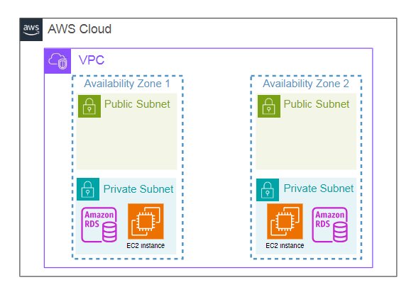
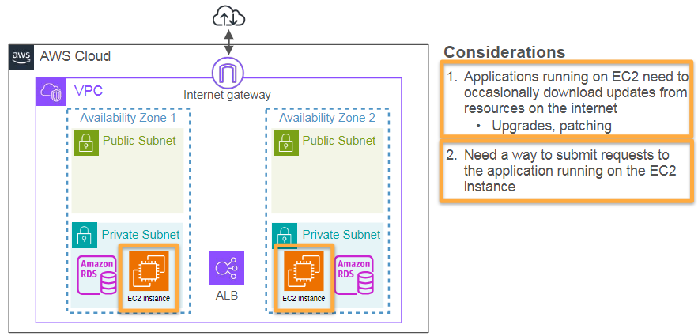
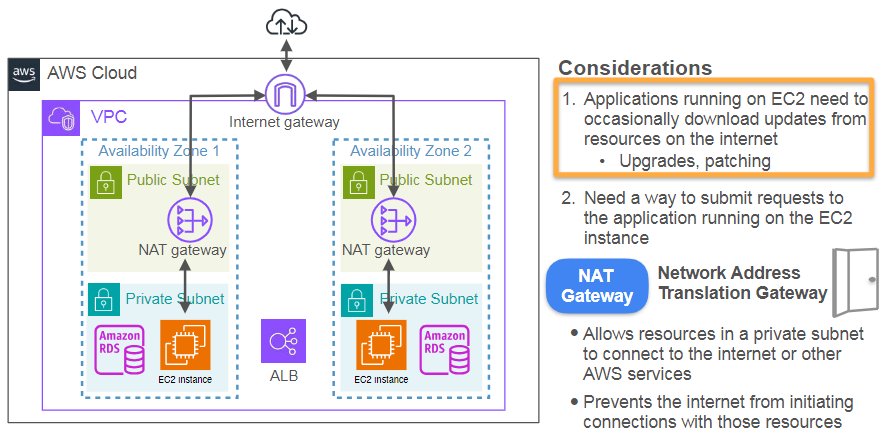
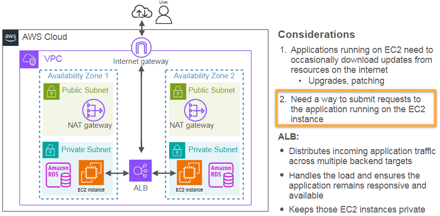
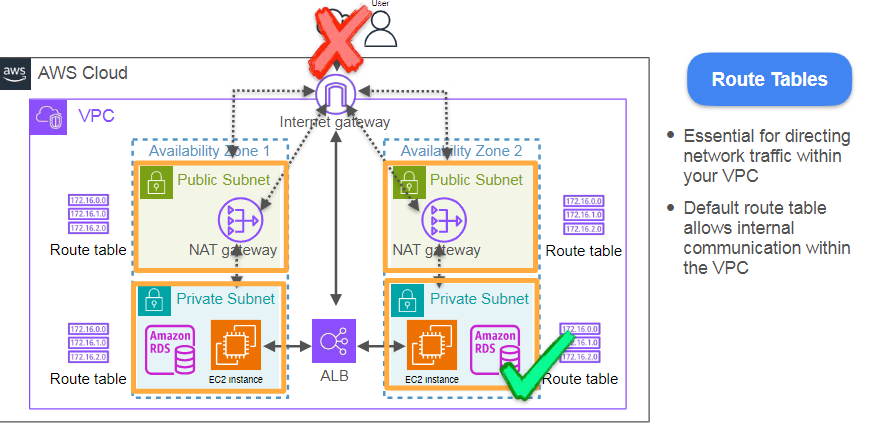

Basics of IAM and Permissions are outlined in the week readme.md. Please refer that page.

## Basics of Networking in the cloud
Regions - Multiple availibility zones - data centers

Single VPC can consist of multiple availability zones. But it cannot span across regions. Under each VPC there are subnets. Private subnets and public subnets. Based on the type of application you have, the usage of these differs. you host services on these subnets. 

 

 

 

ACL - Access Control Lists.

#### Networking Principles in Cloud-Based Data Pipelines
This chapter covers the topic of networking in cloud-based architectures, specifically focusing on AWS and its implications for building data pipelines. Here's a summary of the main points:

| Topic               | Summary                                                                                              |
|---------------------|------------------------------------------------------------------------------------------------------|
| Cloud Infrastructure | Cloud computing involves physical data centers spread across regions, consisting of availability zones and data centers with redundancy. |
| Resource Hosting     | Selecting the appropriate region for hosting resources involves considerations like legal compliance, latency, availability, and cost. |
| Virtual Private Clouds (VPCs) | VPCs allow for custom networking configurations within regions, enabling control over resource access and organization into subnets. |
| Security Measures    | Subnets can be public or private, with security measures like network ACLs and specific routing configurations to control data access. |
| Complexity of Configurations | Connecting to databases and managing resources requires understanding multiple layers of network configurations and IAM permissions. |

Key Takeaways:

• Understanding the global infrastructure of cloud providers is crucial for making informed decisions about resource hosting.  
• VPCs provide control over network access, and properly configured subnets can enhance security and organization of resources.  
• Real-world scenarios can complicate networking tasks, necessitating a solid understanding of configurations for successful data pipeline orchestration.  

From my end:

• The choice of region impacts not only performance but also compliance with regulations, making it a key consideration for data engineers.  
• The setup of security groups and ACLs is essential for protecting sensitive data in private subnets while allowing necessary public access.  
• Debugging and troubleshooting network connections will be critical skills as you work through practical labs and real-world projects in cloud environments.

## AWS Networking Overview - VPCs and Subnets

VPCs span across availibility zones. You can have multiple vpcs based on projects or other enterprise considerations. 

**CIDR Notation Explained**

CIDR, or Classless Inter-Domain Routing, is a method used to allocate IP addresses and manage IP routing. It allows for a more flexible allocation of IP address space compared to the traditional class-based system. Understanding CIDR notation is crucial for configuring networks effectively, especially in cloud environments like AWS.

**Breakdown of CIDR Notation**

IP Address Format: An IP address consists of four numbers separated by dots (e.g., 10.0.0.0). Each number can range from 0 to 255, representing an 8-bit integer value. Thus, the total IP address is a 32-bit value.

**Network and Host Parts:** 

CIDR notation specifies how many bits in the IP address are used for the network part and how many are used for host addresses. This is indicated by a prefix length that follows the IP address, denoted by a slash (e.g., 10.0.0.0/16).

**Understanding the Prefix:**

The prefix length (e.g., /16) indicates how many bits are reserved for the network identifier. In this case, the first 16 bits of the address are fixed, identifying the network.
The remaining bits (16 bits in this case) are available for host addresses within that network. This means that any resource assigned an IP address within this CIDR block will start with "10.0" and can have the last two octets ranging from 0 to 255.
Example:

For the CIDR block 10.0.0.0/16:
The "10.0" part is the network identifier.
The last two octets (the last 16 bits) can vary, allowing for a range of IP addresses from 10.0.0.1 to 10.0.255.254, which provides a total of 65,536 possible addresses (2^16).

**Subnetting:** 

When creating subnets, you can further divide the available address space. For instance, if you were to create a subnet with a CIDR of 10.0.1.0/24:

Here, the "/24" indicates that the first 24 bits are reserved for the network, allowing for 256 addresses (from 10.0.1.0 to 10.0.1.255), with 10.0.1.1 to 10.0.1.254 available for hosts.
Importance of CIDR in Networking

**Efficient IP Address Management:** 

CIDR allows network administrators to allocate IP addresses more efficiently and avoid wasting address space by adapting the size of the network according to needs.

**Improved Routing:** CIDR reduces the size of routing tables and improves the routing efficiency on the Internet by allowing for aggregated routes.

**Flexibility:** By not being confined to traditional classes (A, B, C), CIDR provides greater flexibility in defining network sizes, making it easier to adapt to different organizational requirements.

Understanding CIDR notation is essential for anyone working in networking, especially in cloud environments, as it directly impacts how networks are designed, how resources are allocated, and how IP addresses are managed.

*final network architecture*

#### Building Networking Components for Data Pipelines
This chapter covers the topic of setting up networking components necessary for deploying a data pipeline on AWS, including VPCs, subnets, and other related resources. Here's a summary of the main points:

| Topic                       | Summary                                                                                                           |
|-----------------------------|-------------------------------------------------------------------------------------------------------------------|
| Networking Fundamentals      | Networking in the cloud may seem overwhelming, but understanding core concepts like VPCs and subnets simplifies the process of building data systems. |
| VPC Creation                | AWS allows the creation of custom VPCs to manage resources better, ensuring they are not public-facing by default. Each VPC can span multiple availability zones (AZs). |
| Subnet Configuration         | Subnets are subdivisions of VPCs that can host resources. Each subnet is tied to a specific AZ, enhancing redundancy and availability. |
| CIDR Notation               | CIDR (Classless Inter-Domain Routing) notation defines the range of IP addresses available within a VPC or subnet. Understanding CIDR is crucial for proper network configuration. |
| Redundancy and Availability  | Creating multiple public and private subnets across AZs improves the reliability of applications, enabling failover capabilities in case of issues. |

Key Takeaways:
• Familiarity with core networking concepts is essential for data engineers to effectively design and manage data pipelines in the cloud.  
• Creating custom VPCs and subnets allows for better control over security and access to resources, minimizing exposure to the Internet.  
• Understanding CIDR notation is important for defining IP address ranges and configuring subnets correctly.  

From my end:
• A well-structured network with multiple subnets enhances the resilience of applications by allowing for failover in different availability zones.  
• The setup of NAT gateways and Internet connectivity will be crucial next steps to ensure that resources in private subnets can communicate with the Internet when necessary.  
• Practical hands-on experience with AWS networking components will reinforce theoretical knowledge and help in troubleshooting real-world scenarios effectively.

## Internet Gateways and NAT Gateway

VPC is a closed network by default. By its own there is no way to access internet outside. No public subnet will be accessible via the internet and no internet resources is alloed to access from the subnet. 

* Its like creating the house without the door. You are inside the house and can move from room to room but cant go outside.
You need to install the door to your VPC to get the public internet access. 

* Installng a door to your house is like providing the internet gateway to your VPC which isolated when it created. Even if your some subnets are private they would still need access to for many reasons such allowing ALB to get to the resource. 
or for upgrades and patching. This one support both outbound and inbound traffic. Internet gateways are attached to only one vpc and one vpc can only be connected to one gateway. This is 1to1 relationship. 

 

* NAT gateways allows only the outgoing traffic and prevents incoming traffic. So the EC2 instance can directly download the updates and patches from the internet without exposing them to the public internet.

* ALB Allows application traffic.

shows setting up the Internet gateway and adding NAT gateways to Public subnets. 

 

## Route Tables

Route Tables are essential for routing traffic within your VPC. VPC createa default route table for internal communicattion withing the VPC.

* Each subnet can be associated with a route table, which contains a set of rules or routes that determine where network traffic is directed.

## Network ACLs and Security Groups

 

Rules from security group can refenrecen rules from other SGs. 

ALB accepts traffic fron internet on port HTTP 80 and HTTPS 443 from the whole internet 0.0.0.0/0 .

Now EC2 Accepts traffic from load balancer ALG. Now here you can reference SGs of load balancer. 

And RDS accepts traffic from EC2 and refers SG of EC2. This is called Security Group Chaining. 

 

 

There is nothing magical about creating public subnets and private subnets. Its all about createing proper route tables that define security of these subnets. They define what can come in and what can go out. 

 the topic of networking configurations in AWS, focusing on VPCs, security groups, and network ACLs. Here's a summary of the main points:

| Topic            | Summary                                                                                           |
|------------------|---------------------------------------------------------------------------------------------------|
| VPC and Subnets  | VPCs create a private network in AWS. Subnets can be public or private, determined by route tables. |
| Security Groups   | Security groups are instance-level firewalls that control inbound and outbound traffic. They are stateful, meaning return traffic is automatically allowed if inbound traffic is permitted. |
| Network ACLs     | Network ACLs provide subnet-level security and are stateless, requiring explicit rules for both inbound and outbound traffic. They allow for more granular control over traffic. |
| Troubleshooting   | Key steps include verifying Internet gateway attachment, checking route tables, reviewing security groups, and confirming network ACLs for necessary traffic. |

**Key Takeaways:**

• Understanding the roles of VPCs and subnets is essential for creating a private network in AWS.  
• Security groups simplify traffic management with their stateful nature, while network ACLs offer more detailed control at the subnet level.  
• Troubleshooting connectivity issues involves checking VPC configurations, route tables, security groups, and network ACLs.  

**From my end:**

• Security group chaining allows for efficient traffic management by referencing other security groups, enhancing security configurations.  
• Properly managing route tables is crucial for defining public vs. private subnets and ensuring desired traffic flow.  
• Hands-on practice in troubleshooting network connectivity will solidify understanding of these concepts and their applications in real-world scenarios.