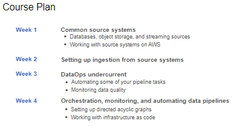
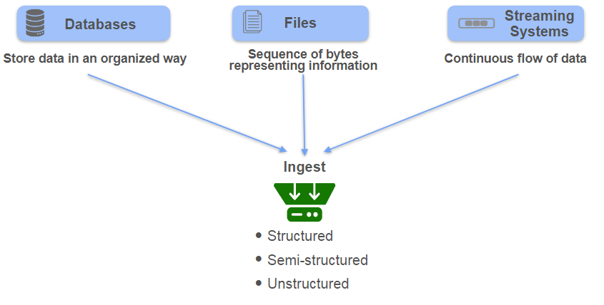
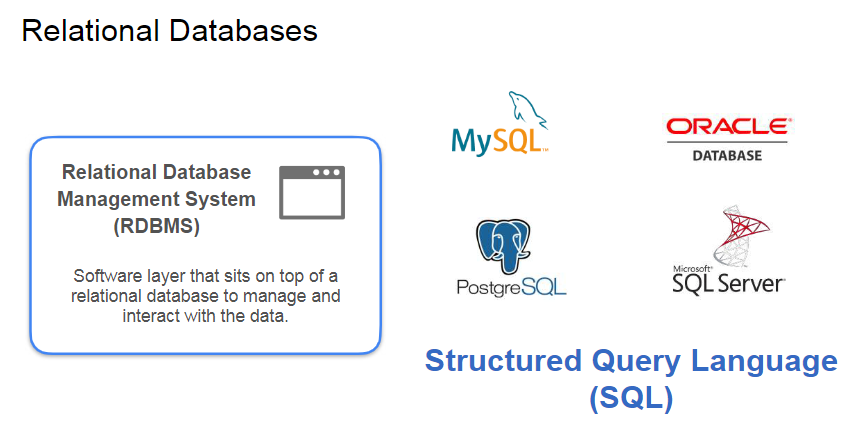
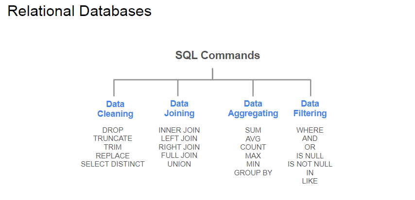
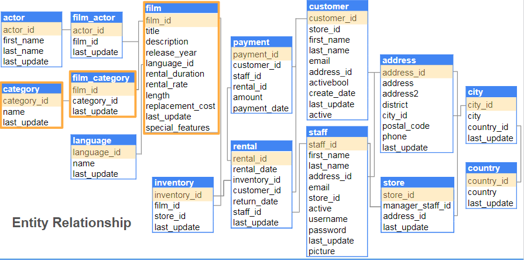
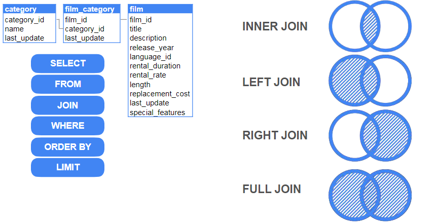
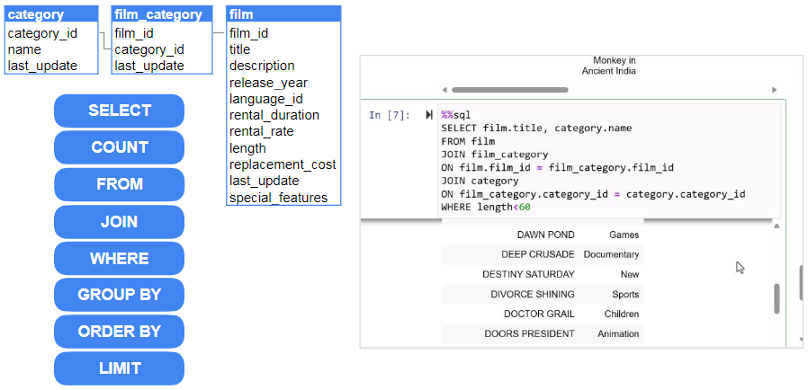

## Week1 - Introduction to source systems

### _Different Types of source systems_
* Types of data
1. Structured Data
2. Semistructured Data
    - JSON
    - Not in tabular but still has some structure.

Data Bases -

1. Relational Databases
2. Non Relational Databases. NoSQL

Files - 

1. Comman source systems for data ingestion.

Streaming Systems - 

1. Semi- Structured data
2. Continuous flow of data

|Databases|Files   |Streaming Systems|
|----|--------   |--------|
||    |

### _Relational Databases_

Normalised Relatetional databases provides high degree of integrity and reduced redundancy. But it can actually be slow to querying the data. 
Utlimately how you are storing the data depends on what are you trying to optimise for. 

OBT - One big table approach for everything for faster processing. 

Querying the data can be distributed into 4 stages:
1. Data Cleaning
2. Data Joining
3. Data Aggregating
4. Data Filtering

 

While dealing with relational databases you need to know :
1. What are the tables ?
2. How are they connected ?
3. What are the columns ?

This can be understool by looking at the entity relationship digram. Then you can start uerying the data.

Ex. Entity relationship Digram showing primary keys and foreign keys

 

Types of joins. By default ON is used for INNER JOIN
 

you can use other aggregated functions such as count after `SELECT` and create a column for it. Need to use GROUP BY for the same. 

