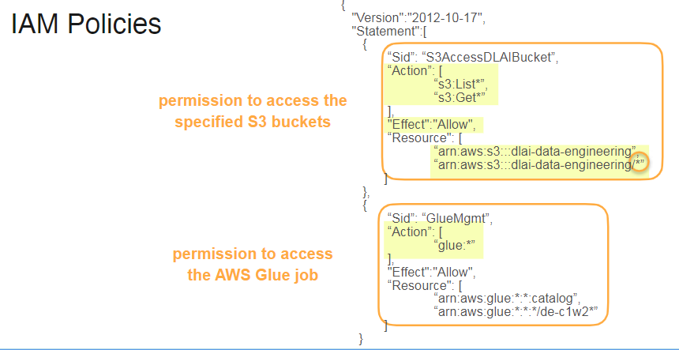

## Week1 - Introduction to source systems


### _Different Types of source systems_
* Types of data
1. Structured Data
2. Semistructured Data
    - JSON
    - Not in tabular but still has some structure.


Data Bases -

1. Relational Databases
2. Non Relational Databases. NoSQL

Files - 

1. Comman source systems for data ingestion.

Streaming Systems - 

1. Semi- Structured data
2. Continuous flow of data


|Databases|Files   |Streaming Systems|
|----|--------   |--------|
||    |


### _Relational Databases_

Normalised Relatetional databases provides high degree of integrity and reduced redundancy. But it can actually be slow to querying the data. 
Utlimately how you are storing the data depends on what are you trying to optimise for. 

OBT - One big table approach for everything for faster processing. 


Querying the data can be distributed into 4 stages:
1. Data Cleaning
2. Data Joining
3. Data Aggregating
4. Data Filtering

 

While dealing with relational databases you need to know :
1. What are the tables ?
2. How are they connected ?
3. What are the columns ?


This can be understood by looking at the entity relationship diagram. Then you can start querying the data.

Ex. Entity Relationship Diagram showing primary keys and foreign keys

 

Types of joins. By default, ON is used for INNER JOIN
 

You can use other aggregated functions such as COUNT after `SELECT` and create a column for it. Need to use GROUP BY for the same. 


### SQL LAB

* Before you start issuing SQL queries to the database, you need first to establish a connection to the MYSQL database. For that, you need information such as the database username, password, hostname (or address), port number and the database name.

**##** 3 - Create, Read, Update, and Delete (CRUD) Operations

CRUD stands for Create, Read, Update, and Delete, which are basic operations for manipulating data. When we talk about databases, we use `INSERT INTO`, `SELECT`, `UPDATE`, and `DELETE` statements respectively to refer to CRUD operations.

Refer SQL Practice notebook for more info.

### _NoSQL Databases_

No SQL databases were developed to overcome the limitations of relational databases. 


* NoSQL databases have horizontal scaling - can also be called as eventual scaling.
Meaning the data doesnt get updated to all the nodes - it happens eventually. This has adventage in speed and time. particularly useful for social media and not live streaming apps. 


NoSQL databases have special query language

```json
{ 
  "id": 1,  
  "key": "Blender",  
  "qty": 6, 
  "sku": “b32" 
}
```
Query

`db.products.find({qty: {$gt: 4}})`

Types of NoSQL Databases :
 | Key-Value Pair Databases                          | Document Databases                          |
 |--------------------------------------------------|---------------------------------------------|
 |      |  |
 | * Fast lookup - like user cache to store session & Flexible schema | Fixed schema                               |
 | No Join Support                                   | Support different Joins                     |
 | Use Cases - Content Management, user catalogs, sensor readings | Used long term data that has schema         |


* ACID Compliant databases


Follwoed by the lab  on Amazon DynamoDB


 

 

Data for the lab


lab uses boto3 which is amazon's SDK for python. - allows you to interact with python resources.

boto3 create client objects. allows you to make api requiest directly. 


**How will you create the tables?**

You will use the [DyanmoDB create_table()](https://boto3.amazonaws.com/v1/documentation/api/latest/reference/services/dynamodb/client/create_table.html) method. This method expects 3 required parameters:
* `TableName`: the name of the table.
* `KeySchema`: an array of the attributes that make up the primary key for a table. For each element in this array, you need to specify: `AttributeName`: the name of the attribute, and `KeyType`: the role that the key attribute will assume (`HASH` if it is a partition key and `RANGE` if it is a sort key). For example,
  ```
  'KeySchema'= [
      {'AttributeName': 'ForumName', 'KeyType': 'HASH'}, 
      {'AttributeName': 'Subject', 'KeyType': 'RANGE'}
  ]
  ```
* `AttributeDefinitions`: an array that describes the attributes that make up the primary key. For each element in this array, you need to specify `AttributeName` and `AttributeType`: the data type for the attribute (S: String, N: Number, B: Binary,...). For example, 
  ```
  'AttributeDefinitions': [
      {'AttributeName': 'ForumName', 'AttributeType': 'S'},
      {'AttributeName': 'Subject', 'AttributeType': 'S'}
  ]
  ```
There is an additional parameter that you can specify if you don't wish to pay for DynamoDB based on demand and you want to choose the provisioned mode:
* `ProvisionedThroughput`: a dictionary that specifies the read/write capacity (or throughput) for a specified table. It consists of two items:
  - `ReadCapacityUnits`: the maximum number of strongly consistent reads consumed per second;
  - `WriteCapacityUnits`: the maximum number of writes consumed per second. 
* Object Storages

Generally there is no hierarchy in the object storage. all the things are stored at the top level.
S3 provides the feature to see them in folder structure but they are all at teh top level. 

### Object storage

Generally doesnt offer file hierarchical system like a tradtional folder structure.

Object storage offers a uuid. Universal Unique Identifier. you can have multiple version of the same object pointing toward same uuid. This versioning will be part of metadata.

* stores semi-structure and structured data
* used for storing machine learning objects - serving data for machine learning models. 


* WHy use object storage ?

1.  Store files of various data formats without a specific file system structure
2.  Easily scales to massive size.
3.  Replicate data across several availability zones
4.  Cheaper than other storage options

- A bucket is a container for objects stored in Amazon S3.
- An object is a file and any metadata that describes that file. It has a unique identifier, also known as the object key. Object storage allows the storage of any object; you can store not only structured but also unstructured and semi-structured data.


### Logs and Streaming systems

* Logs are more like a exhause of a system. It includes metadata about data creation. 
* They are a rich source of information just more than monitoring a health of a system.

 

 Those changes in database can be used to trigger the ingestion process. 
 - Can be used for anamoly detection.
 - It can be used for automation too. 
 
 


 ## Connecting to Source Systems


 ### Basics of IAM and permissions

 

 **IAM Definition**

 It is a framework for managing permissions. Permissions define which actions an identity can perform on a specific set of resources.

 Principle of least privilege is applied using this framework. 

 * Basics of IAM Components
 
 
 
 

 Example of IAM Policies :

 

 Resources for understanding IAM management;

 * [AWS user Guide](https://docs.aws.amazon.com/IAM/latest/UserGuide/access.html)


**What is an IAM user?**
When you create an account on AWS, you begin with the “root user” identity, which has full access to all AWS resources and services in the account. It is strongly recommended that you don’t perform daily operations using this account. Instead, create an admin user for everyday tasks. Whether you’re the root or admin user, you can create other users in your account to allow people in your organization to access AWS resources.

IAM users are created under your AWS account, so you don't need separate accounts for IAM users. Each user could be a person or service that interacts with AWS resources. When you create a user, you define what resources the IAM user can access, and what actions they can perform. AWS will then generate a set of credentials for that user. The credentials could be a username and password for accessing the AWS management console, or they it be an access keys for programmatic access to AWS resources. IAM user credentials are long-term credentials as they stay with the user until the admin rotates them. When you provide users with their own login credentials, you help prevent the sharing of credentials. You can add more users to your account, and all user activities are billed to your account.

By default, a new user does not have any permission to access any AWS resources. You can grant them access to AWS resources by attaching policies to them. A policy specifies what actions are allowed or denied for a given resource (read only, write only, full access). A policy can be attached to multiple users, and a user can have multiple policies. You can choose AWS-managed policies or create your own custom policies. Whenever a user makes a request, AWS evaluates their policies to determine if that request is allowed.


**What is an IAM group?**

Now, what if you want to grant the same permissions to more than one user, maybe a team of data scientists who want to access the same resources with the same level of permissions? You could attach the same policy to each user, but it might be hard to manage as the team grows. In this case, you can create an IAM group, which is a collection of users, and then attach the policy to the group rather than individual users. Each user in the group inherits the group's permissions. Think of the IAM group as a way to organize permissions. Here are some features of IAM groups: 

* Groups can have multiple users
* A user can belong to no group, one group, or multiple groups (up to 10 groups)

* Groups cannot be nested


**What is an IAM role?**

The third IAM identity is a role. An IAM role has specific permissions with short-term credentials. Roles can be assumed by entities, like people, applications, or trusted AWS resources. IAM roles don't have long-term credentials. Instead, they provide temporary security credentials for the duration of the role session. You first create an IAM role and attach a policy to it. Then you specify which resource can assume this role. This temporarily grants permissions to AWS resources.

Example 1: Let’s say you run a code on an EC2 instance that needs to read from S3. By default, the EC2 instance does not have permission to read from S3. You can transfer your credentials to EC2, but this is not secure. A better approach is to create a role, attach the required policy to read from S3, and allow the EC2 instance to assume this role. 

Example 2: Let’s say you run a Glue ETL job and want it to write the ingested and transformed data to S3. You can create a role with permissions to write to S3, then allow Glue ETL to assume this role.

```json
{
  "Version":"2012-10-17",
  "Statement":[
    {
      "Effect": "Allow",
      "Action" : [
        "s3:*",
        "s3-object-lambda:*"
      ]
      "Resources": "*"
    }
  ]
}
```

* Version – Specify the version of the policy language that you want to use.

* Statement – Use this element as a container for the details of some given permissions or denials. You can include more than one statement in a policy. If a policy includes multiple statements, AWS applies a logical OR across the statements when evaluating them.

  * Sid (Optional) – Include a statement ID to differentiate between your statements.

  * Effect – Use Allow or Deny to indicate whether the policy allows or denies access.

  * Action – Include a list of actions the policy allows or denies. In this example, the allowed actions on S3 are “*”, meaning all read and write actions on s3 are allowed).

  * Resource – An object or a list of objects to which the actions apply. For example, in the case of S3, you can specify which bucket is allowed or denied access. In this example, the resource element is "*", meaning all resources.


Here’s another example of a policy that allows read and write access to all S3 buckets, except the bucket “confidential”, where deletion is denied.
  