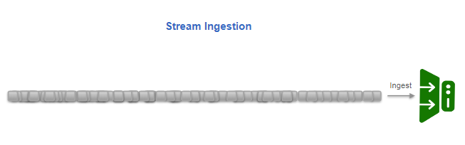
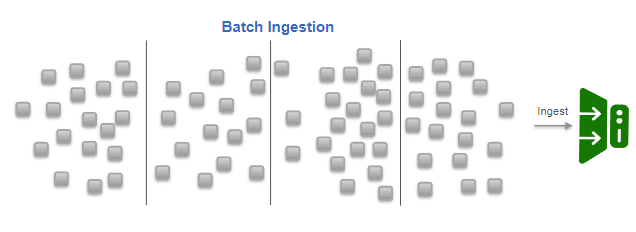
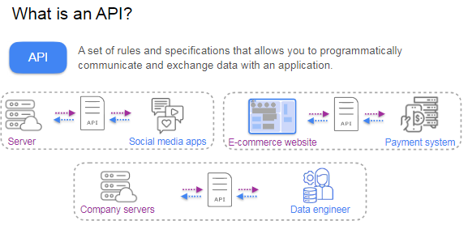
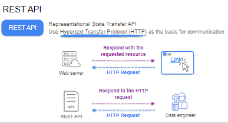
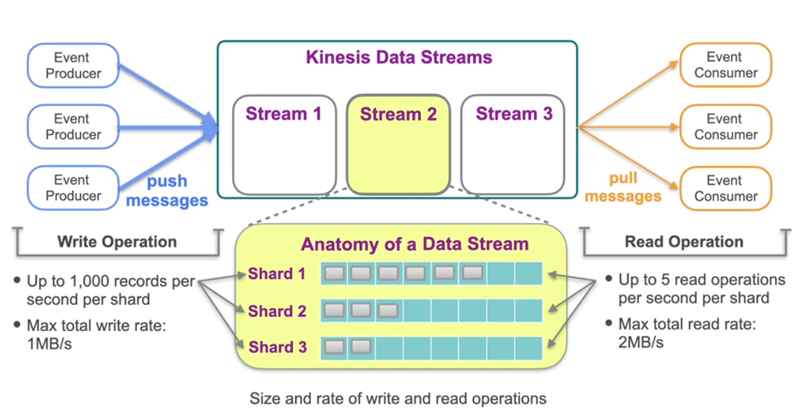
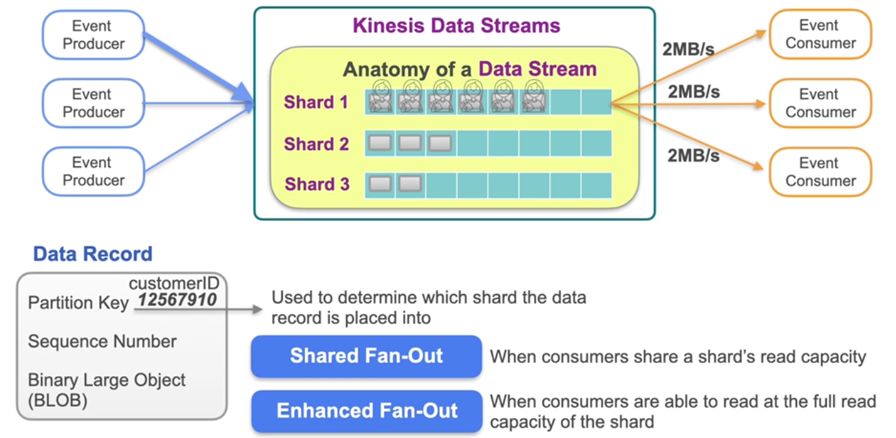
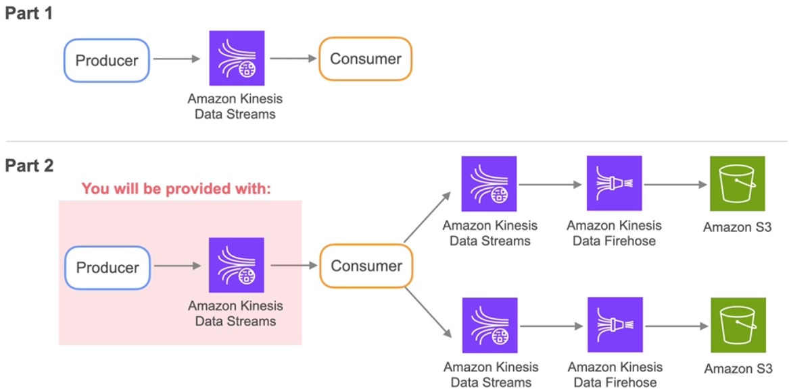
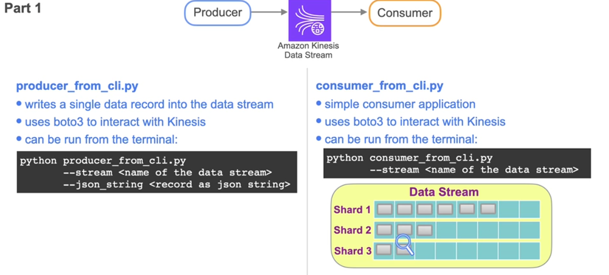
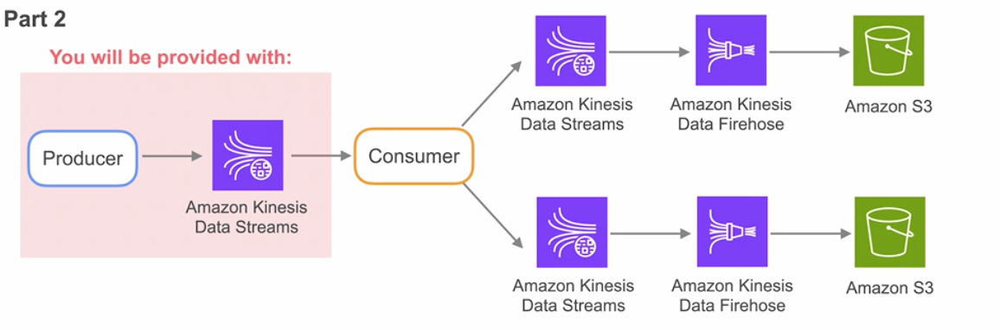

## Batch Ingestion
### Understanding stakeholder requirements - conversation with Marketing analyst. 

- Learn what actions your stakeholder plan to take with the data.
- Watn to pull some external data to see what music people are listening to. 
  - Spotify has public API. 

  Ask for a follow up conversation.  studying the regional trend for the music. Ingest teh data from the API.

### ETL vs ELT

 

**1. Project Goals and Data Ingestion**
- The marketing analysts are primarily interested in historical trends, with potential future needs for current data analysis.
- Data will be sourced from a third-party API, which limits ingestion to a batch process due to the constraints on API calls.
- The focus is on understanding the trade-offs between ETL and ELT for effective data ingestion.

**2. Overview of ETL and ELT**

_**ETL**_ 
- **Definition**: The original batch ingestion pattern that extracts raw data, transforms it in a staging area, and then loads it into a target storage destination (e.g., a data warehouse).
- **Historical Context**: Gained popularity in the 1980s and 1990s when storage and computing resources were limited. Organizations had to carefully plan data ingestion to maximize efficiency.
- **Process**:
  1. **Extract**: Retrieve data from source systems via direct database queries or API calls.
  2. **Transform**: Process data in an intermediate staging area.
  3. **Load**: Store transformed data in a target system.
- **Challenges**: Complex joins and heavy queries were difficult due to storage limitations.

_**ELT (Extract, Load, Transform)**_
- **Definition**: A more modern approach that extracts raw data and loads it directly into a target system without initial transformations.
- **Emergence**: Gained traction in the early 2010s with the advent of scalable cloud storage and data lakes.
- **Process**:
  1. **Extract**: Retrieve raw data from source systems.
  2. **Load**: Store data directly into the target database or data warehouse.
  3. **Transform**: Apply transformations post-load, allowing for more flexibility.
- **Benefits**:
  - Faster implementation due to less upfront planning.
  - Quick availability of raw data for analysis.
  - Preservation of all data for future transformations, reducing the risk of losing information.

**3. Potential Drawbacks of ELT**
- **Risk of Data Swamps**: Without careful planning, organizations may accumulate vast amounts of unorganized and unmanageable raw data, leading to inefficiencies and confusion.
- **Data Management**: both ETL and ELT require a clear understanding of end goals and a well-managed data strategy to avoid pitfalls like data swamps.

**Key Takeaways**
- Understand the differences between ETL and ELT, including their historical context, benefits, and drawbacks.
- Consider the specific needs of your data project when choosing an ingestion method, with a focus on flexibility and data management.
- Always establish clear goals for data use and ensure proper data governance to prevent issues like data swamps.

### Rest API's

- Jeff Bezos to emploees. to use api to offer data and services. 

REST API - Representational State Transfer API

Uses HTTP as the basis for the communication. 

### Lab 1 - Batch Processing to Get Data from an API

performed get request action using spotify api.

It taught what pagination is. What parameters are.
repeat the lab to solidify the understanding.

## Streaming Ingestion

2 modalities of streaming :
  1. Message queues - Buffer to deliver the messages asynchronously.
    * FIFo and message gets deleted once processed from teh queue. 
  2. Event Streaming Platform
    * Append only persisten losin
    * not deleted from the log so can be replay or reprocess teh events in the log. 

Apapche Kafka : 
   - This is an opens source event streaming platform.
  - message streams form teh event producer are routed to what are called as topics. 
    - its the job of the producer to send the topics to required topic. 

  

Partions above is based on Round robin strategy or Messagekey. Now the consumers are grouped and they are subscribed to a particular topic. And each partiction that is present can only be assigned to single event consumer from the group. 

you can keep the database monitored by using strategy known as Continuouse Change data capture. or Continuouse CDC. Ideas is to ingest changes into your data pipeline to ensure that the data in the pipeline is synchronised with teh data updates in the source. 

**Kinessis Streaming Details**

How many shrad are reauited depends upon the write and read rquirements of your system. Image shows teh limits of read and write operations.
 
 
add kinesis data streams

Add continuous CDC info here. 

 LAB details
 

  
 