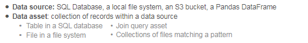

### Data Observability

* Monitoring Data Quality

### Conversation with Bar Moses

Data issues are inevitable and they could occur at any stage of your data pipeline. The earlier you are able to detect them, the less damage to the organization it will cause. To detect data issues, you need to first choose metrics that assess the data quality, similarly to how software teams monitor metrics that assess the health of their software's infrastructure.

**In her book (
Data Quality Fundamentals
), Barr Moses suggests to start with the following questions:**

* Is the data up-to-date?

* Is the data complete?

* Are fields within expected ranges?

* Is the null rate higher or lower than it should be?

* Has the schema changed?

She formulated these questions into 5 pillars for data observability, which aim to fully describe the state of the data. 

**Barr Moses 5 Pillars**

1. _Distribution/ Internal Quality:_ The quality pillar refers to the internal characteristics of the data, and checks metrics such as the percentage of NULL elements, percentage of unique elements, summary statistics and if your data is within the expected range. It helps you ensure that your data is trusted based on your data expectation.

2. _Freshness_: Data freshness refers to how “fresh” or “up-to-date” the data is within the final asset (table, BI report), i.e., when the data was last updated, and how frequently it is updated. Stale data results in wasted time and money.

3. _Volume_: Data volume refers to checking the amount of data ingested and looking for unexpected spikes or drops. Sudden drops in data volume can indicate issues like lost data or system outages, and sudden increases may indicate unexpected surges in usage.

4. _Lineage_: According to 
Barr
, “When data breaks, the first question is always “where?” Data lineage helps you trace the data journey from its source to its destination, visualizing how data was transformed and where it was stored. This way, you can identify the source of errors or anomalies.  

5. _Schema_: Data schema refers to monitoring changes in data structure or types. This pillar helps avoid the failure of the data pipeline.

### Monitoring the Data Quality

- **Importance of Data Observability**: Emphasizes the necessity of monitoring data pipelines to ensure data quality and reliability.

- **Identify Key Metrics**: Focus on monitoring the most critical aspects of the data, as determined by stakeholder needs, to avoid alert fatigue and ensure important issues are not overlooked.

- **Example Metrics**: Consider tracking data freshness, accuracy, and completeness, based on the specific project requirements.

- **Stakeholder Priorities**: Understand what stakeholders value most, such as data being current or accurate sales revenue figures, and prioritize monitoring those aspects.

- **Communication with Source System Owners**: Highlight the importance of understanding and anticipating changes in data sources by maintaining good communication with system owners.

- **Data Consistency Checks**: Implement checks for data schema and type consistency to catch potential issues early in the pipeline.

### Great Expectations - Core components.

 
 
 
 
 
