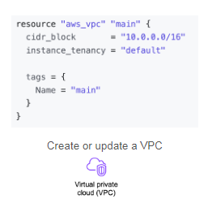

## Learning Objectives
* Explain how the DevOps automation concepts such as Continuous Integration Continuous * * Delivery (CI/CD) are applied within DataOps
* Define Infrastructure as Code and how it relates to the automation pillar of DataOps
* Use Terraform to provision AWS resources
Differentiate between DevOps observability and DataOps observability
* Apply data quality tests using Great Expectations
* Identify and monitor relevant data quality metrics

### Skills Learned

* Infrastructure as a Code
* Terraform
* DataOps and Data Monitoring/ Observability.

### Overview 
Talks about How DataOps is evolved from DevOps and similar principle like creating high quality software products. Instead Data Ops talks about high qaulity data products & its set of practices and culture around. 

* Three pillars of DataOps
    1. Automation
    2. Observability and Monitoring
    3. Incident reposne - not covered because this being a onilne course and centers around the culture and habits. 

### Interview with Chris bergh

Chris Bergh, CEO of Data Kitchen, discusses the evolution of DataOps from DevOps, emphasizing the importance of delivering high-quality data products. He shares his experience managing data teams and the challenges faced in ensuring quick and reliable data delivery. Key points include:
- The need for a systematic approach to data engineering to avoid burnout and improve efficiency.
- The importance of testing and validation to maintain code quality and reduce long-term maintenance.
- Drawing parallels between data operations and manufacturing processes, highlighting the need for flexibility and customer focus.
- The concept of DataOps as a method to deliver trusted insights quickly and with low risk.

- **Manufacturing Line Analogy**: Chris compares data operations to a manufacturing line, where each step (data ingestion, processing, modeling, visualization) is like a station in a factory. The goal is to produce high-quality outputs (insights) efficiently, similar to how Toyota produces cars.
- **Hero Mode**: Chris talks about the temptation for data engineers to go into "hero mode," where they try to solve all problems quickly and single-handedly. He advises against this, suggesting that building a robust system with proper testing and validation is more sustainable. He mentions that being a hero might feel rewarding initially, but it leads to burnout and the need for a therapist.  Instead, focus on creating systems that minimize the need for heroics. One lesson of DataOps is to be a hero maybe 2-3% of the time, but the rest of the time, build a system so you don't have to be a hero. data engineers should create systems with proper testing, validation, and automation to ensure long-term sustainability and efficiency.
- **Customer Focus**: Drawing inspiration from Toyota's customer-centric approach, Chris emphasizes the importance of focusing on customer needs and iterating quickly based on feedback to deliver valuable insights.

"DevOps - How do you get nerdy people to be productive ? "

### Additional Insights from Chris Bergh

- **DataOps Manifesto**: Chris created the DataOps manifesto to explain the concept. He wrote the first version on a plane and received feedback from peers. The manifesto and related resources, including a free certification, are available on their website.
- **Training New Engineers**: Chris emphasizes the importance of enabling new team members to quickly identify and fix problems. He states, "What do you want to do with that person in their first two weeks? I think a good organization says, number 1, if something goes wrong, they should be able to find the source of the problem. Is it data? Is it the integrated data? Is it the model? Is it the Iz? Where's the problem? Or number 2, like, could they write some small could they tweak something like anything? Fix a bug, and get that into production quickly."
- **Comparison with DevOps**: Chris explains that DataOps and DevOps share similar principles, such as delivering work in small, manageable chunks and focusing on automation and observability. He says, "The main idea that's similar between DevOps and DataOps is, if your customer asks you for 10 things, and it's going to take you three months, deliver one of those things in a week."
- **Building Systems**: Chris highlights the importance of building robust systems around data engineering tasks. This includes creating validation tests, managing environments, and ensuring deployment speed. He mentions, "You have to build the thing next to your environment. You have to build the manufacturing line. You have to build the machine that makes the machine."
- **Advice to Younger Self**: Chris advises against relying on hope and heroism. He states, "Hope and heroism is like number 1, what I said before, don't be a hero. You're not doing yourself any favors. And then the second part is, don't hope that things will work. Like, just don't maybe it sounds paranoid, but don't trust your data providers, don't trust your servers. Measure and prove that things work." YOu should build system around that instead of being a hero. 

### DataOps Automation

- There are a lot of concepts that DataOps borrows from DevOps. 

* DevOps CICD Pipeline 

* DataOps Automation

When it come to running the actual data pipeline - You apply dataops principles in multiple ways.
1. CICD at multiple location in your pipeline.
2. No Automation : Running things manually
3. Running things purely on schedule.
Or 
4. Using A directed acyclic graph (DAG)

Most important thing avout the having in CICD piepline is the Version Control. Is to track changes in teh code.

So that you can quickly revert back to previous version of working code in case new changes bring about a failure. Meliorating the Data Pipeline through the Version control. 
Version control of the data and code.

another concept that it imports is : **Infrastructure as Code**

For these reasons DadtaOps closely relates or associates with Software engineering. And is one of the undercurrents of dataEngineering.

### Infrastructure as a code

Iac has its roots connected to early 70's of configuration managements. They were done with the help of BASH scrpts. It was done to drive the challanges of configuration of physical machines. 

Engineers developed tools such as Terraform, AWS cloud formation and ANSIBLE - as an answer to configuration of resources on cloud. Infrastructure on cloud. 

Terraform scripts are written with the help of HCL language or HashiCorp Configuration Language.
This is a domain specific language created by HCL. 

* HCL is delclarative Language. Meaning you define the desired state of your infrastructure - these tools will figure out how to do that. It is not imperative - meaning you dont have implement step by step guide on how to do that. 

*  It is highly idempotent. This means that applying the same configuration multiple times will not change the outcome after the first application if the infrastructure already matches the desired state. This helps prevent unintentional changes and ensures consistency.

    Basically imperative approach - you need provide how to achieve the desired state and in declarative approach you define your end state and TERRAFORM will figure out the how to achiece that. 

* Lack of Idempotency: Imperative systems typically lack idempotency. Running the same script multiple times can lead to different outcomes, such as duplicating resources or reapplying configurations unnecessarily.

| Create or Update a VPC | Create or Update a VPC | Provision a GCP instance |
|----------|----------|----------|
|          |          |            |

### Terraform - Creating an EC2 instance

Generally following steps are taken when creating and using terraform file.

 

Thera are can be 5 sections to your `main.tf`. Terraform will read the required file properly with required .tf extension.

* Terraform Settings: This section includes settings for Terraform itself, such as specifying the required version of Terraform.

* Providers: Here, you define the providers that Terraform will use to create and manage resources. Providers are plugins that allow Terraform to interact with cloud platforms and other services.

    "A provider is described as a plugin file or a binary file that Terraform needs to install in order to interact with external resources. Providers are essential for Terraform to communicate with cloud platforms and other services."

* Resources: In this section, you define all the resources you want to set up. Each resource block specifies the type of resource and its configuration.

* Input Variables (Optional): This section allows you to define input variables that can be used to customize the configuration. Input variables provide flexibility and reusability of configuration files by allowing you to pass different values.

* Output Values (Optional): This section is used to define output values that can be used to display information about your resources after they have been created. Output values can help you easily access resource attributes.

For Ex. 2 required arguments are AMI and instance type. 

**Steps to launch resouce through tf** 
1. Write Configuration Files
   - Define resources in `.tf` files

2. Initialize Terraform Workspace
   - Run `terraform init`

3. Install Providers
   - Terraform installs necessary plugins

4. Create Execution Plan
   - Run `terraform plan`
   - Review proposed actions

5. Approve Plan
   - Confirm actions to be taken

6. Apply Plan and Provision Infrastructure
   - Run `terraform apply`
   - Terraform provisions the resources

* You can use input variables to avoid using hardcoded names for provides, resouces and resouces varaibles. You can just call `var.var_name` for using it.

Terraform will ask the names of variables if they have not been provide in default - while creating those. Or you can `tfvars` file to define them separately. Or you can provid them in them argument of terraform `apply` method. 

* Now each resource has attributes that can be used somewhere else for creating ohter rseources eg ip address of that resources etc. You can do so using output variables. `resource_type.resource_name.attribute` to access the the attribute.

    You can use `terraform output` to get the outputs. in cli. 

* what if scenriao of multiple resouces. 

**File Organization**: To manage complexity, separate different parts of the configuration into multiple .tf files:

* `variables.tf` for input variables
* `providers.tf` for provider settings
* `outputs.tf` for output values
* `main.tf` for resource definitions
Terraform Behavior: Terraform automatically combines all .tf files in a directory as if they were one, allowing you to modularize and organize your configuration files without affecting functionality.

### Terraform - Defining Variables and Outputs

1. **Data Sources**: Using data blocks to reference resources created outside of Terraform or in another workspace.

Example to launch the Ec2 inside the subnet that is created in another terraform scrpt. 

2. **Modules**: Organizing resources into reusable subdirectories and managing them with module blocks. Its like a regular root directory. 

Example Tutorial :

Add images of example 

### LAB 1 :

Terraform will concatenate all tehse files together.
Providers.tf contains other providers who are utility providers such as for passwrd generation. which is random utility.

psql -h de-c2w3lab1-db.cpqiucgiud0s.us-east-1.rds.amazonaws.com -U postgres_admin -p 5432 -d postgres --password

ssh -i de-c2w3lab1-bastion-host-key.pem -L 5432:de-c2w3lab1-db.cpqiucgiud0s.us-east-1.rds.amazonaws.com:5432 ec2-user@ec2-3-81-229-28.compute-1.amazonaws.com -N -f