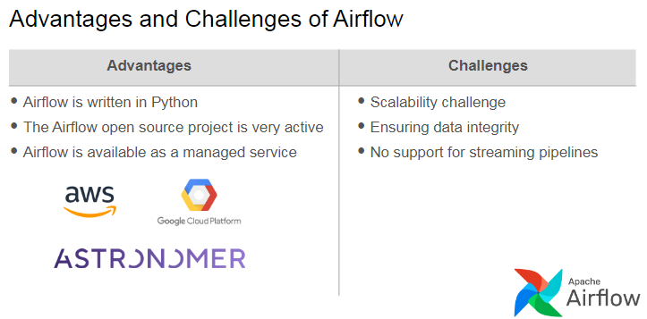

Learn all about orchestrating your data pipeline tasks. You'll identify the various orchestration tools, but will focus on Airflow -- one of the most popular and widely used tools in the field today. You'll explore the core components of Airflow, the Airflow UI, and how to create and manage DAGs using various Airflow features.

## Learning Objective 
* Explain how orchestration can be applied to a data pipeline and list its benefits
* List and interact with the core components of Airflow
* Build data pipelines with DAGs in Airflow using features such as Taskflow API, operators, XCom, variables, etc.
* Apply the best practices in building DAGs in Airflow
* Integrate data quality testing using Great Expectations in an orchestrated pipeline in Airflow

### Before Orchestration

Use of Cron in earlier days was for simple tasks. It was basically pure scheduling. Modern day complex data pipelines will be difficult with cron. Hence the development of orchetration tools.

* How CRON works ?

Example of Modern pipeline using CRON - has lot of issues with it.

When to use CRON ?

* To schedule simple and repetitive tasks.
* In the prototype phase.

### Evolution of orchestration Tools

MOst widely used orchestration tool now days is AirFlow, developed by airbnb for their needs internally. 

Other orchestration tools are PREFECT, dagster and MAGE.

### Orchestration Basics

With orchestration there are a few cons as well, mainly being More operational overhead than simple con scheduling. BUt with pros it makes more sense to use these orchestration tools. THese are :
* Set up dependencies. - start the other when earlier ends. 
* Monitor alerts
* Get alterts
* Create fallback plans.

**Directed Acyclic Graph (DAG)** - Orchestration tools create somethings known as DAG. Data only flows in one direction and there are no cycles in the pipeline. Hence Directed Acyclics. It is called Graph because every step in the pipeline can be considered as node and edge being the direction of flow of data from on step to other. This sort of visual representation is known as _Directed Acyclic Graph_. 

**How is this done in airflow** : (what services airflow offeres.)

 

Triggers to run the DAG - 
1. Trigger based on the Schedule
2. Trigger based on an event - Eg. When dataset is updated.
3. Trigger a portion of the DAG based on an event

We can have data quality checks in the live pipeline with the orchestration flow. Such as follow

### Airflow - Core Components

Ofall the compoenents of the Airflow, User only interacts with `DAG Directory` and `User Interface` also called as UI. UI is used for moniotring the DAG workflows when they start. 

Certainly! Here's a summary focusing on the key components of Apache Airflow and their functions:

---

The video introduces Apache Airflow, emphasizing its architecture and how its components work together to manage and execute Directed Acyclic Graphs (DAGs). The main components of Airflow include:

1. **DAG Directory**: A folder where Python scripts defining DAGs are stored. Adding a DAG here automatically makes it visible in the Airflow User Interface (UI).

2. **Web Server**: Hosts the Airflow UI, allowing users to visualize, monitor, trigger, and troubleshoot DAGs and their tasks.

3. **Scheduler**: Monitors DAGs in the DAG directory, checking every minute to determine if any tasks should be triggered based on schedules or dependencies. It queues tasks ready for execution.

4. **Executor**: Part of the scheduler, it manages task execution by sending tasks from the queue to workers.

5. **Workers**: Execute the tasks. The status of tasks transitions from scheduled to queued, then running, and finally to success or failure.

6. **Metadata Database**: Stores the state and status of DAGs and tasks. The web server retrieves this data to display in the UI.

For those using managed Airflow services like `Amazon Managed Workflows for Apache Airflow (MWAA)`, these components are automatically set up in the cloud. For instance, `Amazon MWAA` uses an S3 bucket as the DAG directory and Aurora PostgreSQL as the metadata database, with additional AWS services for security and monitoring.

Here is the schematic showing the Airflow Components :

 
 

Here is Amazon managed workflow for Apache workflow
