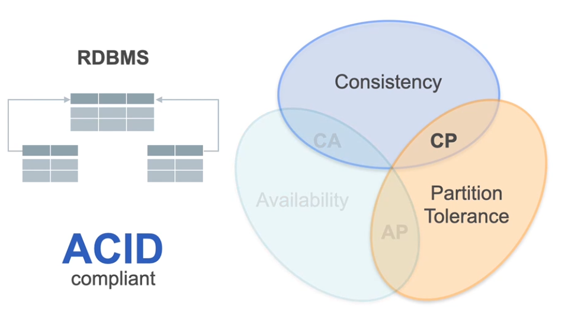

## Storage Deep Dives

**Learning Objectives**
* Explain how data is physically stored on disk and in memory
* Compare how data is stored and queried in object, block, and file storage systems
* Explain how data is stored in row-oriented vs column-oriented databases
* Explain how graph and vector databases store and retrieve data

### Data Storage Deep Dive

**Overview of the content**


Week 2 will talk about how to choose storage abstractions for the usecase. 
Week 3 talks about 
* How Queries work
* How different storage solutions 
affect query performance 
* Techniques for improving query 
performance


**Physical Components of Data Storage**


**Processes required for Data Storage**

* Serialization

Data structure when required for memory is often complex and is optmised for quick access and manipulation.
But when comes to storing it on disk storage, it requires simpler and standardised format. This serialization takes care tranforming data. Deserlzation is done again memory manipulation. Digram below shows it. 


Here are the serialization formats that are generally used in the industry.


Decisions you take as data engineer on serilization format can severy impact your query performance. In a good and bad way. 
Eg. Just by moving from csv to parquet - team could enhance the performance of their data system by a factor of 100. 

* Compression

Once the data volume grows even after serlization, it can slow the movement of data on network. There comes the idea of compression. COmpressing the data to transport it fast and efficient manner over the network. Here is digram depiciting it. 


**Compression Algorithms**

CA's used in Column-Based Formats

* _Run Lengthe Encoding_ : It Compresses run of the same value in a column in more compact representation. Each run is replaced with a tuple that has the following format (value, Start position, runLenght)

    ```
    For example, here's the product sku column data from the table mentioned earlier:

    34 34 34 63 32 32 32 67 67 67

    With RLE, you'll get this result: 

    (34, 1, 3), (63, 4, 1,), (32, 5, 3), (67, 8, 3)
    ```

* _Bit-Vector Encoding (or bitmap encoding)_ : Each distinct value is associated with sequence of bits where in the length of the sequence is equal to number of rows in that column. 

    ```
    For example, here's the product sku column data again:

    34 34 34 63 32 32 32 67 67 67

    With this algorithm, this data would be represented by four sequences of ten bits (i.e. the number of rows):

    bit-string for value 34: 1110000000

    bit-string for value 63: 0001000000

    bit-string for value 32: 0000111000

    bit-string for value 67: 0000000111
    ```
**CLoud Storage Options**


**Storage Tiers**


**Distributed Storage Systems**

Distributed storage is the default way to store the data in the cloud whatmay be the format of the storage. File, Block or Object.In a distributed storage system, you distribute and replicate data across multiple servers known as nodes that are connected by a network. 


Having DS storage system allows you to have horizontal scaling instead of verrical scaling where you increas the size of the machine. 
This also allows you to have higher Fault tolerance and data durability and High Availibility. 

In terms of performance DS Storgage system divide large processing task into smaller sub task as shown below. 


There are two way to disturte the data :
Replication and partitioning. 


CAP Theorem :

| Consistecy | Partition Tolerance | Availibility |
|------------|---------------------|--------------|
|  | ||


 


Example of strong consistency mean read only after write has been completed. In Eventual consistecy you can use read replicas of the database - which might not uptodate. Hence there could be incosistecny between data present in Main Data base and read replicas. ReadReplicas follow eventual consistency and Main Database follows Strong consistency. 


**Database Partitioning/Sharding Methods**

* Range-based sharding
* Hashed sharding 
* Geo Sharding

In conclusion, the choice between object, file, memory, and block storage hinges on weighing their respective advantages and disadvantages to best suit the needs of Data Engineering projects:

- Object storage shines with its scalability, cost-effectiveness, and simplicity, making it ideal for scenarios requiring vast amounts of unstructured data such as backups, archives, and content delivery networks.
- File storage offers ease of access and organization, making it suitable for shared file systems and applications reliant on hierarchical data structures like file servers.
- Memory storage, with its lightning-fast access speeds, is indispensable for real-time data processing and caching tasks, particularly in-memory databases and high-performance computing environments.
- Block storage, providing direct access to data blocks, excels in performance-critical applications such as databases, virtualization platforms, and enterprise storage systems.

Data Engineers must carefully assess the specific requirements of their projects to determine the most suitable storage solution, leveraging the unique strengths of each type to optimize performance, scalability, and cost efficiency.


## Storage in Databases

Column-oriented storage is suitable for analytical workloads where you want to apply aggregating operations on columns. But it is not suitable for reading or writing/updating rows. On the other hand, row-oriented storage is suitable for transactional workloads that require read and write to be performed with low latency. But it is not suitable for efficient analytical workloads.

Parquet and ORC (optimized row columnar) are  file formats that combine both approaches by following a hybrid approach that tries to get the best from both worlds. The hybrid approach relies on partitioning rows into groups where each row group is stored in a column-wise format.


**A bit more detail about Parquet**

With a Parquet file, the data is horizontally partitioned into row groups, where each row group has a default size of 128 megabytes.  A row group consists of a column chunk for each column in the dataset. Each column chunk is divided up into pages, where each page contains the encoded values for that column chunk, metadata like the minimum, maximum and count of the values, along with other data (repetition and definition levels) used to reconstruct the nested structure of the data. Parquet can be used to store tabular data as well as nested (i.e., semi-structured data like json) data. 


Learn about different storage options
such as wide column format,
parquet format that is explained above.

OLTP system which are transaction based system generaally use row-based storages. 
and How OLAP system which are generally used for analytical works use column based storages. 

Read more about Hierarchial Navigable Small world (HNSW) - explaination thre dont make much sense. 


### Graph Database 

**Basic Operations with Graph Database**


A node is used to capture a data item, usually an entity, like a customer, an order, a product, etc.

- `()`:  This represents a *node*. You did not specify a specific type of node or any properties of that node. It's not relevant to the query.
- `(n)`:  This represents a *node* referred to by the variable **n**. You can refer to this variable in other parts of your query.
- `(n:Airport)`: Nodes can have different types (i.e. they can belong to different classes/categories). You can add a *label* to your node to specify its type. Here you are assigning the variable **n** the nodes with the type **Airport**.
- `(n:Airport {code: 'BOS', desc: 'Boston Logan'})`: A node can have properties, which you can specify with `{}`. Here you are assigning the variable **n** the nodes of type **Airport** that have specific values for the **code** and **desc** properties.
- `n.code`: You can access a specific property using this syntax, in this case, the **code** from the node denoted by **n**.


#### Relationships/Edges

A relationship or edge is used to describe a connection between two nodes.

- `[r]`: This represents a *relationship* referred to by the variable **r**. You can refer to this variable in other parts of your query. 
- `[r:Route]`: Relationships can have different types (i.e. they can belong to different classes/categories). You can add a *label* to your *relationship* to specify its type. Here you are assigning the variable **r** the relationships with the type **Route**.
- `[:Route]`: A *relationship* with the *label* **Route** not referred to by any variable.
- `[r:Route {dist:809}]`: Relationships can have properties, which you can specify with `{}`. Here you are assigning the variable **r** the *relationships* of type **Route** that have specific values for the **dist** property.
- `[r:Route*..4]`: This syntax is used to match a pattern where the relationship **r** with the label **route** can be repeated between 1 to 4 times. In other words, it matches paths where the **route** relationship occurs consecutively at least once and at most four times.

#### Paths
A path is used to capture the graph structure.

- `(a:Airport)-[:Route]-(b:Airport)`: This represents a *path* that describes that node **a** and node **b** are connected by a **Route** relationship.
- `(a:Airport)-[:Route]->(b:Airport)`: A path can be directed. In this case, this represents a path that describes a directed relationship from node **a** to node **b**, but not the other way around. 
- `(a:Airport)<-[:Route]-(b:Airport)`: A path that describes a directed relationship from node **b** to node **a**, but not the other way around. 
- `(a:Airport)-[:Route]-(b:Airport)-[:Route]-(c:Airport)`: A path can chain multiple relationships and any of them can be directional.

#### Pattern Matching Syntax

In the following table you can find the characters that represent each component in the Cypher language:

|   Cypher Pattern|Description|
|:--|:--|
|`( )`|A node|
|`[ ]`|An edge|
|`-->`|Follow outgoing edges from a node|
|`<--`|Follow incoming edges to a node|
|`--`|Follow edges in either direction|
|`-[]->`|Include the outgoing edges in the query (for example, to check a label or property)|
|`<-[]-`|Include the incoming edges in the query (for example, to check a label or property)|
|`-[]-` |Include edges in either direction in the query|
|`-[]->( )`|The node on the other end of an outgoing edge|
|`<-[]-()`|The node on the other end of an incoming edge|


### 2.5 - Filtering Statements

**Match nodes with a `WHERE` clause**: The `WHERE` statement is used to filter the results based on conditions. It allows you to specify conditions that nodes, relationships, or properties must meet to be included in the result. The syntax looks like

```cypher
MATCH <PATTERN>
WHERE <NODE-OR-RELATION>.<PROPERTY> = <VALUE>
RETURN <PATTERN>
```

### 2.6 - Create Statements
The `CREATE` statement is used to create new nodes and relationships in the graph. It allows you to specify the structure and properties of the new elements. To create a new node with some properties and return the node you can use a syntax like:

```cypher
CREATE (<VARIABLE>:<LABEL> {<PROPERTY> : <VALUE>, ..., <PROPERTY> : <VALUE>})
RETURN <VARIABLE>
```

To create a new relationship between the nodes, you can use `MATCH` statement to search the nodes you want to join according to a property and then the `CREATE` statement to introduce the relationship, such as:

```cypher
MATCH (<NODE1>:<TYPE> {<PROPERTY>: <VALUE>}), (<NODE2>:<TYPE> {<PROPERTY>: <VALUE2>})
CREATE (<NODE1>)-[:<RELATIONSHIP> {<PROPERTY>: <VALUE>}]->(<NODE2>)
```


### 2.7 - Update Operations

You can use `MATCH`, `WHERE` and `SET` statements to update node properties, using a syntax like:

```cypher
MATCH (<NODE>:<TYPE>)
WHERE <NODE>.<CONDITIONAL-PROPERTY> = <CONDITIONAL-VALUE>
SET <NODE>.<PROPERTY-TO-UPDATE> = <NEW-VALUE>
```

With `MATCH` and `WHERE` you will select and filter a node according to a particular condition, while the `SET` statement is used to update the values. 

### 2.8 - Delete Statements

As an important part of the CRUD operations, the `DELETE` statement is used to delete nodes and relationships from the graph. It allows you to specify the elements to delete based on patterns or conditions. 

With the deletion of a specific node, you should also delete the associated relationships. Here's the syntax for deletion:

```cypher
MATCH (<NODE>:<TYPE>)-[r]-()
WHERE <NODE>.<PROPERTY> = <VALUE>
DELETE r, <NODE>

```
    

