### Learning Objectives
* Explain the key architectural features of data warehouses and data lakes
* Explore the good practices in data lake storage such as partitioning and cataloging
* Explain the use of open table formats in building transactional data lakes
* Define the data lakehouse storage abstraction
* Implement a data lakehouse with a medallion-like architecture

 

### Conversation with Bill Inmon - Father of DataWarehousing
ITs the definition of warehouse in simple terms by Bill Inmon. 

* A data warehouse is a centralized repository of corporate data, designed to provide a comprehensive view across various organizational departments like marketing, sales, and finance.
* Before data warehouses, data was siloed within individual applications, making it challenging to get a holistic view of corporate data.

### Data Warehouse - Key Architectural Ideas

A Subject-oriented, integrated, nonvolatile and time-variant collection of data in support of managements decisions.

DataWarehousing also takes care of CDC or change data capture. Only capture change evnt and deliver those to dataware house from the production databases. 
With datawarehousing you can direct load away from teh production database and even provide better experience to end user of analytical systems. 

These warehouses were departure from traditional OLTP systems. 

### Modern Cloud Data Warehousing

This lecture talks about how cloud data warehousing efficiently better than traditional data Ware HOusing. And even offers MPP with latest of the technologies. They have greater processing  power compared to traditional in house warehouses. 

Scaling performance and cost can be managed well. 

You can scale up and scale down the clusters as you need them with cloud data warehouse. 

**How MPP works on Amazon Redshift :**

Leader node sends the code to the requred slice in the cluster to have proper use of hte data.

Then after teh computation. Leader node collects the data from all the slices and aggragates and sends it back to he client application. 

Since you can use parallel processing. you can spin up more compute nodes or upgrade the node type. 

Since these are big in size and have faster compute speed, they happen to support ELT cycles. Extract Load Transform.

### Data Lakes - Key Architectural Ideas

### Next Generation Data Lakes

Lab 1 :

a simple data lake using Amazon S3, AWS Glue ETL, Glue Crawler, and Amazon Athena. You ingested raw data into an S3 bucket, which acted as the storage layer of the data lake. You then used AWS GLUE ETL to transform and prepare the data for analysis. After that, you used the Glue Crawler to catalog the data, and then used Athena to run SQL queries directly against the data lake without the need for complex data movement or transformation. This setup allows for easy and efficient querying of data stored in S3, enabling organizations to derive valuable insights from their data assets.

## Data LakeHouses

### The datalakehouse archtecture

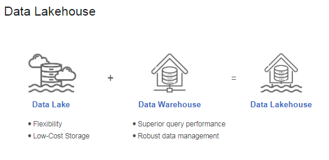

DataBricks came up with the datalakehouse architecture where they called medallion architecture. And introduced three zones as shown in the picture. 
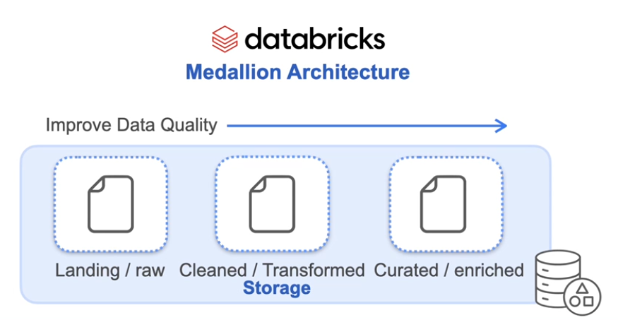

Bronze, Silver and Gold - which could be translated to Raw, Transformed and Enriched.

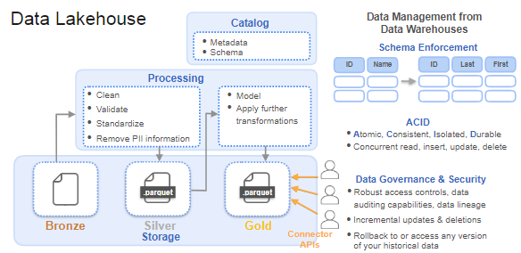

It provides unified architecture. support sql applications to business reporting to Machine learning because it is integrating best of the both the worlds of datawarehouse and datalakes. 
* connect to a data lakehouse using connector APIs, then use SQL to perform incremental updates and deletions to your datasets.
* These are critical features that enable compliance with data regulatory and privacy rules

### Data LakeHouse Implementation

- The data lakehouse concept merges features of cloud data warehouses and data lakes.Cloud data warehouses are integrating data lake features, while data lakes adopt warehouse characteristics like schema management and SQL functionality.

**Data Lakehouse implementation using open table formats.**

- Open table formats like Databricks Delta Lake, Apache Iceberg, and Apache Hudi support a transactional data lake.
- These formats add transactional capabilities to data lakehouses, enabling easy updates and deletions.
- They operate on object storage data lakes and support ACID principles found in data warehouses.

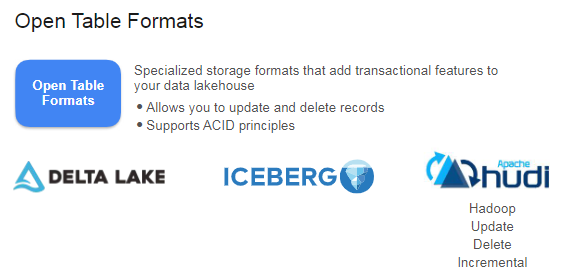

- Open table formats provide a logical abstraction over stored data. They track changes (insert, update, delete) and store them as snapshots.
- Snapshots enable "time travel" to access previous table versions or roll back changes.Support schema and partition evolution, allowing queries despite schema changes.
- Open-source nature allows different query engines to access data without duplication. OFfered tech in the industry - formats offer schema evolution and time travel, differing mainly in implementation.

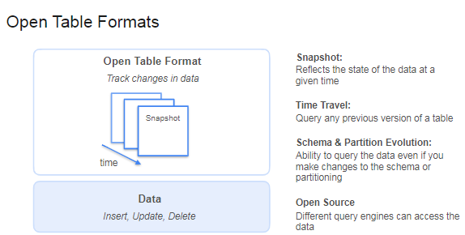

- Iceberg has a data catalog and a data storage layer with Parquet files. A metadata layer sits between the catalog and storage as shown
- Updates or new data files trigger the creation of a new manifest file. A manifest list is created to track manifest files, snapshots, and partition info.
- A new metadata file in JSON is created, containing the current snapshot and schema details.
Each table in the Iceberg catalog has a pointer to its latest metadata file. The pointer updates with each new metadata file creation.
- During queries, the catalog pointer directs the query engine to the current metadata file. The engine retrieves the manifest list, relevant manifest files, and data files.The metadata layer helps identify necessary data files, boosting query performance by ignoring irrelevant files.

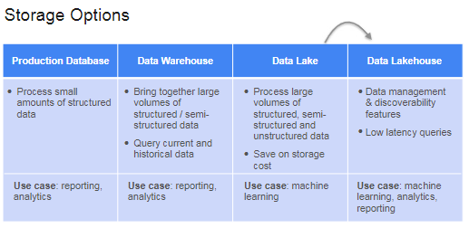

### Lakehouse Archtecture on AWS

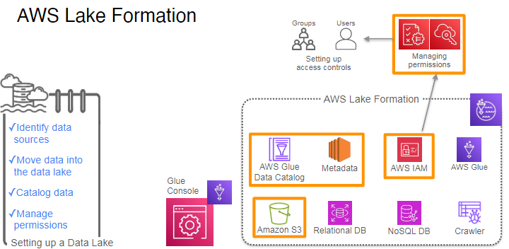
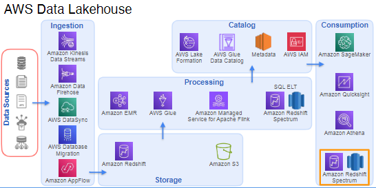

### Implementing the LakeHouse on AWS

The lecture focuses on the **data lakehouse architecture** on AWS, specifically discussing the **storage and catalog layers**. Here are the key points covered:

- **Data Lakehouse Architecture**: It combines elements of data lakes and data warehouses, allowing for efficient data storage and analysis.
  
- **Storage Layer**: 
  - **Amazon S3** is commonly used for storing various types of data (structured, semi-structured, and unstructured).
  - **Amazon Redshift** is used for storing highly curated, structured data that fits predefined schemas.
  - **Redshift Spectrum** allows querying data in S3 without moving it to Redshift, reducing complexity and potential data issues.

- **Catalog Layer**: 
  - A central data catalog is essential for managing metadata and making datasets easily searchable.
  - **Lake Formation** and **AWS Glue** are used to create and maintain this catalog, ensuring it stays updated with evolving data schemas.

- **Apache Iceberg**: This technology helps manage evolving schemas and large datasets efficiently, allowing for versioning and time travel features.

Amazon Redshift Spectrum (often abbreviated as ARS) is primarily part of the **consumption layer** in the data lakehouse architecture. 

Here are the key points regarding Redshift Spectrum:

- **Purpose**: It is used for **querying** data stored in Amazon S3 without needing to load that data into Amazon Redshift first. This allows for more efficient data analysis.

- **Data Storage**: Redshift Spectrum does not store data itself. Instead, it allows you to run SQL queries on data that is already stored in S3. This means you can analyze large datasets directly in S3 while leveraging the performance capabilities of Redshift.

In summary, Redshift Spectrum is a querying tool that enables you to access and analyze data in S3, but it does not store data itself.

The **catalog layer** in the AWS lakehouse architecture is essential for managing and organizing metadata about the datasets stored in the lakehouse. Here are the key points covered in the lecture regarding the catalog layer:

1. **Central Data Catalog**:
   - The catalog layer provides a **centralized repository** for metadata, which describes the datasets in the lakehouse.
   - This makes it easier for users to **search and discover** datasets, ensuring they can find the data they need without confusion.

2. **Lake Formation and AWS Glue**:
   - **Lake Formation** is a service that helps manage the data lake and uses **AWS Glue** behind the scenes to create the data catalog.
   - AWS Glue crawlers automatically scan the datasets in the storage layer to identify and catalog them, storing important metadata such as schema information, partition details, and data locations.

3. **Dynamic Metadata Management**:
   - The metadata catalog is not static; it needs to be **updated regularly** as datasets evolve over time (e.g., changes in schema or new data partitions).
   - AWS Glue can be configured to periodically crawl the storage layer to discover new or updated datasets and refresh the metadata in the catalog.

4. **Importance of Metadata**:
   - Having a well-maintained catalog is crucial for **self-service data discovery**, allowing users to easily understand the data available in the lakehouse.
   - It helps prevent the creation of a "data swamp," where users struggle to find and understand the data due to poor organization.

In summary, the catalog layer is vital for managing metadata, enabling efficient data discovery, and ensuring that the data lakehouse remains organized and accessible.

Data cataloging is **not a one-and-done activity** because datasets are constantly evolving. Here are the key reasons why ongoing cataloging is necessary:

1. **Evolving Schemas**: 
   - Datasets may change over time, such as adding new fields or modifying existing ones. The catalog must reflect these changes to ensure accurate metadata.

2. **New Data Partitions**: 
   - As more data is ingested, new partitions may be created. The catalog needs to be updated to include these new partitions for effective data discovery.

3. **Data Quality and Consistency**: 
   - Regular updates help maintain data quality and consistency. If the catalog is not kept up to date, users may encounter outdated or incorrect information.

4. **User Needs**: 
   - As users interact with the data, their needs may change. Ongoing cataloging allows for adjustments based on user feedback and usage patterns.

5. **Automated Crawling**: 
   - Tools like AWS Glue can be configured to periodically crawl the storage layer to discover new or updated datasets, ensuring the catalog remains current.

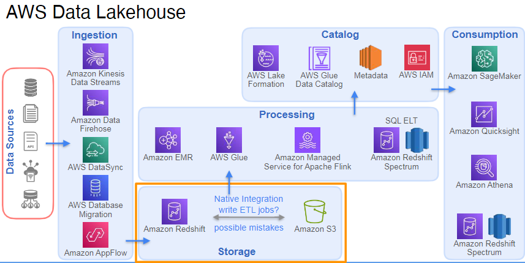

In summary, continuous data cataloging is essential to keep the metadata accurate, relevant, and useful for users.

**Apache Iceberg** plays a significant role in managing evolving schemas and large datasets within the data lakehouse architecture. Here’s how it helps:

1. **Schema Evolution**:
   - Iceberg allows for **flexible schema changes** without disrupting existing processes. You can add, rename, or drop columns in a dataset without needing to rewrite the entire dataset.

2. **Versioning**:
   - Iceberg supports **data versioning**, which means you can keep track of changes made to the data over time. This allows users to access historical versions of the data, making it easier to analyze changes and revert if necessary.

3. **Time Travel**:
   - With versioning, Iceberg enables a **time travel feature** that allows users to query historical versions of the data. This is useful for auditing, debugging, or understanding how data has changed over time.

4. **Partitioning**:
   - Iceberg provides advanced partitioning capabilities, allowing datasets to be partitioned in a way that optimizes query performance. This helps in efficiently managing large datasets and improving query speed.

5. **Integration with Data Catalogs**:
   - Iceberg tables can be integrated with data catalogs (like AWS Glue), ensuring that the metadata is kept up to date and accurately reflects the current state of the data.

In summary, Apache Iceberg enhances the management of schemas by allowing for flexible changes, maintaining version history, and optimizing data organization, which ultimately improves data accessibility and analysis.

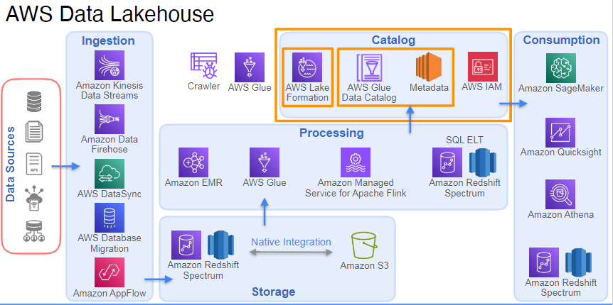

Yes, **AWS Lake Formation** does offer features that support schema management and data organization, but it works in conjunction with technologies like **Apache Iceberg** to enhance these capabilities. Here’s how Lake Formation relates to schema management:

1. **Data Cataloging**:
   - Lake Formation provides a central data catalog that helps manage metadata for datasets, making it easier to discover and understand data.

2. **Schema Management**:
   - While Lake Formation helps manage schemas, it may not provide the same level of flexibility for schema evolution as Apache Iceberg. Iceberg allows for more complex schema changes without disrupting existing processes.

3. **Integration with Iceberg**:
   - Lake Formation supports Iceberg tables, allowing users to leverage Iceberg's advanced features (like versioning and time travel) while benefiting from Lake Formation's data governance and cataloging capabilities.

4. **Data Governance**:
   - Lake Formation focuses on data governance, security, and access control, ensuring that users can access the right data while maintaining compliance.

In summary, while AWS Lake Formation provides essential features for managing data and schemas, integrating it with Apache Iceberg enhances the overall schema management capabilities, particularly for evolving schemas and versioning.

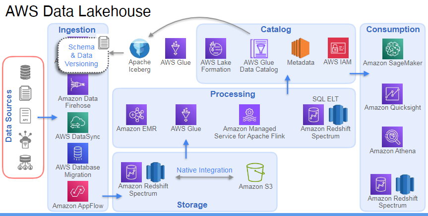
The **consumption layer** in data lakehouses plays a critical role in enabling users to access, analyze, and derive insights from the data stored in the architecture. Here are the key functions of the consumption layer:

1. **Data Access**:
   - Provides a unified interface for users to access data stored in both the data lake (e.g., Amazon S3) and the data warehouse (e.g., Amazon Redshift).

2. **Querying Capabilities**:
   - Supports SQL-based querying through services like **Amazon Redshift Spectrum** and **Amazon Athena**, allowing users to run complex queries on large datasets without needing to move the data.

3. **Performance Optimization**:
   - Reduces data latency by enabling direct querying of data in place, which improves response times for analytics and reporting.

4. **Cost Efficiency**:
   - Minimizes costs associated with data movement and storage by allowing users to query data directly from the lake without duplicating it in the warehouse.

5. **Flexibility and Scalability**:
   - Allows users to analyze data from various sources and formats, supporting diverse analytical workloads and scaling as data volumes grow.

6. **Integration with Data Catalogs**:
   - Works in conjunction with data catalogs (like AWS Lake Formation) to ensure that users can easily discover and understand the data they are querying.

In summary, the consumption layer is essential for facilitating data access and analysis in data lakehouses, providing users with the tools and capabilities needed to derive insights efficiently and effectively.

**Amazon Redshift Spectrum (ARS)** and **Amazon Athena** both provide querying capabilities for data stored in Amazon S3, but they serve different purposes and have distinct features. Here’s a comparison:

### Amazon Redshift Spectrum (ARS)
- **Integration with Redshift**: 
  - ARS extends the capabilities of Amazon Redshift, allowing users to run queries that combine data stored in S3 with data in Redshift.
- **Performance**: 
  - Optimized for performance, leveraging Redshift's architecture and capabilities, including massive parallel processing.
- **SQL Interface**: 
  - Users can use the same SQL interface as Redshift, making it easier for those familiar with Redshift to query data.
- **Data Management**: 
  - Requires a Redshift cluster, which means users need to manage the cluster and associated costs.

### Amazon Athena
- **Serverless**: 
  - Athena is a serverless service, meaning there is no infrastructure to manage. Users pay only for the data scanned by their queries.
- **Direct S3 Queries**: 
  - Allows users to query data directly in S3 using standard SQL without needing to load it into another system.
- **Flexibility**: 
  - Supports a wide range of data formats and can query data from various sources, including federated queries to other databases.
- **Ease of Use**: 
  - Ideal for ad-hoc querying and quick analysis without the need for a dedicated data warehouse.

### Summary
While both services allow querying data in S3, **Redshift Spectrum** is designed for users who are already using Redshift and want to extend their analytics capabilities, whereas **Amazon Athena** is a more flexible, serverless option for direct querying of S3 data without the need for a data warehouse. 