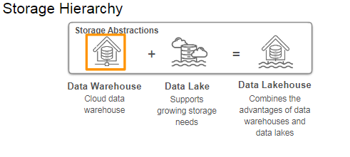
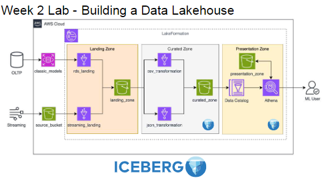
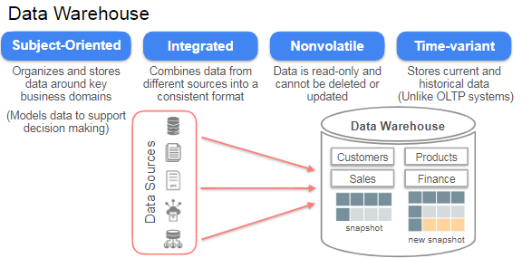
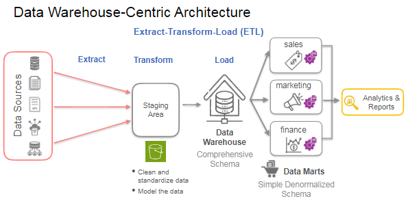
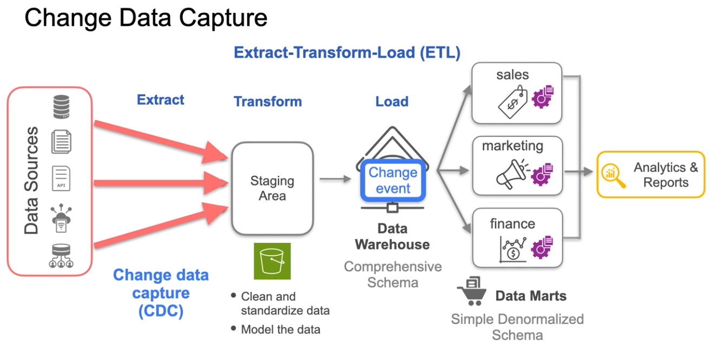
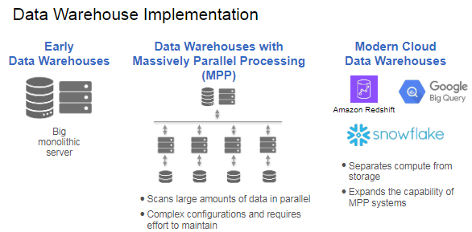
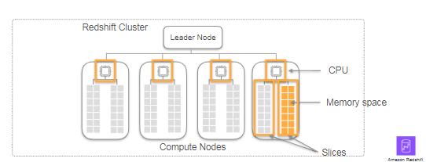
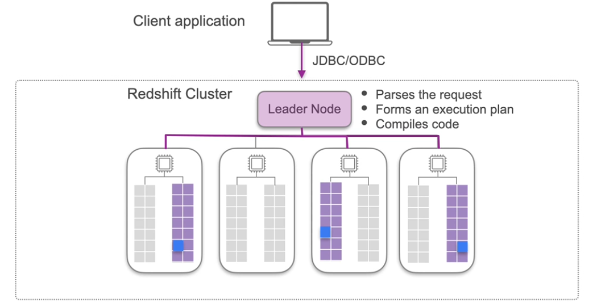
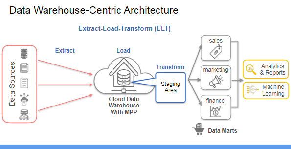

### Learning Objectives
* Explain the key architectural features of data warehouses and data lakes
* Explore the good practices in data lake storage such as partitioning and cataloging
* Explain the use of open table formats in building transactional data lakes
* Define the data lakehouse storage abstraction
* Implement a data lakehouse with a medallion-like architecture

 

### Conversation with Bill Inmon - Father of DataWarehousing
ITs the definition of warehouse in simple terms by Bill Inmon. 

* A data warehouse is a centralized repository of corporate data, designed to provide a comprehensive view across various organizational departments like marketing, sales, and finance.
* Before data warehouses, data was siloed within individual applications, making it challenging to get a holistic view of corporate data.

### Data Warehouse - Key Architectural Ideas

A Subject-oriented, integrated, nonvolatile and time-variant collection of data in support of managements decisions.

DataWarehousing also takes care of CDC or change data capture. Only capture change evnt and deliver those to dataware house from the production databases. 
With datawarehousing you can direct load away from teh production database and even provide better experience to end user of analytical systems. 

These warehouses were departure from traditional OLTP systems. 

### Modern Cloud Data Warehousing

This lecture talks about how cloud data warehousing efficiently better than traditional data Ware HOusing. And even offers MPP with latest of the technologies. They have greater processing  power compared to traditional in house warehouses. 

Scaling performance and cost can be managed well. 

You can scale up and scale down the clusters as you need them with cloud data warehouse. 

**How MPP works on Amazon Redshift :**

Leader node sends the code to the requred slice in the cluster to have proper use of hte data.

Then after teh computation. Leader node collects the data from all the slices and aggragates and sends it back to he client application. 

Since you can use parallel processing. you can spin up more compute nodes or upgrade the node type. 

Since these are big in size and have faster compute speed, they happen to support ELT cycles. Extract Load Transform.

### Data Lakes - Key Architectural Ideas

### Next Generation Data Lakes

Lab 1 :

a simple data lake using Amazon S3, AWS Glue ETL, Glue Crawler, and Amazon Athena. You ingested raw data into an S3 bucket, which acted as the storage layer of the data lake. You then used AWS GLUE ETL to transform and prepare the data for analysis. After that, you used the Glue Crawler to catalog the data, and then used Athena to run SQL queries directly against the data lake without the need for complex data movement or transformation. This setup allows for easy and efficient querying of data stored in S3, enabling organizations to derive valuable insights from their data assets.