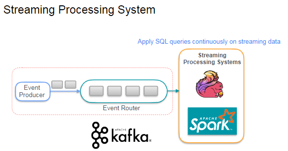
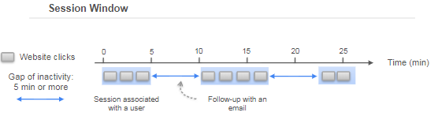
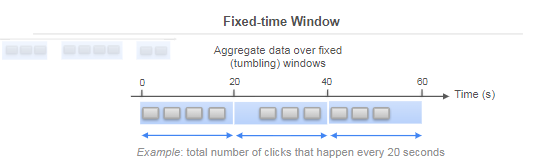
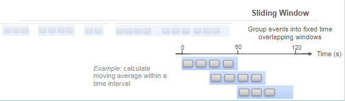
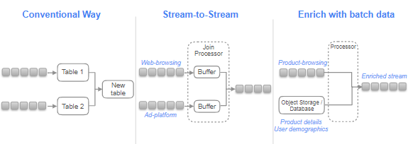
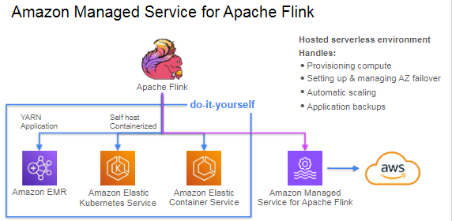

## Streaming Queries

The focus is on **querying streaming data** and the use of **windowed queries** for real-time data processing. Key points include:

- **Streaming Data Processing**: Systems like **Apache Flink** and **Spark Streaming** allow continuous SQL queries on streaming data.

- **Windowed Queries**: These queries help aggregate data over specific time frames. Bound your queries using a window and Apply operations over that window. There are three common types of windows:
  - **Session Windows**: Group events that occur close together in time, separated by inactivity (e.g., user clicks on a website). More on it
  
  

  - **Fixed Time (Tumbling) Windows**: Aggregate data over fixed intervals (e.g., every 20 seconds).
  
  
  - **Sliding Windows**: Overlapping time windows that allow for continuous aggregation (e.g., moving averages).
  
  
- **Joining Streams**: You can join multiple streams or combine streaming data with historical batch data, often using streaming buffers to manage event rates and latencies.

**Session Windows :**

A **session window** is a type of time-based window used in stream processing to group events that occur close together in time. Here’s a breakdown of its key features:

- **Purpose**: It is designed to handle events that arrive at irregular intervals, making it ideal for scenarios where user activity is sporadic.

- **Time Gap**: You define a maximum time gap (e.g., 5 minutes) between events. If no events occur within this gap, the session window closes. 

- **Unique to Each Key**: Each session window is unique to a specific key (e.g., a user). This means that different users can have their own session windows based on their activity.

- **Example**: 
  - If you are analyzing website clicks, and you set a 5-minute inactivity period, the system will create session windows for each user. 
  - For instance, if User A clicks on a link, then clicks again after 3 minutes, and then again after 6 minutes, the system will create two session windows:
    - The first window includes the first two clicks (within 5 minutes).
    - The second window starts with the third click (after 6 minutes of inactivity).

- **Analytics Use**: This approach allows analysts to perform targeted actions, such as sending follow-up emails with offers based on the user's last session activity.

Joining data streams involves combining multiple streams of data or integrating streaming data with historical batch data. Here are two relatable examples:

1. **Web Browsing Data and Ad Platform Data**:
   - **Scenario**: You have a stream of user web browsing data and a stream of advertisements served to those users.
   - **Joining Process**: You can join these two streams to analyze the effectiveness of ads. For instance, if a user clicks on an ad while browsing, you can combine the browsing data (e.g., pages visited) with the ad data (e.g., ad type, time served) to understand user behavior and ad performance.

2. **E-commerce Product Browsing and User Demographics**:
   - **Scenario**: You have a stream of product browsing events from an e-commerce website and a stream of user demographic information.
   - **Joining Process**: By joining these streams, you can enrich the product browsing events with user details (e.g., age, location). This allows for targeted marketing strategies, such as sending personalized recommendations or promotions based on user demographics.

### Deploying An application with Amazon managed service for Apache flink

### Deploying a Studio Notebook with amazon managed service for APache flink

 the focus is on deploying a Flink application using a studio notebook instead of a traditional application deployment. Key points include:

- **Connectors**: Flink uses connectors to interface with various data sources and destinations, such as Amazon Kinesis, S3, DynamoDB, and relational databases via JDBC.
- **Studio Notebook**: The lecture demonstrates creating a studio notebook in Amazon Managed Service for Apache Flink, which allows for interactive data analytics using tools like Apache Zeppelin.
- **Data Interaction**: The notebook sends demo data (stock ticker prices) to an MSK topic, enabling real-time data interaction with Flink.
- **Paragraphs in Zeppelin**: Each paragraph in the notebook can execute code, display text, or visualize data, allowing for modular and manageable data processing tasks.
- **User-Defined Functions**: The lecture includes creating a custom Flink function to generate random stock ticker data, which can be used in SQL queries.
- **AWS Glue**: The backend uses AWS Glue to manage connection information for data sources and destinations.

explored the capabilities of PyFlink within a Zeppelin notebook to perform advanced stream processing tasks. By creating sliding window and tumbled window queries, you gained hands-on experience with two fundamental types of window operations used in stream processing:

Sliding Windows: You learned how to create sliding window queries that allow for overlapping time intervals, providing a continuous and detailed view of your data over time. This is useful for real-time monitoring and detecting trends.
Tumbled Windows: You implemented tumbled window queries, which divide the stream into non-overlapping, fixed-size windows. This is ideal for periodic reporting and aggregating data over uniform intervals.
You applied windowing functions to simulate real-time analytics scenarios, such as summarizing data over time windows. By working with event time attributes and defining watermarks, you ensured accurate and timely processing of out-of-order events, which is critical for reliable stream processing.

The ability to process and analyze streaming data in real time is a valuable asset in today’s data-driven world, opening up opportunities for innovation and insights in various domains.