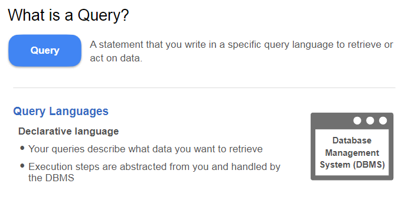
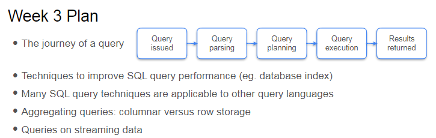
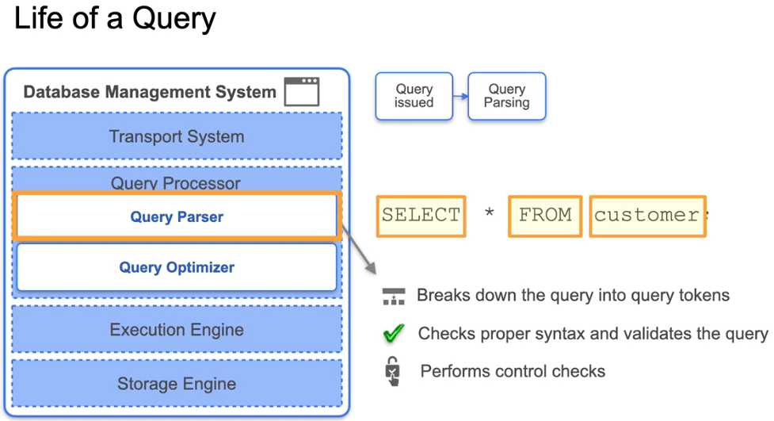
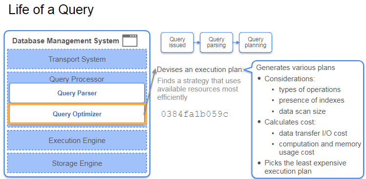
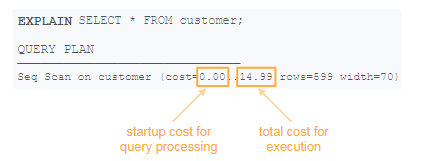
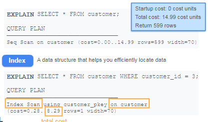
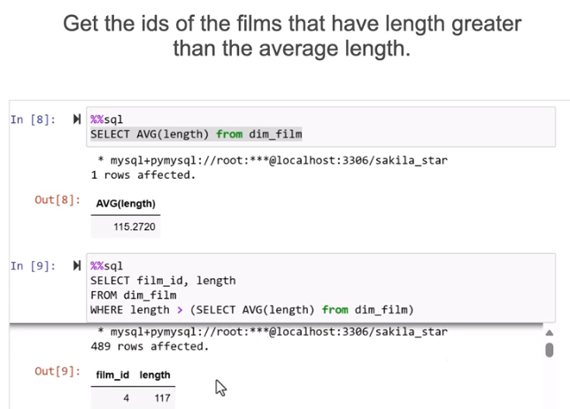
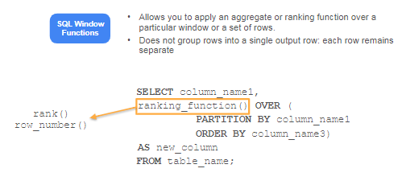

## Batch Queries

### Overview

The lecture this week focuses on the following key concepts:

- **Impact of Data Storage on Query Speed**: Understanding how the way data is stored affects the speed of data retrieval and overall system performance.
  
- **Query Definition**: A query is a statement in a specific query language that retrieves or manipulates data. You'll revisit SQL and explore its application in various storage systems.



* Details how these queries are processed are abstracted away from the user by DBMS.

* understanding how queries are processed can help you model the data so that it's easier and faster to retrieve

Following is the journey of a query and the plan for the week:




### The Life of a Query

1. **Query Submission**: When a query is sent to the database, it first arrives through the transport system.

2. **Query Processor**: The query is handed over to the query processor, which consists of two main components:
   - **Query Parser**: 
     - Breaks down the query into tokens (keywords, table names, attributes, etc.).
     - Checks for proper syntax and validates that all referenced tables and attributes exist.
     - Ensures the user has appropriate access to the attributes.
     - Converts the SQL code into byte code for efficient execution.

     

   - **Query Optimizer**: 
     - Analyzes the byte code and devises an execution plan.
     - Generates various execution plans based on factors like operations required, indexes, and data scan size.
     - Calculates a cost value for each plan, considering IO costs, computation, and memory usage.
     - Selects the least expensive plan for execution.

     

3. **Execution Engine**: Once the execution plan is created, the execution engine carries out the operations outlined in the plan to produce the query results.

    Execution Plan -> Query Results

This process ensures that even simple queries are executed efficiently by leveraging the capabilities of the DBMS.


To understand what a query does in a Database Management System (DBMS), you can use the **EXPLAIN** command. Here’s how it works:

1. **Execution Plan**: By adding the **EXPLAIN** command before your SQL statement, you can view the execution plan generated by the query optimizer. This plan outlines the steps the database will take to execute the query.

2. **Details Provided**:
   - **Type of Scan**: Indicates whether a sequential scan (full table scan) or an index scan will be used.
   - **Cost Values**: Displays the startup cost (initial processing) and total cost (overall execution).
   - **Estimated Rows**: Shows the expected number of rows that will be returned.
   - **Row Width**: Provides information about the expected size of each row in bytes.



### Example:
If you have a query like:
```sql
SELECT * FROM customer WHERE customer_id = 3;
```
You can run:
```sql
EXPLAIN SELECT * FROM customer WHERE customer_id = 3;
```
This will give you insights into how the query will be executed, including whether it will use an index on the `customer_id` column or perform a full table scan.

Using the **EXPLAIN** command is a valuable way to analyze and optimize your queries.

### Advanced SQL Queries P1


 Here are the key queries mentioned using the DVD Rental data:

1. **Selecting Staff and Customer IDs**:
   ```sql
   SELECT staff_id, customer_id FROM fact_rental;
   ```

2. **Using DISTINCT to Get Unique Pairs**:
   ```sql
   SELECT DISTINCT staff_id, customer_id FROM fact_rental;
   ```

3. **Joining Tables to Get Staff Names**:
   ```sql
   SELECT DISTINCT f.staff_id, CONCAT(s.first_name, ' ', s.last_name) AS staff_name
   FROM fact_rental f
   JOIN dim_staff s ON f.staff_id = s.staff_id;
   ```

4. **Using CASE Statement for On-Time Payment**:
   ```sql
   SELECT customer_id, rental_id,
   CASE 
       WHEN payment_date < return_date THEN 1 
       ELSE 0 
   END AS on_time_payment
   FROM fact_rental;
   ```

5. **Filtering Results by Country and Date**:
   ```sql
   SELECT *
   FROM fact_rental f
   JOIN dim_customer c ON f.customer_id = c.customer_id
   WHERE c.country IN ('United States', 'Canada')
   AND rental_date BETWEEN '2005-05-24' AND '2005-07-26';
   ```

several string operations were mentioned that can be applied to columns in SQL. Here are the key string operations:


   ```sql
   CONCAT(first_name, ' ', last_name)
   ```

   ```sql
   LOWER(column_name)
   ```

   ```sql
   UPPER(column_name)
   ```

   ```sql
   SUBSTRING(column_name, start_position, length)
   #  Extracts a part of a string based on specified start position and length.
   ```
### Advanced SQL Queries P2

**Explanation of CTE (Common Table Expression):**

- **Definition**: A CTE is a temporary result set that you can reference within a `SELECT`, `INSERT`, `UPDATE`, or `DELETE` statement. It is defined using the `WITH` keyword.
- **Purpose**: CTEs help simplify complex queries by breaking them into smaller, more manageable parts. They can improve readability and maintainability of SQL code.


```sql
WITH staff_customer_pairs AS (
    -- This is where you would include the query to get unique staff and customer pairs
    SELECT staff_id, customer_id
    FROM rental
)
SELECT staff_id, COUNT(customer_id) AS total_customers
FROM staff_customer_pairs
GROUP BY staff_id;
```

- **Usage**: After defining a CTE, you can use it like a regular table in your main query. In the example above, `staff_customer_pairs` is the CTE that holds the unique pairs of staff and customer IDs, which is then used to count the total customers served by each staff member.
The first query used in the lecture involves defining a Common Table Expression (CTE) to compute the total number of customers served by each staff member. 

The second query in the lecture is used to compute the percentage of on-time payments for each customer using a Common Table Expression (CTE). Here’s how you can write that query:

```sql
WITH customer_payment_info AS (
    -- This is where you would include the query to get the on-time payment indicator
    SELECT customer_id, 
           CASE 
               WHEN payment_date <= due_date THEN 1 
               ELSE 0 
           END AS on_time_payment
    FROM payments
)
SELECT customer_id, AVG(on_time_payment) AS percent_on_time_payment
FROM customer_payment_info
GROUP BY customer_id;
```

- **Usage**: In this example, `customer_payment_info` is the CTE that calculates whether each payment was made on time (1 for on-time, 0 for late). The main query then calculates the average of these values to determine the percentage of on-time payments for each customer.

**SUBQUERIES**



**SQL Window Functions**



- **Definition**: Window functions perform calculations across a set of table rows that are related to the current row. Unlike aggregate functions, they do not group the result set into a single output row; each row retains its identity.
- **Purpose**: Window functions allow you to perform calculations such as ranking, running totals, or moving averages without collapsing the result set. This is useful for analyzing data in a more granular way.

example of using SQL window functions to compute the average rental days for each customer by film category, along with their rank based on rental days:

```sql
WITH customer_info AS (
    SELECT fact_rental.customer_id, 
           dim_category.name, 
           AVG(DATEDIFF(return_date, rental_date)) AS average_rental_days
    FROM fact_rental
    JOIN dim_category ON fact_rental.category_id = dim_category.category_id
    GROUP BY customer_id, category_name
    ORDER BY customer_id, average_rental_days DESC
)
SELECT customer_id, name, average_rental_days,
       RANK() OVER 
            (PARTITION BY customer_id ORDER BY average_rental_days DESC) AS rank_category
FROM customer_info
ORDER BY customer_id, rank_category;
```


- **Usage**: In this example:
  - The CTE `customer_info` calculates the average rental days for each customer by film category.
  - The `RANK()` function is then used to assign a rank to each category for each customer based on the average rental days, ordered in descending order. The `PARTITION BY` clause ensures that the ranking resets for each customer.
  - The final result shows each customer’s ID, the category name, the average rental days, and the rank of each category based on rental days.

This approach allows you to see not only the average rental days but also how each category compares within the context of each customer.
