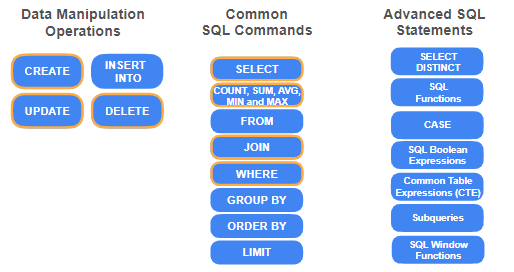
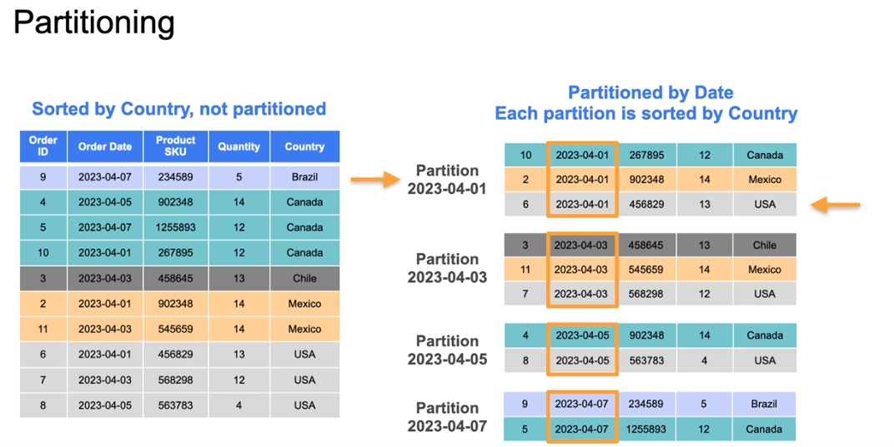

## Batch Queries

### Overview

The lecture this week focuses on the following key concepts:

- **Impact of Data Storage on Query Speed**: Understanding how the way data is stored affects the speed of data retrieval and overall system performance.
  
- **Query Definition**: A query is a statement in a specific query language that retrieves or manipulates data. You'll revisit SQL and explore its application in various storage systems.


* Details how these queries are processed are abstracted away from the user by DBMS.

* understanding how queries are processed can help you model the data so that it's easier and faster to retrieve

Following is the journey of a query and the plan for the week:


### The Life of a Query

1. **Query Submission**: When a query is sent to the database, it first arrives through the transport system.

2. **Query Processor**: The query is handed over to the query processor, which consists of two main components:
   - **Query Parser**: 
     - Breaks down the query into tokens (keywords, table names, attributes, etc.).
     - Checks for proper syntax and validates that all referenced tables and attributes exist.
     - Ensures the user has appropriate access to the attributes.
     - Converts the SQL code into byte code for efficient execution.

     

   - **Query Optimizer**: 
     - Analyzes the byte code and devises an execution plan.
     - Generates various execution plans based on factors like operations required, indexes, and data scan size.
     - Calculates a cost value for each plan, considering IO costs, computation, and memory usage.
     - Selects the least expensive plan for execution.

     

3. **Execution Engine**: Once the execution plan is created, the execution engine carries out the operations outlined in the plan to produce the query results.

    Execution Plan -> Query Results

This process ensures that even simple queries are executed efficiently by leveraging the capabilities of the DBMS.


To understand what a query does in a Database Management System (DBMS), you can use the **EXPLAIN** command. Here’s how it works:

1. **Execution Plan**: By adding the **EXPLAIN** command before your SQL statement, you can view the execution plan generated by the query optimizer. This plan outlines the steps the database will take to execute the query.

2. **Details Provided**:
   - **Type of Scan**: Indicates whether a sequential scan (full table scan) or an index scan will be used.
   - **Cost Values**: Displays the startup cost (initial processing) and total cost (overall execution).
   - **Estimated Rows**: Shows the expected number of rows that will be returned.
   - **Row Width**: Provides information about the expected size of each row in bytes.


### Example:
If you have a query like:
```sql
SELECT * FROM customer WHERE customer_id = 3;
```
You can run:
```sql
EXPLAIN SELECT * FROM customer WHERE customer_id = 3;
```
This will give you insights into how the query will be executed, including whether it will use an index on the `customer_id` column or perform a full table scan.

Using the **EXPLAIN** command is a valuable way to analyze and optimize your queries.

### Advanced SQL Queries P1



 Here are the key queries mentioned using the DVD Rental data:

1. **Selecting Staff and Customer IDs**:
   ```sql
   SELECT staff_id, customer_id FROM fact_rental;
   ```

2. **Using DISTINCT to Get Unique Pairs**:
   ```sql
   SELECT DISTINCT staff_id, customer_id FROM fact_rental;
   ```

3. **Joining Tables to Get Staff Names**:
   ```sql
   SELECT DISTINCT f.staff_id, CONCAT(s.first_name, ' ', s.last_name) AS staff_name
   FROM fact_rental f
   JOIN dim_staff s ON f.staff_id = s.staff_id;
   ```

4. **Using CASE Statement for On-Time Payment**:
   ```sql
   SELECT customer_id, rental_id,
   CASE 
       WHEN payment_date < return_date THEN 1 
       ELSE 0 
   END AS on_time_payment
   FROM fact_rental;
   ```

5. **Filtering Results by Country and Date**:
   ```sql
   SELECT *
   FROM fact_rental f
   JOIN dim_customer c ON f.customer_id = c.customer_id
   WHERE c.country IN ('United States', 'Canada')
   AND rental_date BETWEEN '2005-05-24' AND '2005-07-26';
   ```

several string operations were mentioned that can be applied to columns in SQL. Here are the key string operations:


   ```sql
   CONCAT(first_name, ' ', last_name)
   ```

   ```sql
   LOWER(column_name)
   ```

   ```sql
   UPPER(column_name)
   ```

   ```sql
   SUBSTRING(column_name, start_position, length)
   #  Extracts a part of a string based on specified start position and length.
   ```
### Advanced SQL Queries P2

**Explanation of CTE (Common Table Expression):**

- **Definition**: A CTE is a temporary result set that you can reference within a `SELECT`, `INSERT`, `UPDATE`, or `DELETE` statement. It is defined using the `WITH` keyword.
- **Purpose**: CTEs help simplify complex queries by breaking them into smaller, more manageable parts. They can improve readability and maintainability of SQL code.


```sql
WITH staff_customer_pairs AS (
    -- This is where you would include the query to get unique staff and customer pairs
    SELECT staff_id, customer_id
    FROM rental
)
SELECT staff_id, COUNT(customer_id) AS total_customers
FROM staff_customer_pairs
GROUP BY staff_id;
```

- **Usage**: After defining a CTE, you can use it like a regular table in your main query. In the example above, `staff_customer_pairs` is the CTE that holds the unique pairs of staff and customer IDs, which is then used to count the total customers served by each staff member.
The first query used in the lecture involves defining a Common Table Expression (CTE) to compute the total number of customers served by each staff member. 

The second query in the lecture is used to compute the percentage of on-time payments for each customer using a Common Table Expression (CTE). Here’s how you can write that query:

```sql
WITH customer_payment_info AS (
    -- This is where you would include the query to get the on-time payment indicator
    SELECT customer_id, 
           CASE 
               WHEN payment_date <= due_date THEN 1 
               ELSE 0 
           END AS on_time_payment
    FROM payments
)
SELECT customer_id, AVG(on_time_payment) AS percent_on_time_payment
FROM customer_payment_info
GROUP BY customer_id;
```

- **Usage**: In this example, `customer_payment_info` is the CTE that calculates whether each payment was made on time (1 for on-time, 0 for late). The main query then calculates the average of these values to determine the percentage of on-time payments for each customer.

**SUBQUERIES**


**SQL Window Functions**


- **Definition**: Window functions perform calculations across a set of table rows that are related to the current row. Unlike aggregate functions, they do not group the result set into a single output row; each row retains its identity.
- **Purpose**: Window functions allow you to perform calculations such as ranking, running totals, or moving averages without collapsing the result set. This is useful for analyzing data in a more granular way.

example of using SQL window functions to compute the average rental days for each customer by film category, along with their rank based on rental days:

```sql
WITH customer_info AS (
    SELECT fact_rental.customer_id, 
           dim_category.name, 
           AVG(DATEDIFF(return_date, rental_date)) AS average_rental_days
    FROM fact_rental
    JOIN dim_category ON fact_rental.category_id = dim_category.category_id
    GROUP BY customer_id, category_name
    ORDER BY customer_id, average_rental_days DESC
)
SELECT customer_id, name, average_rental_days,
       RANK() OVER 
            (PARTITION BY customer_id ORDER BY average_rental_days DESC) AS rank_category
FROM customer_info
ORDER BY customer_id, rank_category;
```


- **Usage**: In this example:
  - The CTE `customer_info` calculates the average rental days for each customer by film category.
  - The `RANK()` function is then used to assign a rank to each category for each customer based on the average rental days, ordered in descending order. The `PARTITION BY` clause ensures that the ranking resets for each customer.
  - The final result shows each customer’s ID, the category name, the average rental days, and the rank of each category based on rental days.

This approach allows you to see not only the average rental days but also how each category compares within the context of each customer.


### Index Deep Dive 

An **index** in a database serves to improve the speed of data retrieval operations. Here are the key functions of an index:


- **Faster Query Performance**: It allows the database management system to quickly locate and access the data without scanning the entire table.
- **Ordered Data Structure**: An index stores data from one or more columns in a defined order, similar to an alphabetical index in a book.

In summary, an index enhances the performance of queries by allowing the database to quickly find the relevant data, rather than scanning through all records.

The implementation of an index is explained through the following key points:


- **Index Structure**: An index is a separate data structure that contains references to the actual table data. It is organized in blocks that are doubly linked, allowing for efficient forward and backward reading. 


- **Sorted Data**: The data within each block is sorted, and the blocks are linked to maintain the logical order of the entire index. This structure allows for efficient updates when new data is added or old data is deleted.

- **B-Tree Structure**: A **balanced search tree (B-Tree)** is built on top of the index blocks. The leaf nodes of the tree represent the index blocks, while internal nodes (branch nodes) act as parent nodes for groups of leaf nodes. This hierarchical structure allows for efficient searching.


- **Traversal Process**: When querying data, the database starts at the root node of the B-Tree and traverses down to the appropriate leaf node, following the logical order until it finds the desired records.

### Summary
- An index improves query performance by allowing quick access to data.
- It is implemented using a sorted structure of blocks linked together.
- A B-Tree is used to efficiently locate index blocks.


**Things to take care while creating index**

- **Select Suitable Columns**: Choose columns that will improve the performance of your most performance-sensitive queries. 

- **Avoid Overloading with Indexes**: Do not create too many indexes on a table, as maintaining balance in multiple tree structures can degrade database performance during data updates.

- **Monitor Query Performance**: Regularly check how indexes impact query performance and adjust as necessary.

Here is the example of index creation on rental_id column :


On **columnar storage** 

- **Sort Keys**: When creating a table in systems like Amazon Redshift, you can declare one or more columns as **sort keys**. This means that the rows of the data are organized based on the specified column(s) without needing a separate index structure.

- **Data Organization**: By declaring a column as a sort key, the data is reorganized on disk according to that column. This is similar to sorting a spreadsheet by a specific column, which can enhance query performance.

- **Comparison with Other Systems**: Other cloud data warehouses, such as BigQuery, refer to the sort key as a **cluster key**, but the underlying concept remains the same.

- **Performance Enhancement**: Properly creating an index in row-oriented databases or specifying a sort/cluster key in columnar storage can significantly improve query performance by reducing the number of rows that need to be scanned.


### Retrieving Only Data You need


- **Avoiding SELECT * Queries**: Running a `SELECT *` command without a `WHERE` clause can lead to full table scans, which are costly in terms of performance and resources. An example is given where such a query brought down a critical inventory database for three days.


- **Pruning Techniques**: To improve query performance, it's recommended to use pruning techniques:
  - **Row-based Pruning**: Filter out rows that don't meet specific conditions.
  - **Column-based Pruning**: Select only the necessary columns instead of all.
  - **Partition Pruning**: Scan only specific partitions of data based on a partition key, such as date or location.

- **Performance Considerations**: Efficient querying not only saves costs but also enhances performance, especially when joining data from different tables, which will be discussed in the next video.


The example of partition pruning given in the lecture involves partitioning records based on **order dates**. Here's a breakdown of the example:



- A table is partitioned by **order dates**.
- Each partition is further ordered by **country**.
- When a user queries the data, they filter by a specific **order date** (e.g., April 1st) and a **country** (e.g., USA).
- The database only scans the records in the **April 1st partition** and then looks for records with **USA** as the country.

This method reduces the amount of data scanned, improving query performance and efficiency.


### The Join Statement
 **joins** in SQL, which are essential for combining datasets. Here are the key points:


- **Joins** allow you to transform and create new datasets by combining data from different tables, such as an **orders** table and a **customers** table, linked by customer IDs.
- The **inner join** combines rows from both tables where there is a matching customer ID.
- There are three common methods for implementing joins:
  - **Nested Loop Join**: Scans each row in one table and matches it with rows in another.
  - **Index-Based Nested Loop**: Utilizes an index to speed up the search for matching rows.
  - **Hash Join**: Uses a hash function to group rows into buckets for faster matching.

   
  
- Joins can be time-consuming, so it's important to model data effectively to minimize the need for complex joins.

lecture also discusses **schemas** and their relationship with joins.

- **Normalized Schema**: This schema reduces data redundancy by storing data in separate tables. However, it often requires more complex join statements to retrieve related data. For example, to compute total products sold by country, a data analyst would need to join multiple tables (e.g., customers, orders, and order details).


- **Star Schema**: This schema simplifies data retrieval by organizing data into a central fact table (e.g., fact_orders) and related dimension tables (e.g., dim_locations). In this case, the data analyst would only need to perform one join to get the required information.

- **Denormalized Schema**: Combining relevant attributes into a single large table can eliminate the need for joins altogether, making data retrieval simpler.

- The choice of schema affects how easily end users can access and combine data. A well-designed schema can minimize the complexity of joins and improve query performance.

- **Row explosion** can occur when joining tables with many-to-many relationships, leading to excessive output rows. It's crucial to ensure the join logic is correct to avoid this issue.


### Amazon Redshift Cloud data Warehouse


Here's a summary of the lecture content up to the discussion on table design:


- **Amazon Redshift Overview**: Redshift is a highly efficient data warehousing solution that utilizes **columnar data storage**, which stores data column-by-column rather than row-by-row. This method is particularly effective for analytical queries and OLAP workloads, allowing for faster data retrieval and improved query performance.


- **Data Compression**: Columnar storage enables better data compression. When queries are executed, Redshift reads compressed data into memory, which speeds up query execution by using more memory for analysis rather than data retrieval.

- **Massively Parallel Processing (MPP)**: Redshift operates on a cluster of multiple compute nodes and a leader node. Data is distributed across these nodes, and each node processes its portion of the data in parallel. The leader node manages query parsing and execution plans, distributing tasks to compute nodes.

- **Distribution Style**: When creating tables, defining a distribution style is essential for optimizing query performance. The goals are to achieve uniform data distribution across nodes and minimize data movement during query execution. 


Table Design :

Here's a summary of the key points taught on table design in the lecture:

- **Distribution Style**: 
  - **Purpose**: To control how data is distributed across compute nodes.
  - **Goals**:
    - Achieve a uniform distribution of data to avoid data distribution skew, which can lead to poor performance.
    - Minimize data movement across nodes to reduce network traffic and improve query efficiency.  reasonable data distribution across the nodes ensures that related data is collocated on the same node. Reducing the need for this cross node communication.

    

  - **Options**:
    - **Auto**: Redshift assigns an optimal distribution style based on table size.
    - **Even**: Distributes rows across nodes using a round-robin approach.
    - **Key**: Distributes rows based on a specific column's values, ensuring rows with the same key value go to the same node.
    - **All**: A full copy of the table is distributed to every node, useful for small tables frequently joined with larger tables, but increases storage requirements.

- **Sort Keys**:
  - **Purpose**: To determine how data is physically organized on disk.

    

  - **Impact on Performance**: A well-chosen sort key allows Redshift to efficiently locate relevant data, reducing the amount of data scanned during queries.
  - **Example**: If a sales table is frequently queried by order date, setting the order date as the sort key optimizes those queries.

These considerations in table design are crucial for optimizing query performance in Amazon Redshift.

Practice Lab 1 :


### Additional Query Strategies

Certainly! Here's an updated summary that includes information on table bloat:

In the current course content, the focus is on optimizing query performance in databases. Key points include:

- **Complex Queries**: Understanding how to work with complex queries using multiple joins to retrieve data from various tables, such as calculating total spending on specific film categories in a DVD rental database.

- **Query Caching**: Utilizing query caching to improve performance by storing results of frequently run queries for quicker access, reducing the load on the database.

- **Common Table Expressions (CTEs)**: Using CTEs to enhance query readability and structure, making it easier to manage complex queries.


- **Table Bloat**: This occurs when outdated records accumulate in the database, causing the physical disk space used to exceed the actual data size. It can slow down queries as the database has to skip over many blocks to retrieve the required data. Regular maintenance, such as vacuuming, is essential to mitigate table bloat and ensure efficient query execution.


- **Database Maintenance**: The importance of vacuuming to remove outdated records, which can lead to inefficiencies and slow down query performance.


