**Learning Objectives**
* Define data modeling and its role in reflecting business logic
* Apply the normalization stages to a denormalized table
* Explain the use of the fact and dimension tables of a star schema
* Differentiate between the data warehouse modeling approaches such as Inmon, Kimball and Data Vault
* Transform data in third normal form to a star schema
* Describe the use of hub, link and satellite tables in a data vault model
* Discuss the pros and cons of the use of one big table

## Introduction to Data Modelling for Analytics

### Course Overview :

Data modeling involves deliberately choosing a coherent data structure that aligns with business goals and logic, defining the structure, relationships, and meaning of the data.

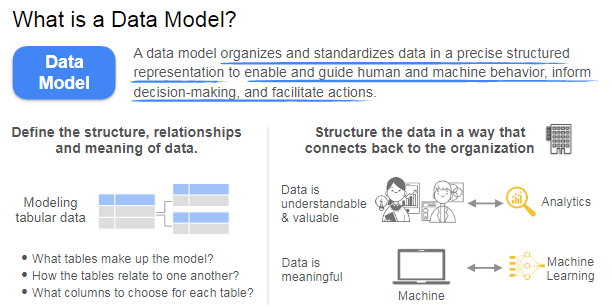

what makes something a good data model ?

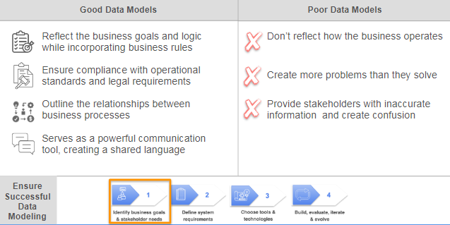

Examples :
 
1. **Good Data Model**: 
   - Linking **sales data** with **product inventory data** to ensure that the sales process is directly informed by current inventory levels, which helps prevent overselling.

2. **Bad Data Model**: 
   - A poorly constructed model that is created haphazardly and does not reflect how the business operates, leading to inaccurate information and confusion among stakeholders.

Sometimes data teams ignore data modeling entirely because they perceive it as a slow, tedious, and irrelevant process, often jumping directly into building data systems without a structured plan for organizing the data. This oversight can lead to the creation of data swamps, resulting in redundant, mismatched, or inaccurate data. _Data Modelling is a critical practice that enhances your understanding of the data throughout its life cycle._

Targeted Data Modelling : It aims to help particular teams, such as marketing or finance, better understand their data and improve decision-making.

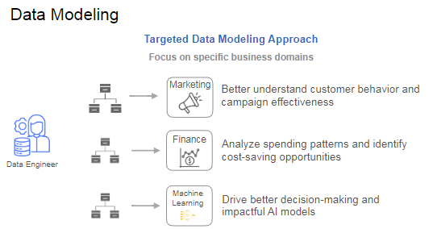

- **Examples**:
  - Creating a data model for the **marketing team** to analyze customer behavior and campaign effectiveness.
  - Modeling **financial transactions** for the finance team to identify spending patterns and cost-saving opportunities.
  - Targeted data modeling efforts can drive better decision-making and support impactful AI models, even in complex business environments.

### Conceptual Logical and Physical Data Modelling

### Normalization

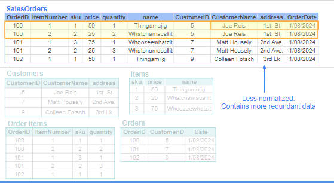

It is a data modeling practice applied to relational databases to reduce data redundancy and ensure referential integrity between data tables.
- Introduced by **Edgar Codd** in 1970, normalization aims to improve data integrity and reduce undesirable dependencies.

Codd outlined several objectives for normalization:
- **Eliminate Insertion, Update, and Deletion Dependencies**: This helps prevent anomalies when adding, modifying, or deleting data.
- **Reduce Restructuring Needs**: As new types of data are introduced, normalization minimizes the need to restructure the database.
- **Increase Application Lifespan**: By maintaining data integrity, applications can remain functional for longer periods.

Two models are presented to illustrate normalization:
1. **Less Normalized Model**: 
   - Consists of a single large sales order table.
   - Contains redundant data, making updates cumbersome (e.g., updating a customer's address requires changing multiple rows).
   
2. **More Normalized Model**: 
   - Data is spread across multiple tables (e.g., separate tables for customers, orders, and shipments).
   - Reduces redundancy; updating a customer's address only requires changing one row in the customer table.

Denormalized Form :

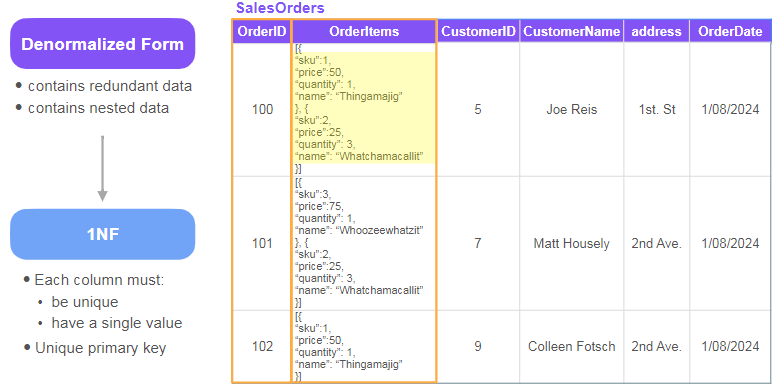

various normalization forms:
- **First Normal Form (1NF)**: 
  - Requires each column to have unique values and no nested data.
  - A unique primary key must be present.

  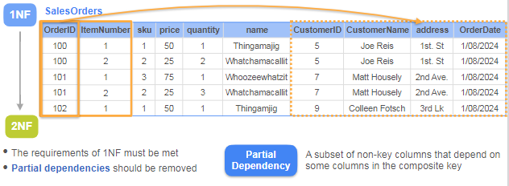  

- **Second Normal Form (2NF)**: 
  - Builds on 1NF by removing partial dependencies, where non-key columns depend on part of a composite key.
  - Example: Splitting a sales order table into separate order items and orders tables.

  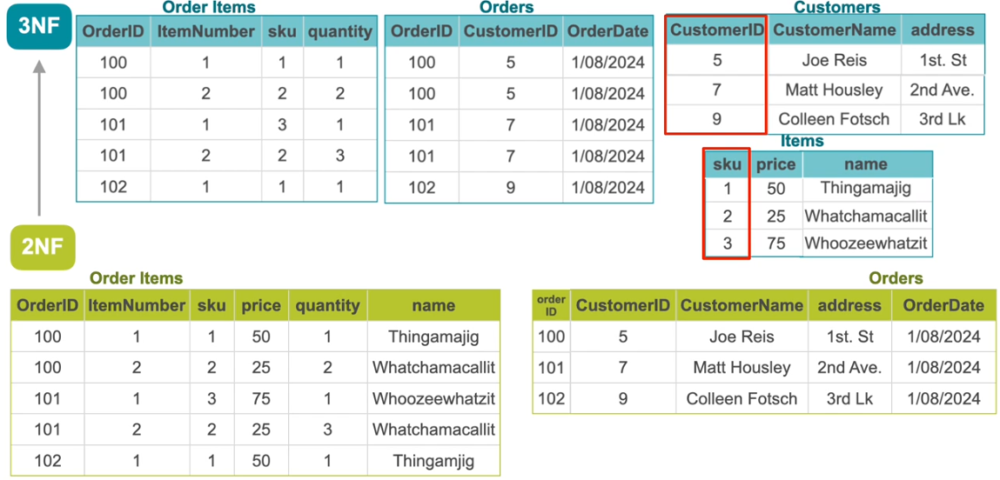

- **Third Normal Form (3NF)**: 
  - Requires compliance with 2NF and eliminates transitive dependencies, where non-key columns depend on other non-key columns.
  - Example: Creating separate tables for items and customers to remove dependencies.

### Denormalization
- **Denormalization** may be beneficial in certain scenarios, as it can enhance performance by reducing the need for join operations between tables.
- The choice between normalization and denormalization depends on the specific use case and performance requirements.

practiceLab Data Normalization

### Dimensional Modelling - Star Schema

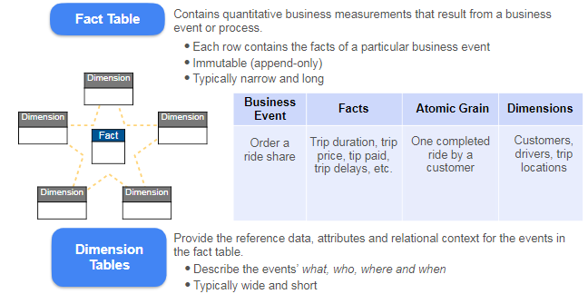

- **Star Schema**: 
  - A **dimensional data model** designed to facilitate faster analytical queries.
  - It consists of a **fact table** at the center, surrounded by **dimension tables**.
  - The fact table contains **quantitative business measurements** (facts) from business events, while dimension tables provide **contextual information**.

- **Fact Table**:
  - Contains **business measures** resulting from events (e.g., trip duration, trip price in a rideshare example).
  - Each row corresponds to a specific event, and the data is **immutable** (append-only).
  - Typically **narrow and long** (few columns, many rows).

- **Dimension Tables**:
  - Provide descriptive attributes related to the facts (e.g., information about customers, drivers, trip locations).
  - Typically **wide and short** (many columns, fewer rows).

- **Grain**:
  - Refers to the level of detail in the fact table (e.g., each row could represent a single ride or all rides in a day).
  - The **atomic grain** is the most detailed level, capturing individual events.

- **Keys**:
  - Fact tables connect to dimension tables through **foreign keys**.
  - Each dimension has a **primary key**, and best practices suggest using a **surrogate key** for the fact table.

  

- **Analytical Queries**:
  - Star schema simplifies queries, allowing for easier aggregation and filtering.
  - Example SQL query: To find total sales for each product line in the USA, you would join the fact table with dimension tables and apply aggregate functions.

- **Comparison with Normalized Models**:
  - Normalized models focus on reducing data redundancy and ensuring data integrity.
  - Star schemas are more user-friendly for analytical workloads, resulting in simpler queries and improved performance.

  **Example**
  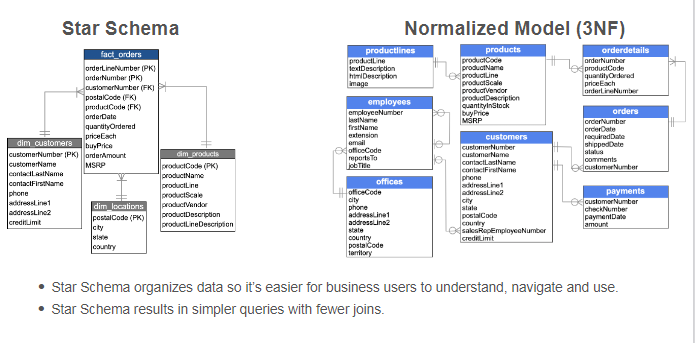

  ## Data Modelling Technique 

 **Inmon vs Kimball Data Warehouse Architecture**

The lecture discusses two primary data modeling approaches for data warehouses: **Inmon** and **Kimball**. It highlights their definitions, methodologies, and applications in the context of data engineering.

### Inmon Approach
- **Origin**: Developed by Bill Inmon in 1989, he is recognized as the father of the data warehouse.
- **Definition**: Inmon defines a data warehouse as a **subject-oriented, integrated, non-volatile, and time-variant** collection of data that supports management's decision-making.
- **Key Characteristics**:
  - **Subject-Oriented**: Data is organized around major subject areas of the business (e.g., products, orders, customers).
  - **Granularity**: The model includes detailed data related to each subject, such as business keys, relationships, and attributes.
  - **Highly Normalized**: Data is consolidated from various sources and stored in a highly normalized form (typically third normal form).
  
  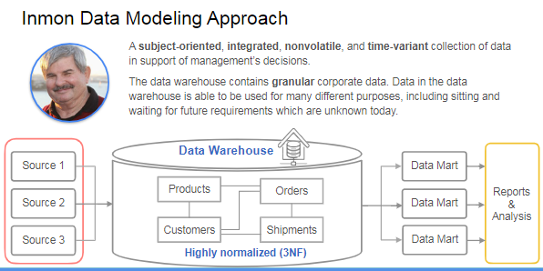

  - **Single Source of Truth**: The data warehouse serves as a central repository that supports various analytical needs, even if those needs are not yet defined.
- **Benefits**:
  - Reduces data duplication, leading to fewer analytical errors.
  - Enhances data integrity and consistency.
- **Example**: In an e-commerce context, data from orders, inventory, and marketing systems can be ingested and stored in a normalized format. Department-specific data marts can then be created for sales, marketing, and purchasing, each tailored to their unique needs.
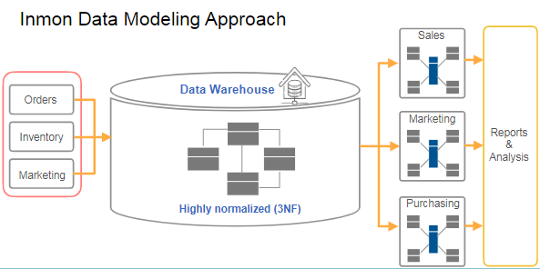

### Kimball Approach
- **Origin**: Developed by Ralph Kimball in the early 1990s.
- **Focus**: Unlike Inmon, Kimball's approach emphasizes modeling and serving department-specific analytics directly from the data warehouse.

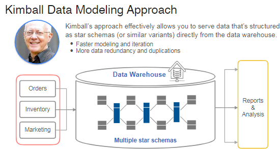
- **Key Characteristics**:
  - **Star Schemas**: Data is structured as star schemas or similar variants, allowing for direct access from the data warehouse.
  - **Faster Modeling**: This approach enables quicker iterations and faster insights compared to Inmon's method.
  - **Data Redundancy**: While it allows for rapid implementation, it may introduce data integrity issues due to redundancy.
- **Benefits**:
  - Ideal for organizations that prioritize quick, practical insights into specific business processes.
- **Example**: In an e-commerce scenario, data from various source systems can be modeled into multiple star schemas to address different business facts, allowing departments to query data efficiently.

### Conclusion
- **Choosing Between Approaches**:
  - **Inmon** is recommended for organizations that prioritize data quality and consistency, especially when analytical requirements are not well-defined.
  - **Kimball** is suitable for organizations looking for rapid implementation and insights into specific business processes.
- **Flexibility**: Depending on the organization's needs, both approaches may be applied to different data warehouses.

**From Normalization to star Schema**
- The lecture discusses the process of transforming normalized data stored in a relational database into a star schema, which is more efficient for querying and analysis.

### Key Concepts
1. **Normalized Data**: The data is initially in a normalized schema, consisting of multiple tables (e.g., Customers, Orders, Items, and Stores).

2. **Star Schema**: A star schema simplifies data retrieval by organizing data into fact and dimension tables. Fact tables contain measurable data (facts), while dimension tables provide context (dimensions).

### Steps to Create a Star Schema
1. **Understand Business Needs**:
   - Identify the business processes to model in the fact tables.
   - Determine the grain (level of detail) for the fact table, such as total sales transactions or individual product items.
  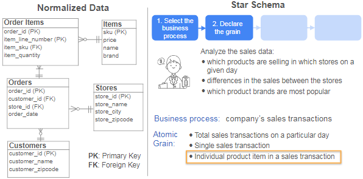

2. **Identify Facts and Dimensions**:
   - Select business measurements (facts) related to the grain.
   - Choose dimensions that provide context for the facts, such as stores, dates, and product features.
  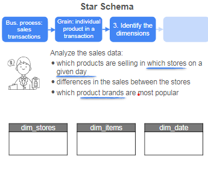

3. **Create Dimension Tables**:
   - **Stores Dimension**: Create a table with attributes like `store_id`, `store_name`, `store_city`, and `store_zipcode`. Use a surrogate key (e.g., `store_key`) for unique identification.
   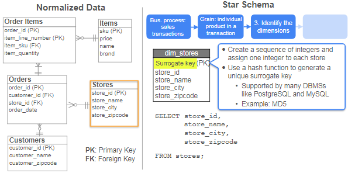

   - **Items Dimension**: Create a table with attributes like `SKU`, `name`, and `brand`. Again, use a surrogate key (e.g., `item_key`).
   - **Date Dimension**: Generate a table with sequential dates and corresponding attributes (day of the week, month, quarter, year).

4. **Create Fact Table**:
   - The fact table (e.g., `fact_order_items`) contains foreign keys linking to the dimension tables and facts like quantity sold and price.
   - Use a surrogate key (e.g., `fact_order_key`) to uniquely identify each row.
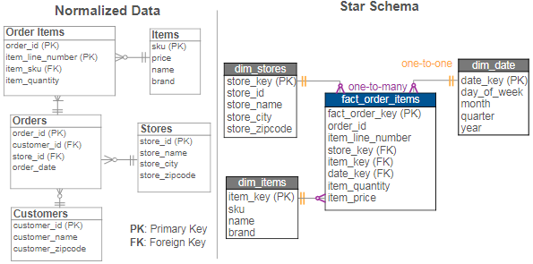
### Relationships
- The relationships between the fact and dimension tables are defined:
  - One-to-one relationships between the fact table and dimension tables.
  - One-to-many relationships from dimension tables to the fact table.

### Tools for Data Transformation
- The lecture introduces **DBT (Data Build Tool)**, which simplifies the data transformation process by generating SQL code for modeling data in a star schema.

### Conclusion
- The lecture emphasizes the importance of understanding business needs and the steps involved in creating a star schema from normalized data. It also highlights the use of tools like DBT for efficient data transformation.

### Modeling Example

Assume you work at a car rental company and you are tasked with developing a star schema model that can help the  company gather and analyze information on rental trends and customer preferences. For example, you'd like to determine peak booking times, identify the most popular cars being rented, and adjust car rental rates based on demand.

1. **Identify the business process and the grain**: the business process consists of the car rental transactions. The grain would be an entire rental booking made by a customer for a particular car.  So each row in the fact table should correspond to one rental booking and could be identified by the booking id. 

2. **Identify the dimension tables**: to provide context for each rental event,  you can create the following dimension tables:

    * dim_customers that contains the customers' details (name, address, phone number, driver's license number);

    * dim_cars that contains the cars' information (VIN - Vehicle Identification Number, model, brand, make, color, purchase date);

    * dim_dates that contains the information of a given date (year, month, time, day, quarter, day of the week). 

    * dim_stores that contains the information of the rental store (zip code, state, city, address)

3. **Identify the fact table**: Each row represents one rental booking which is identified by the booking id. It also contains the dates that describe this rental period: rental start date, rental end rental date, and return date. It also contains the foreign keys: customer key, car key and store key. And the business measures are the booking fee, insurance fee, fuel charge, extra rental days, fuel level, and total cost.

  

### One Big Table

- **Modeling Approaches**: The course discusses traditional data modeling approaches like **Kimball** and **Inmon**, which were developed when data warehouses were expensive and resource-constrained.

  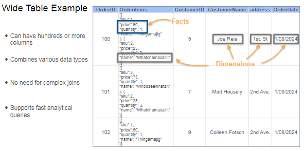

- **One Big Table (OBT)**: 
  - This approach involves combining all data into a single wide table, which can have thousands of columns.
  - It is highly **denormalized** and flexible, allowing for faster analytical queries without the need for complex joins.
  - The wide table can store various data types, with each row representing a unique entity, such as a customer order.

- **Performance Benefits**: 
  - Wide tables can improve scan performance compared to normalized data or star schemas, as they contain all necessary data in one place.
  - The emergence of **columnar databases** allows for efficient reading of only the required columns, making it cost-effective to handle sparse data with many null values.

- **Criticism of OBT**: 
  - One major criticism is the potential loss of business logic in analytics due to blending data.
  - Complex data structures like arrays may be needed for nested data, which can hinder performance during updates and aggregations.

- **Choosing the Right Approach**: 
  - There is no one-size-fits-all solution for data modeling. It's essential to understand the trade-offs between flexibility, data integrity, and ease of use for stakeholders.

  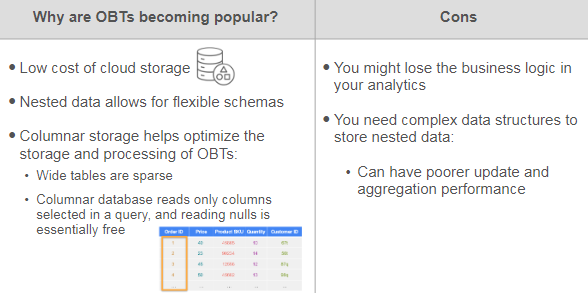

### Assignment :

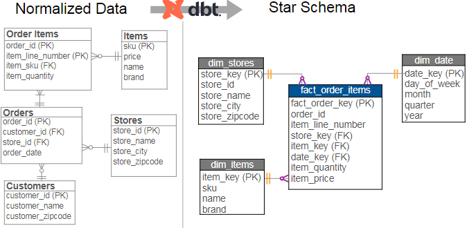

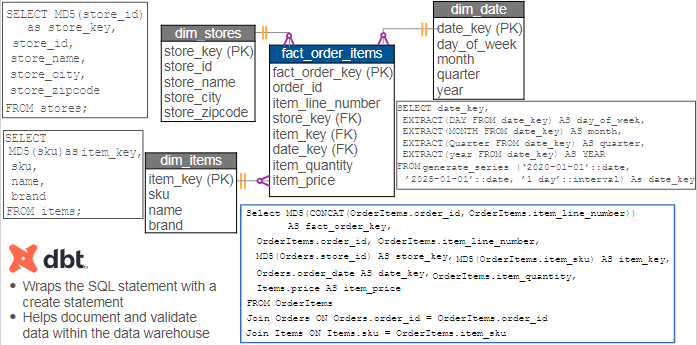

This lecture, the focus is on using **dbt (data build tool)** to model normalized data into a **star schema**. Here’s a detailed summary of the key points:

- **Setup**: A local PostgreSQL database is prepared with five tables: order items, orders, customers, items, and stores, all under a schema labeled **staging schema**.

- **Star Schema Creation**: The lecture explains how to create a new schema called **star schema**, which will include:
  - **Fact Table**: `fact_order_items`
  - **Dimension Tables**: `dim_stores`, `dim_items`, and `dim_date`

- **Dbt Installation**: 
  - Two environments are discussed: `dbt core` (open-source command line tool) and `dbt Cloud` (hosted environment).
  - The lecture proceeds with the installation of `dbt core` and the `dbt-postgres adapter` to connect to the PostgreSQL database.

- **Project Initialization**: 
  - A new virtual environment is created, and dbt is initialized with the command `dbt init`, specifying the project name as **dbt tutorial**.
  - The lecture covers the creation of a project folder containing various subfolders for models, analyses, macros, seeds, snapshots, and tests. the purpose of each folder created during the initialization:

  1. **models**
      -  This is the main directory where you define the SQL files for each table in your star schema. Each SQL file contains the SQL statements that create the corresponding tables in the database. This is where most of your work will be focused.

  2. **analyses**
      -  This folder is used to store SQL statements that are not part of the models directory. It can be used for exploratory analysis or ad-hoc queries that you want to run against your data.

  3. **macros**
      -  This folder is for storing reusable pieces of SQL code that can be called multiple times within your models. It helps in maintaining DRY (Don't Repeat Yourself) principles in your SQL code.

  4. **seeds**
      -  This folder is intended for CSV files that you want to load into your data warehouse or database using dbt. It allows you to easily manage and import static data.

  5. **snapshots**
      -  This folder is used to record changes in your tables over time. Snapshots help in tracking historical data and changes, which can be useful for auditing and analysis.

  6. **tests**
      -  This folder is where you can create SQL statements to perform specific tests on your data. It helps ensure data quality and integrity by allowing you to validate your data against certain conditions.

  7. **dbt_project.yml**
      -  This file contains the configurations for your dbt project, including project name, version, and directory settings. It defines how dbt should behave when running commands.

  8. **profiles.yml**
      -  This file specifies the connection details to your database, including credentials and database type. It is essential for dbt to connect to the correct database environment.

- **Configuration Files**: 
  - The `dbt_project.yml` file is introduced, which contains project configurations, including the project name, version, and directory settings.
  - The `profiles.yml` file is created to specify the connection details to the PostgreSQL database, including host, username, password, and database name.

- **Connection Verification**: 
  - The connection to the database is verified using the command `dbt debug`.

- **Sensitive Information**: 
  - It is advised to move the **profiles.yml** file to a hidden `.dbt` folder in the home directory for security.

### Week_1 Summary

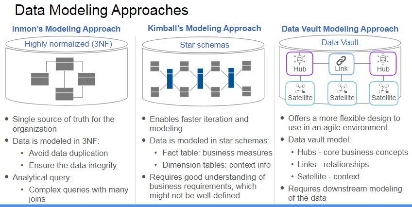