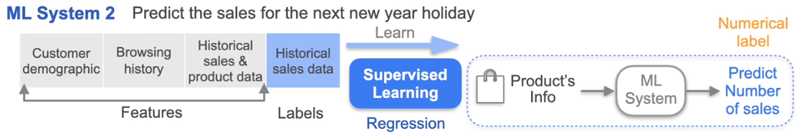

### Learning Objectives
* Differentiate between supervised vs unsupervised learning, and classification vs regression
* Describe the tabular form expected by classical machine learning algorithms
* Apply preprocessing steps to prepare tabular data for machine learning
* Apply preprocessing steps to clean textual data
* List techniques for vectorizing textual data
* List techniques for processing and augmenting image data

## Week 1 Overview :

 

## ML Overview :

1. **Types of Learning**:
   - **Supervised Learning**: Involves training a machine learning algorithm using labeled data. The algorithm learns from features (input data) and labels (output data).
     - **Example**: Predicting customer churn using historical customer data.
   - **Unsupervised Learning**: Involves training an algorithm on data without labels. The algorithm identifies patterns or groups based on the features alone.
     - **Example**: Segmenting customers based on purchasing behaviors without predefined groups.

     
     
    

3. **Machine Learning Project Lifecycle**:

    1. **Scoping**:
    - **Role**: Collaborate with machine learning engineers or data scientists.
    - **Responsibility**: Define the project and identify the business problems to be solved.

    2. **Data Phase**:
    - **Role**: Data Engineer.
    - **Responsibility**: 
        - Determine necessary features and labels.
        - Collect, clean, and organize data for training.
        - Ensure data quality and relevance.
    
    3. **Algorithm Training**:
    - **Role**: Data Engineer and Machine Learning Engineer.
    - **Responsibility**:
        - Data Engineer: Serve prepared data to the machine learning team.
        - Machine Learning Engineer: Select and train algorithms, perform error analysis, and evaluate model performance.

    

    4. **Deployment**:
    - **Role**: Data Engineer and Machine Learning Engineer.
    - **Responsibility**:
        - Data Engineer: Prepare and serve data for the deployed model, maintain data systems, and update data as needed.
        - Machine Learning Engineer: Conduct final checks, implement the system into production, and monitor performance.

As a data engineer, tasks throughout the machine learning project lifecycle may include:

1. **Data Collection**:
   - Gather data from various sources, ensuring it is relevant and of high quality.

2. **Data Preparation**:
   - Clean and preprocess data to remove inconsistencies and handle missing values.
   - Transform data into the required format for machine learning algorithms.

3. **Feature Engineering**:
   - Identify and create relevant features that will improve model performance.
   - Collaborate with the machine learning team to understand which features are needed.

4. **Data Pipeline Development**:
   - Design and implement data pipelines to automate the flow of data from source to storage and processing systems.
   - Ensure data is served efficiently to machine learning models.

5. **Data Storage Management**:
   - Manage databases and data warehouses, ensuring data is stored securely and is easily accessible.

6. **Collaboration with Data Scientists**:
   - Work closely with data scientists to understand their data needs and provide the necessary datasets for training and testing models.

7. **Monitoring and Maintenance**:
   - Monitor data pipelines and systems for performance and reliability.
   - Update and maintain data systems as needed, including retraining models with new data.

8. **Documentation**:
   - Document data processes, pipelines, and workflows to ensure clarity and reproducibility.
