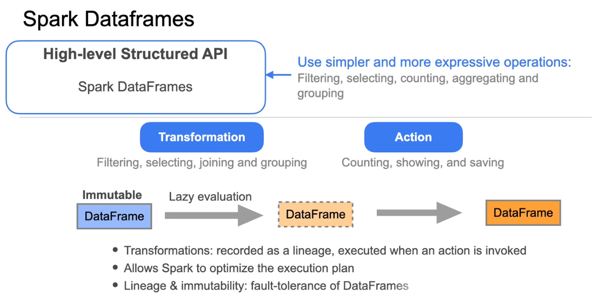
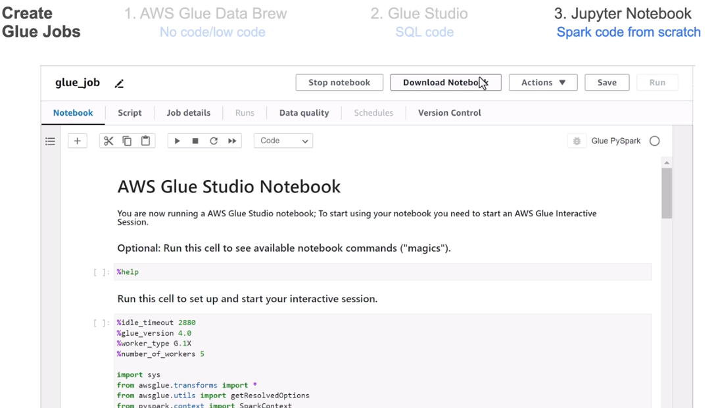

## Learning Objectives
* Identify batch transformation use cases and patterns
* Compare an in-memory processing framework like Spark, and a processing framework that involves disk read and write operations, such as Hadoop
* Describe the technical considerations for choosing a distributed processing framework, such as Spark, vs a non-distributed framework like Pandas dataframes
* Describe the technical considerations for using SparkSQL vs DataFrames when transforming data using PySpark
* Explain how streaming transformation works with a near-real time processing engine such as Spark Structured Streaming


### Week Overview


This weeks plan :

 focus on **data transformations** and the technical considerations for various data processing frameworks. 

- **Batch Transformation Use Cases**:  explored different scenarios where batch transformations are applicable as a data engineer.
  
- **Distributed Processing Frameworks**:
  - **Hadoop MapReduce**: Understand its use of disks for data storage and processing. Although considered a legacy technology, it's important to grasp the MapReduce paradigm as it influences modern distributed systems.
  - **Spark**: Learn about this in-memory processing framework, which is often preferred for its performance and scalability.

- **Transformation Logic**: You'll compare SQL-based transformations with those implemented in other languages, such as Python.

- **Lab Work**: You'll have the opportunity to perform transformations outside the data warehouse, similar to what you did with DBT earlier in the course.

- **Guest Speaker**: Navnit Shukla, a senior solutions architect at AWS, will discuss the AWS Glue Service, a tool built on Spark, and demonstrate how to generate Glue jobs for data processing.

- **Streaming Transformations**: In the second lesson, you'll implement a Change Data Capture (CDC) pipeline using Kafka and Flink to capture changes in your data source and update your system accordingly.

### Batch Transformation Patterns and Use Cases


Sure! Here’s a detailed summary of the lecture on batch processing and data transformation:

- **Batch Processing**: Data engineers often work with batch processing to serve data for analytics and machine learning. This involves manipulating discrete chunks of data on a fixed schedule (e.g., daily, hourly).

- **Transformation Approaches**:
  - **ETL (Extract, Transform, Load)**: Data is extracted, transformed using an external tool, and then loaded into a target system (e.g., data warehouse).
  - **ELT (Extract, Load, Transform)**: Raw data is extracted and loaded directly into a data warehouse, where it is then cleaned and transformed.
  - **EtLT (Extract, Transform, Load, Transform)**: A hybrid approach where simple transformations are applied before loading, followed by more complex transformations in the data warehouse.

- **Data Wrangling**: This process involves cleaning and normalizing data to handle issues like missing values and duplicates. While custom code can be used, data wrangling tools (e.g., AWS Glue DataBrew) are recommended for efficiency.

- **Data Updates**: 
  - **Truncate and Reload**: Deletes all records and reloads data from the source. Suitable for small datasets.
  - **Change Data Capture (CDC)**: Identifies changes in the source system and updates only those changes in the target system.
    
- **Handling Updates**:
  - **Insert-Only Pattern**: New records are added without modifying old ones.
  - **Upsert/Merge Pattern**: Matches source records with target records to update or insert as necessary.

- **Delete Patterns**:
  - **Hard Delete**: Permanently removes records.
  - **Soft Delete**: Marks records as deleted without permanent removal.
    
- **Inserting Data**: Single row inserts can be inefficient in OLAP systems. Instead, bulk loading is recommended for better organization and performance.


- **Scalability**: As data transformations become more complex and datasets larger, distributed processing frameworks (like Spark) may be necessary.

This lecture emphasizes the importance of choosing the right transformation approach and tools based on the specific needs of the data and the architecture design.

### Distributed Processing Framework - Hadoop

- **Evolution of Big Data Tools**: The lecture discusses the development of big data tools to manage increasing data volumes, focusing on Apache Hadoop as a foundational framework.


- **Limitations of Traditional Databases**: In the early 2000s, traditional databases could not efficiently handle massive data, leading to the need for scalable and reliable solutions.

- **Key Innovations**:
  - **Google File System (GFS)**: Introduced in 2003, it provided a fault-tolerant distributed file system.
  - **MapReduce**: A parallel programming model published by Google in 2004 for processing large datasets.

- **Apache Hadoop**: Inspired by Google's innovations, Yahoo developed Hadoop in 2006, which includes:
  - **Hadoop Distributed File System (HDFS)**: A distributed file system that manages data across clusters.
  - **MapReduce**: Integrated into Hadoop for processing data.
**Hadoop Distributed File System (HDFS)**:
- **Purpose**: HDFS is designed to store large files across multiple machines in a distributed manner.
- **Architecture**:
  - **NameNode**: 
    - Acts as the master server.
    - Maintains the metadata for all files and directories in the file system.
    - Keeps track of where data blocks are stored across the cluster.
  - **DataNodes**: 
    - These are the worker nodes that store the actual data blocks.
    - Each DataNode manages the storage of its blocks and periodically sends heartbeat signals to the NameNode to confirm its status.
- **Data Replication**:
  - Each data block is typically replicated across three DataNodes.
  - This replication ensures data durability and availability. If one DataNode fails, the data can still be accessed from another node.

**Data Block Management**:
- **Block Size**: 
  - HDFS breaks files into blocks, usually 128 MB or 256 MB in size.
  - This large block size reduces the overhead of managing many small files and optimizes data processing.
- **Fault Tolerance**:
  - If a DataNode fails, the NameNode detects the failure and re-replicates the blocks that were stored on that node to maintain the desired replication factor.


**MapReduce Programming Model**:
- **Map Phase**:
  - Each block of data is processed by a separate map task.
  - The map function reads the data and produces intermediate key-value pairs.
- **Shuffle Phase**:
  - After mapping, the framework redistributes the key-value pairs based on keys.
  - This ensures that all values associated with the same key are sent to the same reducer.
  
- **Reduce Phase**:
  - The reduce function aggregates the intermediate results for each key.
  - The final output is written back to HDFS.

**Data Locality**:
- Hadoop emphasizes data locality, meaning that computation is performed close to where the data is stored.
- This reduces network traffic and increases processing speed, as data does not need to be moved across the network to be processed.

- **Example**: Running a SQL query to count records by user ID demonstrates how MapReduce processes data efficiently by working on smaller blocks rather than the entire dataset.

- **Shortcomings of MapReduce**: 
  - High disk usage and processing time due to reading and writing data to disk.
  - No intermediate state is preserved in memory.

- **Advancements**: New frameworks like Apache Spark have emerged, allowing for in-memory processing, which significantly speeds up data processing tasks.

- **Conclusion**: While Hadoop and MapReduce are not the latest technologies, understanding their concepts is crucial as they influence many current data processing systems.

### Spark

- **Spark Project Initiation**: Researchers at UC Berkeley initiated the Spark project in 2009 to address Hadoop MapReduce's shortcomings.
- **Framework Goals**: Spark aims to provide a simpler and faster distributed framework, supporting in-memory storage for intermediate results and interactive data processing.
- **Evolution**: It has evolved to include streaming processing, machine learning, and graphing libraries.


- **Computing Engine**: Unlike Hadoop, which combines compute and storage, Spark functions solely as a computing engine for processing large distributed datasets.
- **Performance**: Spark allows for parallel computations and retains intermediate results in memory, reducing disk I/O and significantly speeding up computations compared to Hadoop MapReduce.
- **Deployment**: Spark can be used locally in data centers or in the cloud, with the ability to load and store data in various persistent storage systems.

Here’s a summary of the specified section:

- **Unified Platform**: Spark allows running various analytical workloads as self-contained applications on a single processing engine.
- **Workload Capabilities**: You can perform SQL queries, train and test machine learning algorithms, and apply streaming transformations using the same engine.
- **Supported Languages**: Workloads can be written in Python, Java, Scala, and R using Spark core APIs.
- **Built-in Libraries**:
  - **Spark SQL**: For executing SQL queries.
  - **MLlib**: For machine learning applications.
  - **Structured Streaming**: For real-time data processing.
  - **GraphX**: For graph processing.
- **External Libraries**: Spark supports third-party libraries from open-source communities, including connectors for various external data sources and storage systems, as well as performance monitoring tools.


**Spark Application** 

- **Cluster Components**:
  - **Driver Node**: Acts as the central controller of the Spark application.
  - **Cluster Manager Node**: Communicates with the driver to allocate computational and memory resources across the cluster.
  - **Worker Nodes**: Each contains a Spark executor that executes tasks assigned by the driver.

- **Data Partitioning**:
  - Spark applies a partitioning scheme to break data into partitions when loading from disk.
  - Each Spark executor is allocated the partitions closest to it in the network, allowing efficient data processing.

- **Spark Session**:
  - A Spark application begins by instantiating a Spark session object, which serves as a unified entry point to all Spark functionalities.
  - Through this session, users can define data frames, read data from sources, and perform SQL queries.

- **Job Execution**:
  - The driver node translates user-written instructions (in Python, Scala, etc.) into Spark jobs.
  - Jobs are executed sequentially based on priority and are transformed into a sequence of stages represented as a Directed Acyclic Graph (DAG).

- **DAG and Stages**:
  - Each DAG serves as the execution plan for the corresponding job.
  - Stages are further broken down into tasks that can run in parallel.
  - Stages with shared dependencies run serially, while those without can run in parallel.

- **Task Execution**:
  - For example, if stage 1 has four tasks, they run in parallel. Once completed, stages 2 and 3 (each with three tasks) can start and run in parallel.
  - The driver communicates with the cluster manager to request resources for the executors.

- **Task Assignment**:
  - Each task is assigned to a single core within an executor, and each executor processes a single data partition.
  - Executors execute tasks and send computation results back to the driver node, which aggregates the results and returns them to the user.

- **User Interaction**:
  - Users do not need to manage the underlying details of task distribution and execution.
  - Regardless of the programming language or libraries used, the code is decomposed into tasks and assigned across Spark executors.

### Spark DataFrames

 **Spark DataFrames** and their relationship with **Resilient Distributed Datasets (RDDs)**. Here are the main points:

- **Spark DataFrames** allow you to work with large datasets distributed across Spark executors, presenting them as a single table.


- They are built on top of RDDs, which are collections of records that can be processed in parallel.
- **Immutability**: Both DataFrames and RDDs are immutable, meaning they cannot be changed once created. This property ensures fault tolerance.
- **Transformations vs. Actions**:
  - **Transformations** (e.g., filtering, selecting) create new DataFrames without modifying the original.
  - **Actions** (e.g., count, show) trigger the execution of transformations.
- **Lazy Evaluation**: Transformations are not executed immediately; they are recorded and executed only when an action is called, allowing for optimization.



### Using PySpark

Spark DataFrames using PySpark, along with relevant Python code snippets to illustrate each step:

1. **Setting Up Spark**:
   - **Install PySpark**:
     ```bash
     pip install pyspark
     ```
   - **Install Findspark**:
     ```bash
     pip install findspark
     ```
   - **Initialize Findspark**:
     ```python
     import findspark
     findspark.init()
     ```

2. **Creating a Spark Session**:
   - **Import and Create Spark Session**:
     ```python
     from pyspark.sql import SparkSession
     spark = SparkSession.builder.appName("example").getOrCreate()
     ```

3. **Creating Spark DataFrames**:
   - **Manually Create a DataFrame**:
     ```python
     data = [(1, "Product A", 100), (2, "Product B", 150)]
     columns = ["id", "product", "price"]
     orders_df = spark.createDataFrame(data, schema=columns)
     orders_df.show()
     ```
   - **Create a DataFrame from CSV**:
     ```python
     transactions_df = spark.read.csv("transactions.csv", header=True, inferSchema=True)
     transactions_df.show(5)
     ```

4. **Manipulating DataFrames**:
   - **Select Specific Columns**:
     ```python
     selected_df = transactions_df.select("price", "quantity", "country")
     selected_df.show(5)
     ```
   - **Describe DataFrame**:
     ```python
     transactions_df.describe().show()
     ```
   - **Add a New Column**:
     ```python
     transactions_df = transactions_df.withColumn("amount", transactions_df.price * transactions_df.quantity)
     transactions_df.show()
     ```
   - **Rename a Column**:
     ```python
     transactions_df = transactions_df.withColumnRenamed("invoice", "id")
     transactions_df.show()
     ```
   - **Drop a Column**:
     ```python
     transactions_df = transactions_df.drop("description")
     transactions_df.show()
     ```

5. **Data Cleaning**:
   - **Remove Rows with Null Values**:
     ```python
     cleaned_df = transactions_df.dropna()
     cleaned_df.show()
     ```
   - **Filter Rows Based on Conditions**:
     ```python
     positive_qty_df = transactions_df.filter(transactions_df.quantity > 0)
     positive_qty_df.show()
     ```

6. **Aggregating Data**:
   - **Group By and Aggregate**:
     ```python
     total_amount_df = transactions_df.groupBy("order_id").sum("amount")
     total_amount_df.show()
     ```
   - **Count and Order**:
     ```python
     country_count_df = transactions_df.groupBy("country").count().orderBy("count", ascending=False)
     country_count_df.show()
     ```

7. **User-Defined Functions (UDFs)**:
   - **Define and Apply a UDF**:
     ```python
     from pyspark.sql.functions import udf
     from pyspark.sql.types import StringType

     def to_upper(s):
         return s.upper()

     to_upper_udf = udf(to_upper, StringType())
     uppercase_df = transactions_df.withColumn("country", to_upper_udf(transactions_df.country))
     uppercase_df.show()
     ```

8. **Performance Considerations**:
   - Be aware that Python UDFs can be less efficient due to serialization between JVM and Python processes. For better performance, consider using Scala or Java UDFs when possible.


### SparkSQL

The text outlines the process of using SQL queries within PySpark to interact with Spark DataFrames. Here's a detailed summary, including Python code snippets to illustrate key concepts:

1. **Integrating SQL with PySpark**:
   - PySpark allows you to manipulate data using both Python and SQL, running on the same computation engine and compiling to the same low-level code.
   - You can choose the method (Python, SQL, or a mix) that best suits your workflow.

2. **Creating a Temporary View**:
   - A temporary view acts as a virtual table that is available as long as the Spark session is active.
   - To create a temporary view from a DataFrame:
     ```python
     transactions_df.createOrReplaceTempView("orders")
     ```

3. **Executing SQL Queries**:
   - Use the Spark session object to run SQL queries on the temporary view:
     ```python
     # Example: Calculate total amount spent on each order
     result_df = spark.sql("""
         SELECT id, SUM(amount) AS total
         FROM orders
         GROUP BY id
         ORDER BY total DESC
     """)
     result_df.show()
     ```

4. **Using User-Defined Functions (UDFs) in SQL**:
   - Register a Python function as a UDF to use it in SQL queries:
     ```python
     def to_lower(s):
         return s.lower()

     spark.udf.register("udf_to_lower", to_lower)
     ```
   - Apply the registered UDF in an SQL query:
     ```python
     result_df = spark.sql("""
         SELECT DISTINCT udf_to_lower(country) AS country
         FROM orders
     """)
     result_df.show()
     ```

5. **Creating and Joining Multiple Views**:
   - You can create multiple temporary views and join them in SQL queries.
   - Example: Create a new DataFrame and view, then join with an existing view:
     ```python
     product_category_data = [(101, "Electronics"), (102, "Books"), (103, "Clothing")]
     product_category_df = spark.createDataFrame(product_category_data, ["code", "category"])
     product_category_df.createOrReplaceTempView("items")

     result_df = spark.sql("""
         SELECT category, AVG(amount) AS avg_amount
         FROM items
         LEFT JOIN orders ON items.code = orders.stock_code
         GROUP BY category
     """)
     result_df.show()
     ```


### Amazon EMR

The text provides an overview of Amazon EMR (Elastic MapReduce) and its role in running big data processing tasks, particularly with Spark. Here's a detailed summary:

1. **Introduction to Amazon EMR**:
   - Amazon EMR is a big data tool that supports various processing frameworks and is used to run Spark jobs, among others.
   - It operates on a cluster of nodes that work in parallel, similar to Amazon Redshift's massively parallel processing, allowing efficient handling of big data.

2. **Cluster Operations**:
   - EMR clusters are elastic, meaning they can scale up or down based on the workload requirements, optimizing resource use and job completion time.
   - When a job is submitted to EMR, it is distributed across multiple nodes, where each node processes a portion of the data, leading to faster job execution compared to a single machine.
    
3. **Output and Storage**:
   - After job completion, results are stored in specified destinations like Amazon S3, HDFS, or other data stores.
   - These results can then be analyzed or used in subsequent workflows or applications.

4. **Supported Frameworks**:
   - EMR supports popular big data frameworks such as Apache Spark, Hadoop, Hive, Presto, Flink, and HBase, among others.
   - This managed environment simplifies the setup and scaling of these frameworks and integrates seamlessly with AWS services, allowing users to focus on data workflows rather than infrastructure management.
    
5. **Integration with AWS Services**:
   - EMR integrates with Amazon S3, enabling the decoupling of compute and storage, which is crucial for processing large datasets that exceed local storage capabilities.
   - Data from S3 is streamed to EMR clusters for processing, allowing multiple EMR clusters to process the same dataset differently.
   - EMR can also connect with other AWS data sources like Amazon DynamoDB, Amazon RDS, and Amazon Redshift.

6. **Amazon EMR Studio**:
   - EMR Studio is a browser-based IDE for Jupyter Notebooks running on EMR clusters.
   - It enables users to interact with EMR clusters using notebooks, which is particularly useful for running Spark jobs.

This summary captures the key points about Amazon EMR's functionality, including its parallel processing capabilities, integration with AWS services, and support for various big data frameworks, emphasizing its role in simplifying big data processing tasks.

### AWS Glue Overview


The text provides insights into AWS Glue and its role in batch ETL processes, particularly focusing on its integration with Apache Spark. Here's a summary:

1. **Lab Experience**:
   - In previous labs, participants have interacted with various aspects of data infrastructure, with some components set up by themselves and others provided.
   - AWS Glue has been a recurring tool for batch ETL processes, though the details have often been abstracted.

2. **AWS Glue Overview**:
   - AWS Glue is a data integration service that simplifies bringing together data from multiple sources, transforming it, and loading it into target systems.
   - It supports data ingestion from diverse sources like databases, object stores (e.g., Amazon S3), logs, APIs, and streaming platforms.

3. **Underlying Technology**:
   - AWS Glue leverages Apache Spark to process data behind the scenes. Participants have learned about Apache Spark, and the text aims to demonstrate creating PySpark scripts for ETL processes using Spark on AWS Glue.

4. **ETL Pipeline and Glue Jobs**:
   - An ETL pipeline in AWS Glue involves ingesting, transforming, and loading data into a destination such as a database, data lake, or data warehouse.
   - The tasks performed in this pipeline are collectively referred to as a "Glue job."


There are three options for creating and running AWS Glue jobs, each catering to different levels of technical proficiency and use cases:

1. **AWS Glue DataBrew**:
   - **No Code/Low Code**: DataBrew is designed for users who prefer a visual, spreadsheet-like interface without needing to write code.
   - **Visual Interface**: Allows users to see data transformations and manipulations visually, similar to working in Excel, but with the power of Spark.
   - **Ease of Use**: Suitable for those not proficient in Spark or coding.
    
2. **AWS Glue Studio**:
   - **Intermediate Level**: Aimed at users with a fair understanding of ETL processes and who are comfortable writing some Spark code.
   - **Drag-and-Drop Interface**: Users can visually construct ETL pipelines by dragging and dropping data sources, transformations, and destinations.
   - **Enhanced Control**: Offers more control and customization compared to DataBrew.
    
3. **Jupyter Notebook**:
   - **Advanced Option**: For users who wish to write Spark code from scratch, providing maximum flexibility and control.
   - **Coding Environment**: Users write their own Spark scripts and run them using AWS Glue.
   - **Support Tools**: Assistance available from Amazon Q Developer or Amazon Q chatbot for getting started.
   - **ETL Operations**: ETL tasks can be orchestrated using Glue ETL, with additional features like Glue triggers, blueprints, and workflows for managing pipelines.
    


### Technical Considerations 

In this lecture, you learned about transforming data using PySpark, focusing on the choice between using **Spark SQL** and **Python on Spark DataFrames**. Here are the key points:

- **Transformation Methods**:
  - You can use **SQL queries** with Spark SQL or operate directly on **Spark DataFrames** using Python.
  - Consider factors like **transformation complexity**, **code reusability**, and the **technical background** of your team when choosing between the two.

- **Performance**:
  - For simple transformations (e.g., filtering, grouping, aggregation), both methods generally yield comparable performance since they are translated into the same execution plan.
  - Complex transformations may be easier to implement in Python, as some operations (like transposing a DataFrame) are not supported in SQL.

- **Code Reusability**:
  - Python on Spark DataFrames allows for more **testable**, **maintainable**, and **modular** code compared to SQL, which lacks good reusability for complex queries.

- **Team Skills**:
  - The choice may also depend on your team's familiarity with SQL versus Python.

- **Data Size Considerations**:
  - If your dataset fits into memory, you might consider using **Pandas** instead of Spark. However, for larger datasets, Spark is preferable due to its distributed computing capabilities.

- **Best Practices**:
  - Always extract only the necessary data from the source to improve performance and reduce resource usage.


#### Streaing Transformations

Here's a detailed bullet-point summary of the transcription, capturing key points and examples:

- **Streaming Data Queries and Transformations**
  - Queries can be applied to streaming data for real-time analytics and data transformations.
  - Streaming transformations prepare data for downstream consumption by enriching or joining streams.

- **Use Cases and Examples**
  - **IoT Event Enrichment**
    - Incoming IoT events can be enriched with metadata from a separate database.
    - Stream processing engines can query this metadata and add it to the IoT events.
  - **Streaming ETL Example**
    - Previous labs involved enriching user session events with timestamps and computed metrics.
  - **Window Queries**
    - Used to compute roll-up statistics dynamically and output results to a target stream.
  - **Joining Streams**
    - Example: Combine website clickstream data with IoT data for a unified view of user activities.

- **Streaming Platforms and Tools**
  - Events are typically streamed via platforms like Kafka or Kanesa Data Streams.
  - Distributed stream processing tools such as Spark Streaming and Flink are used for large datasets.
    - Both tools are open-source and support processing data with Python code or SQL queries.

- **Choosing a Streaming Processing Tool**

  - Consider use case, latency requirements, and framework performance.
  - **Spark Streaming**
    - Processes data in microbatches for near real-time performance.
    - Accumulates and processes small batches of input data in parallel.
  - **Flink**
    - True streaming system, processing one event at a time.
    - Delivers lower latency but with significant overhead.
  - Choice depends on use case:
    - **Microbatches**: Suitable for metrics collected every few minutes.
    - **True Streaming**: Needed for metrics computed every millisecond, like detecting malicious attacks.

- **Additional Learning Materials**
  - Optional materials provided for comparing architectures of Spark Streaming and Flink.
  - Code examples for using Spark Streaming.

- **Upcoming Lab**
  - Implement a streaming change data capture (CDC) pipeline.
  - Use Debezium to capture changes from a source database, push to a CFI stream, and process with Flink.
  - Lab walkthrough available for guidance.
