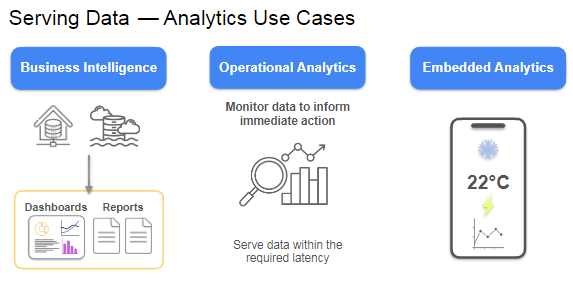
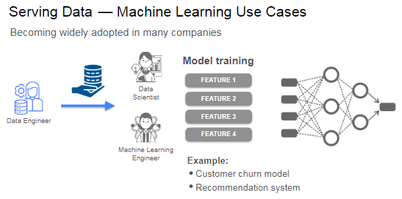
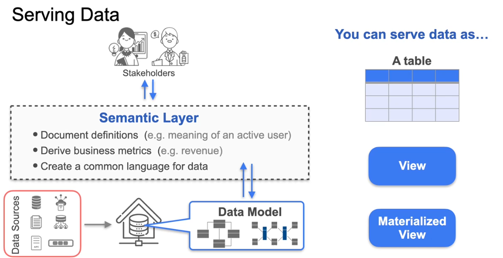
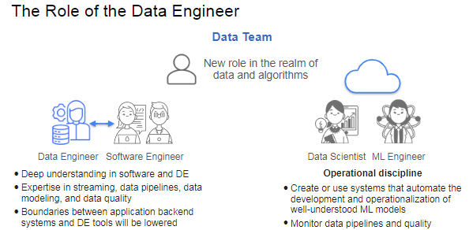

### Learning Objectives 

* Identify different ways of serving data for analytics and machine learning use cases
* Describe the purpose of a semantic layer that sits on top of the data model
* Create views and materialized views
* Describe the benefits and drawbacks for serving data using views and materialized views
* Build an end-to-end data pipeline that encompasses all stages of the data engineering lifecycle to serve data that provides business value

### Week 4 Overview

In this final week of the course, you will focus on **serving data** for various analytics and machine learning use cases. Here’s a detailed summary of the key points:

- **Data Serving Contexts**:
  - **Business Analytics**: Data is served from a data warehouse or data lake for users to create dashboards, reports, or perform ad hoc analysis.
  - **Operational Analytics**: Data is served to monitor immediate trends, requiring low latency for timely decision-making.
  - **Embedded Analytics**: Data is integrated into client-facing products or dashboards.

- **Machine Learning Applications**: Collaboration with data scientists or machine learning engineers is essential to acquire, transform, and deliver data for model training.

- **Examples from Earlier in the Course**: 
  - Customer churn model
  - Recommendation system

- **Semantic Layer**: 
  - A semantic layer can be built to document definitions (e.g., what constitutes an active user) and derive business metrics (e.g., revenue), creating a common language for the data served.

- **Data Formats**: Data can be served as:
  - Tables
  - Views
  - Materialized views

- **Upcoming Activities**: 
  - You will practice creating views using dbt in the first lab.
  - A summary of the data engineering concepts learned throughout the course will be provided, revisiting the framework of thinking like a data engineer and the data engineering lifecycle.

- **Capstone Lab**: The course will culminate in a capstone project where you will build an end-to-end data pipeline that encompasses all stages of the data engineering lifecycle to serve data that provides business value.

Congratulations on completing the data engineering professional certificate program! This final lecture wraps up your journey by reflecting on the evolving nature of data engineering and offering guidance for your future endeavors.

### Key Takeaways:
1. **Evolving Roles**: The boundaries between data engineering, software engineering, data science, and machine learning are becoming increasingly blurred. As data becomes integral to business processes, roles may merge, with data and machine learning engineering potentially blending together. Machine learning is becoming more operational, focusing on automating model training and performance monitoring.

2. **Integration with Software Engineering**: The intersection of software engineering and data engineering is growing, driven by data applications that combine software and analytics. Software engineers will need to understand data engineering principles, and data engineers will integrate more with application development, with streaming and event-driven architectures lowering existing boundaries.

3. **Tool Simplification**: There's a trend toward simpler, more interoperable tools that allow engineers to focus on high-level tasks rather than low-level infrastructure. As tools become easier to use, data engineers will engage in more complex, value-added work.

4. **Streaming and Real-Time Analytics**: Streaming pipelines and real-time analytical databases are becoming more accessible, with managed cloud services facilitating deployment. While batch processing remains relevant, streaming transformations are becoming standard for real-time data needs.

5. **AI in Data Engineering**: AI is a hot topic, with tools like GitHub Copilot serving as an introduction to AI-enhanced workflows. However, AI won't replace handwritten code soon; it will assist in streamlining tasks while engineers continue to prefer manual coding.

### Advice for Future Growth:
- **Engage in Projects**: Work on personal data engineering projects to hone your skills. The course provides resources and examples to inspire your efforts.
- **Join the Community**: Participate in meetups, ask questions, and share knowledge with peers. Engaging with the community can enrich your learning experience.
- **Stay Updated**: Keep abreast of industry trends by reading, listening to talks, and learning from domain experts to navigate the strengths and pitfalls of new technologies.

